<!-- ********************************************************************** -->
<!-- ***********FIGURES: Model results ********************************** --> 
<!-- ********************************************************************** -->

\FloatBarrier

<!-- ********************************************************************** -->
<!-- ***********History of modelleing approaches FIGURES******************* --> 
<!-- ********************************************************************** -->


<!-- ********************************************************************** -->
<!-- ****************STAR PANEL Recommendations FIGURES******************** --> 
<!-- ********************************************************************** -->


<!-- ********************************************************************** -->
<!-- ****************Model description section FIGURES********************* --> 
<!-- ********************************************************************** -->


\FloatBarrier

<!-- ====================================================================== -->
<!-- *********************BASE MODEL FIGURES******************************* -->
<!-- ====================================================================== -->

<!-- ***********MODEL 1 BASE MODEL FIGURES********************************* --> 
 


\FloatBarrier


\FloatBarrier

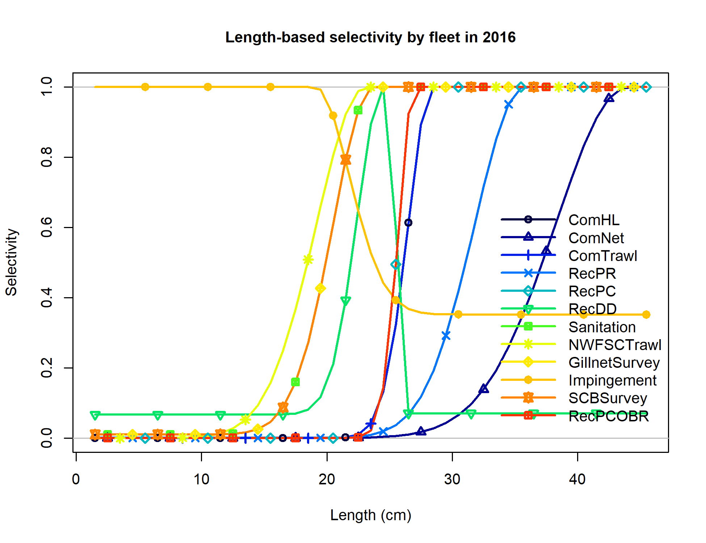


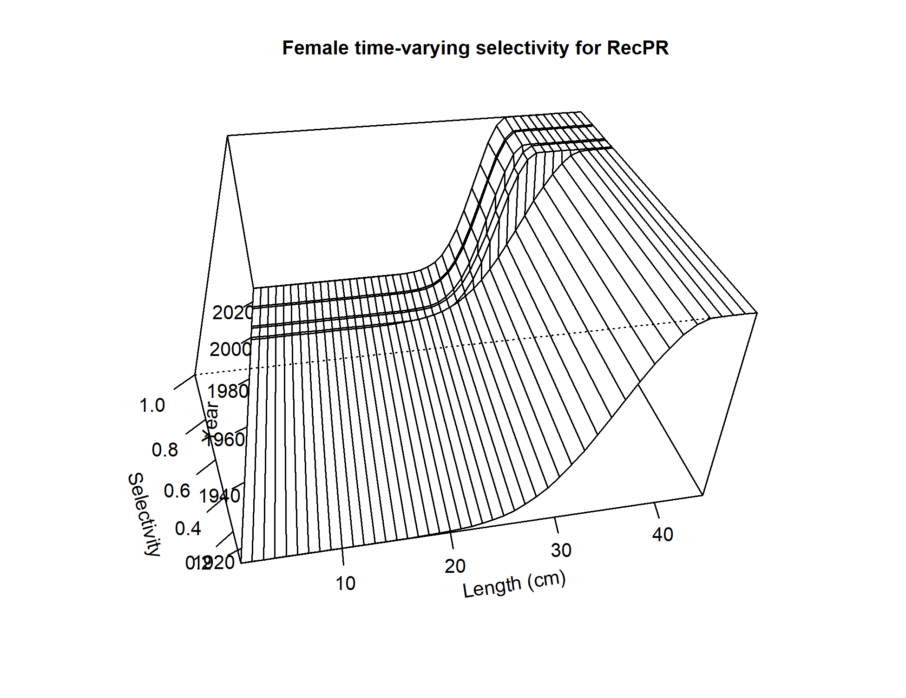


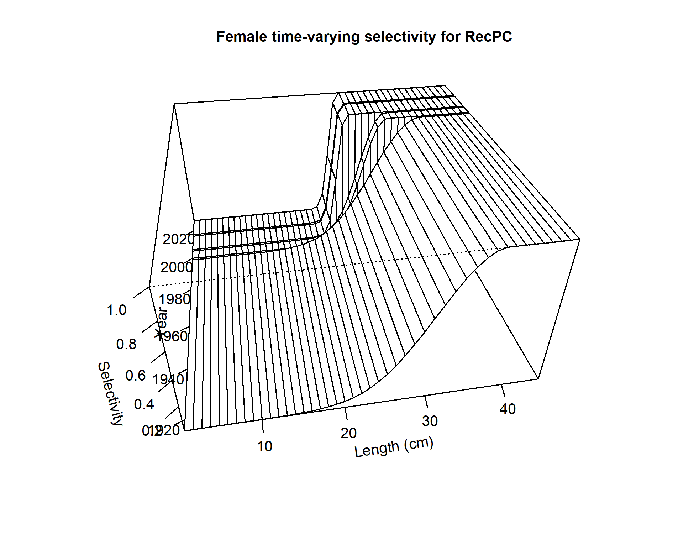

\FloatBarrier


_with_95_asymptotic_intervals.png)


<!-- ***********Fits to the data********************************* --> 


\FloatBarrier


```{r, results='asis'}
#     # Plot all of the timeseries plots
     for(i in 4:dim(AALComp_mod1)[1]) {
#         
#      # find matches to multi-page plots
      page_test = sapply(multi_page_fig, grepl, AALComp_mod1$label[i])
#      
#      # if the plot is page2+ of a series, add the extra caption
      if(TRUE %in% page_test) {
        cat('\n', sep='')
#       
        cat('\\begin{center} \n
              Figure continued from previous page \n
             \\end{center}',sep='')
#        
      } else {
#      
    cat('\n![', AALComp_mod1[i,caption_col], ' \\label{fig:mod1_', i, '_', AALComp_mod1[i, label_col], '}](', AALComp_mod1[i, path_col], ')\n', sep='')
 } }
```


 
 


\FloatBarrier


<!-- ********************************************************************** -->
<!-- ****************Uncertainty and Sensitivity FIGURES******************* -->
<!-- ********************************************************************** -->

<!-- ***********MODEL 1 Uncertainty and Sensitivity FIGURES**************** --> 

\FloatBarrier


<!-- ********************************************************************** -->
<!-- *****************Retrospective analysis FIGURES*********************** -->
<!-- ********************************************************************** -->

<!-- ***********MODEL 1 Retrospective analysis FIGURE********************** --> 


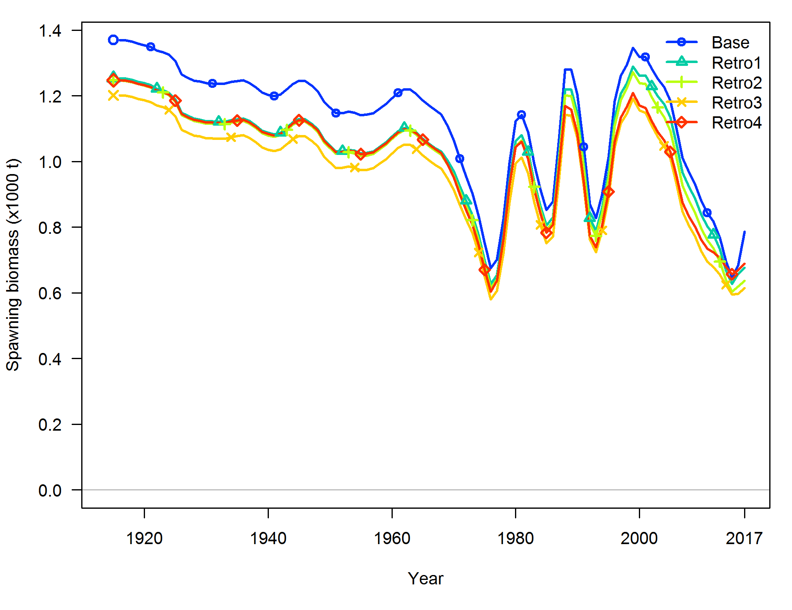


\FloatBarrier


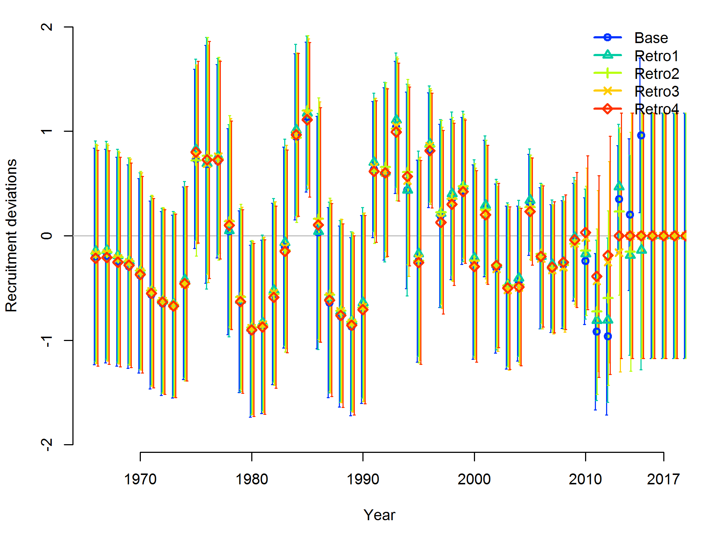

fig:retro_recdev


<!-- ********************************************************************** -->
<!-- ******************Likelihood profile FIGURES************************** --> 
<!-- ********************************************************************** -->

<!-- ***********R0 Likelihood profile FIGURES****************************** --> 


  
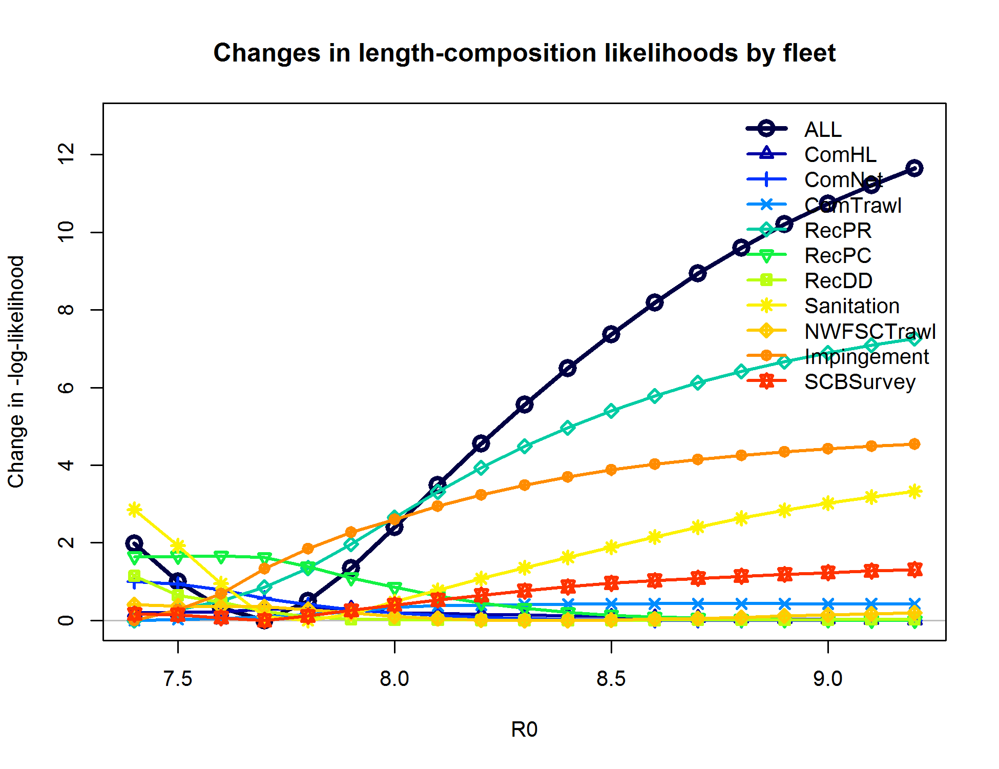


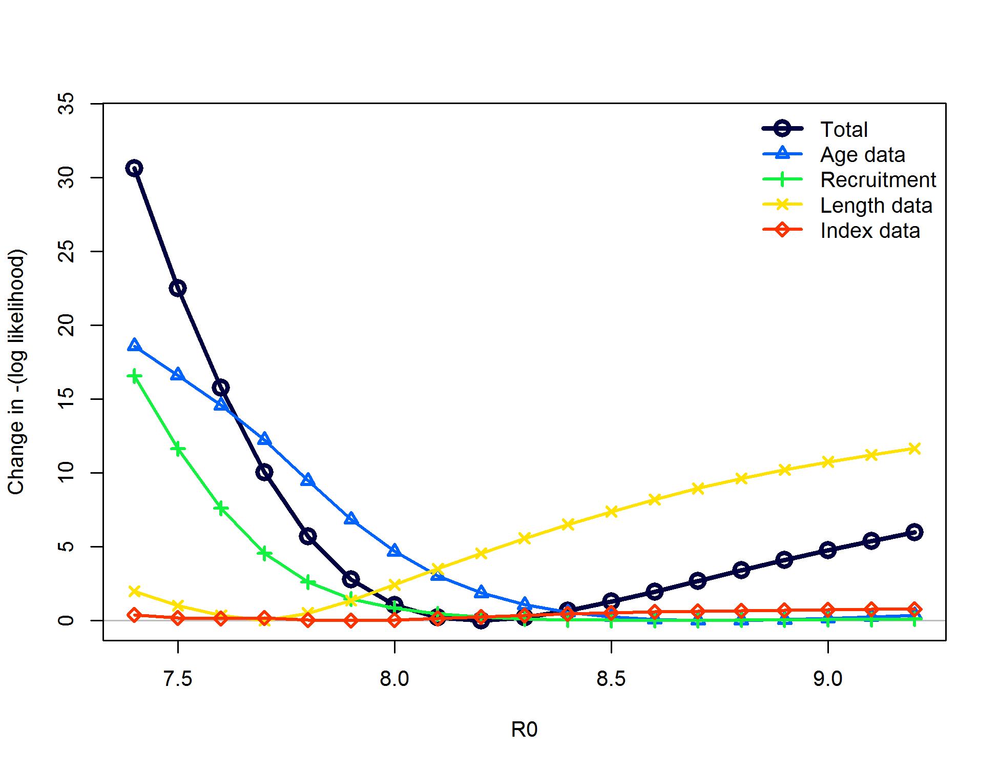


\FloatBarrier
<!-- ***********h Likelihood profile FIGURES******************************* -->


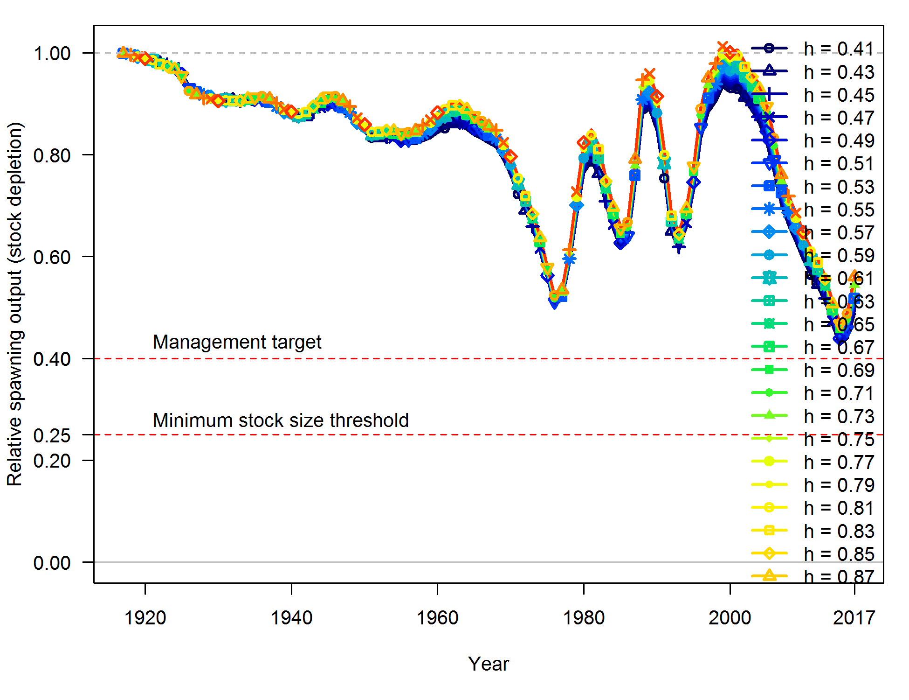


<!-- ***********M Likelihood profile FIGURES******************************* -->


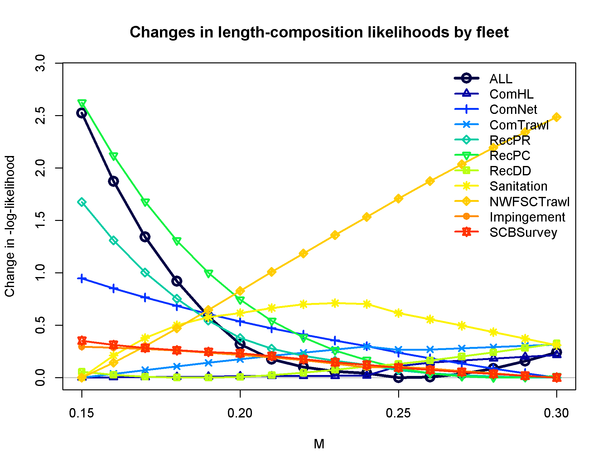

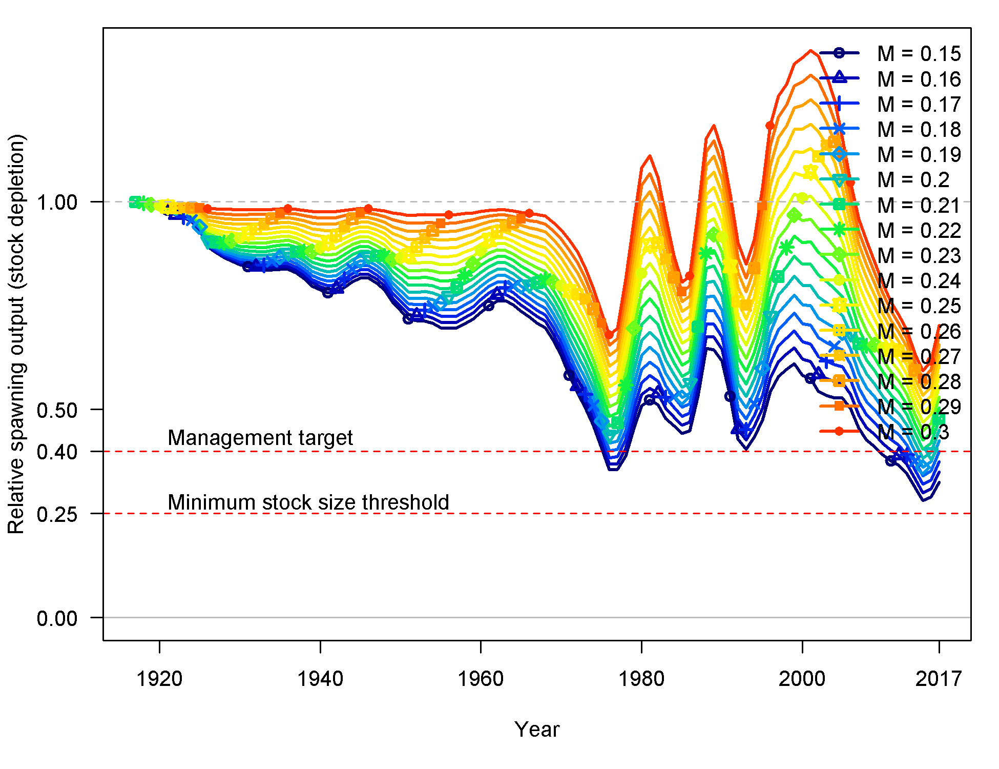


\FloatBarrier
<!-- ********************************************************************** -->
<!-- *********************REFERENCE POINTS FIGURES************************* --> 
<!-- ********************************************************************** -->

<!-- ***********MODEL 1 REFERENCE POINTS FIGURES*************************** --> 


_with_95_asymptotic_intervals_intervals.png)


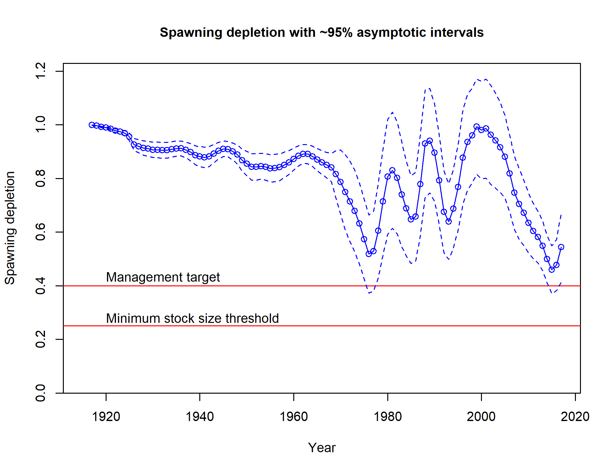


![Equilibrium yield curve for the base case model. Values are based on the `r Dat_end_mod1` fishery selectivity and with steepness fixed at `r print(mod1$parameters[mod1$parameters$Label == "SR_BH_steep","Value"],2)`. \label{fig:yield1_yield_curve}](r4ss/plots_mod1/yield1_yield_curve.png)


\FloatBarrier
<!-- ********************************************************************** --> 
<!-- *************************FORECAST FIGURES***************************** --> 
<!-- ********************************************************************** --> 
