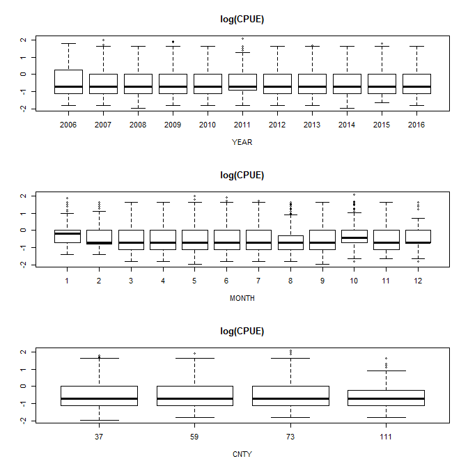
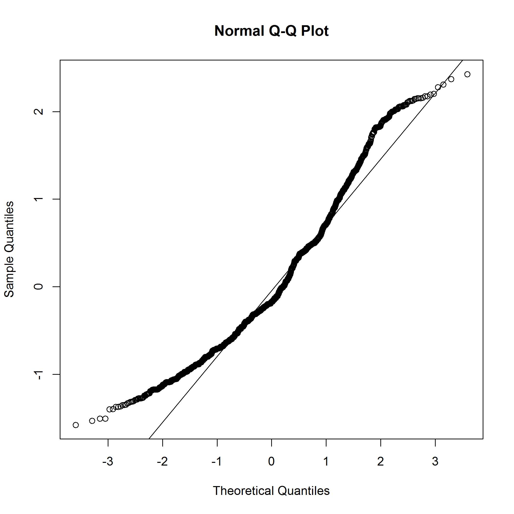
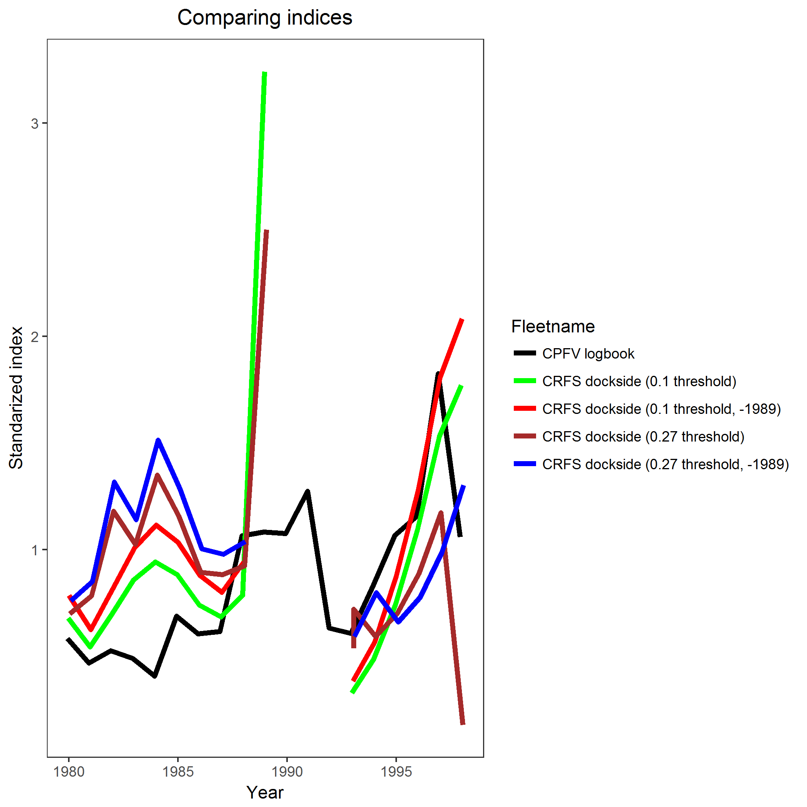
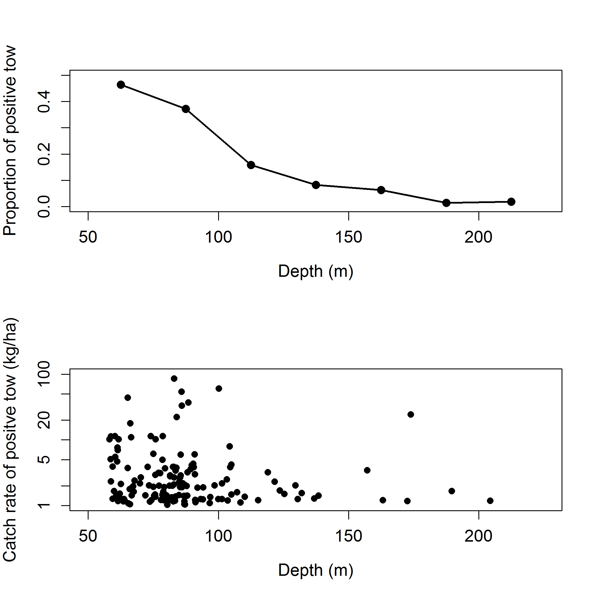
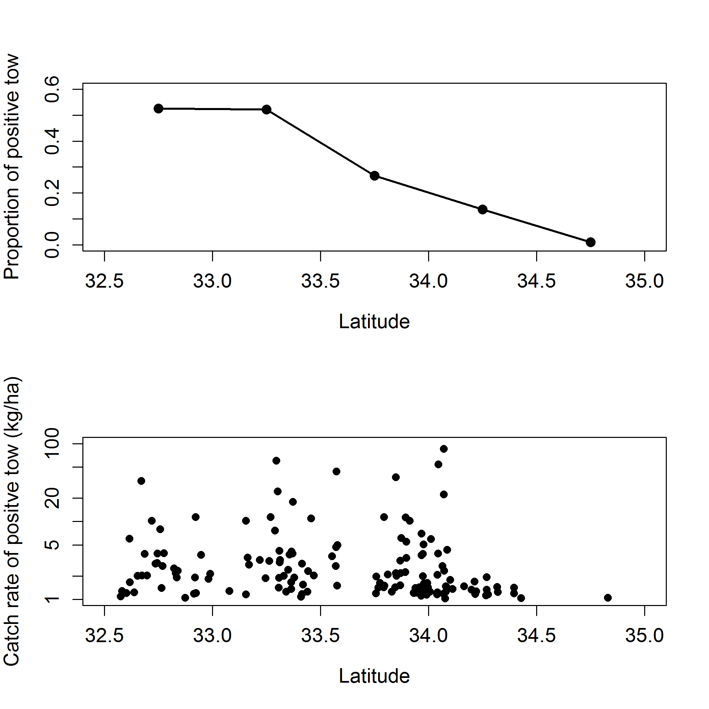
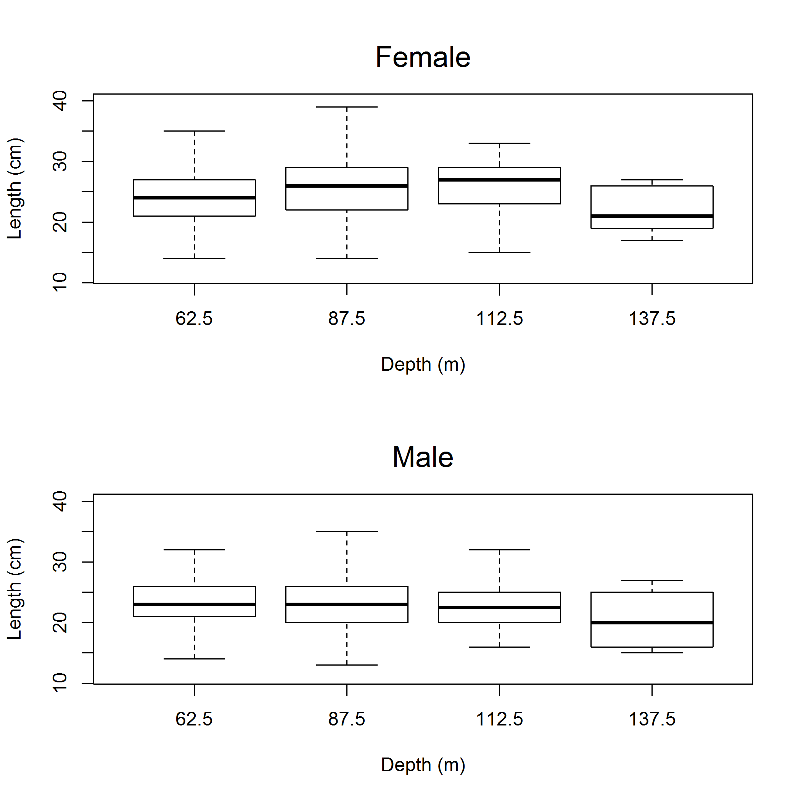
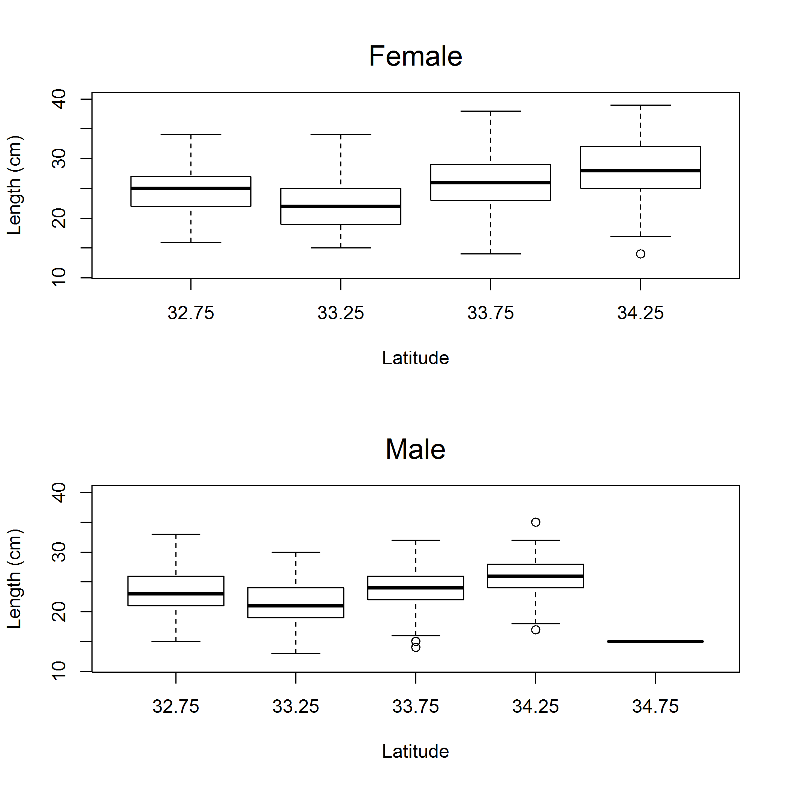
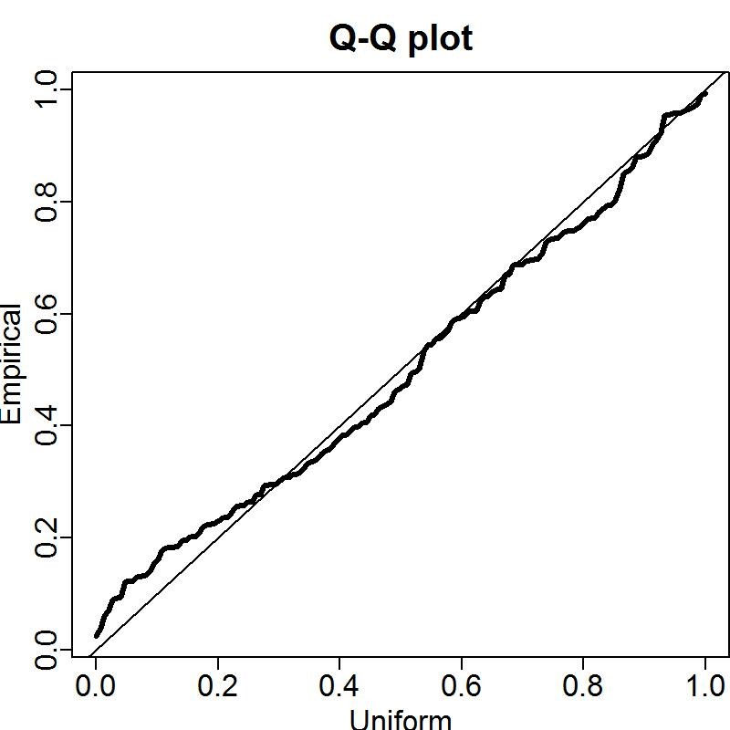
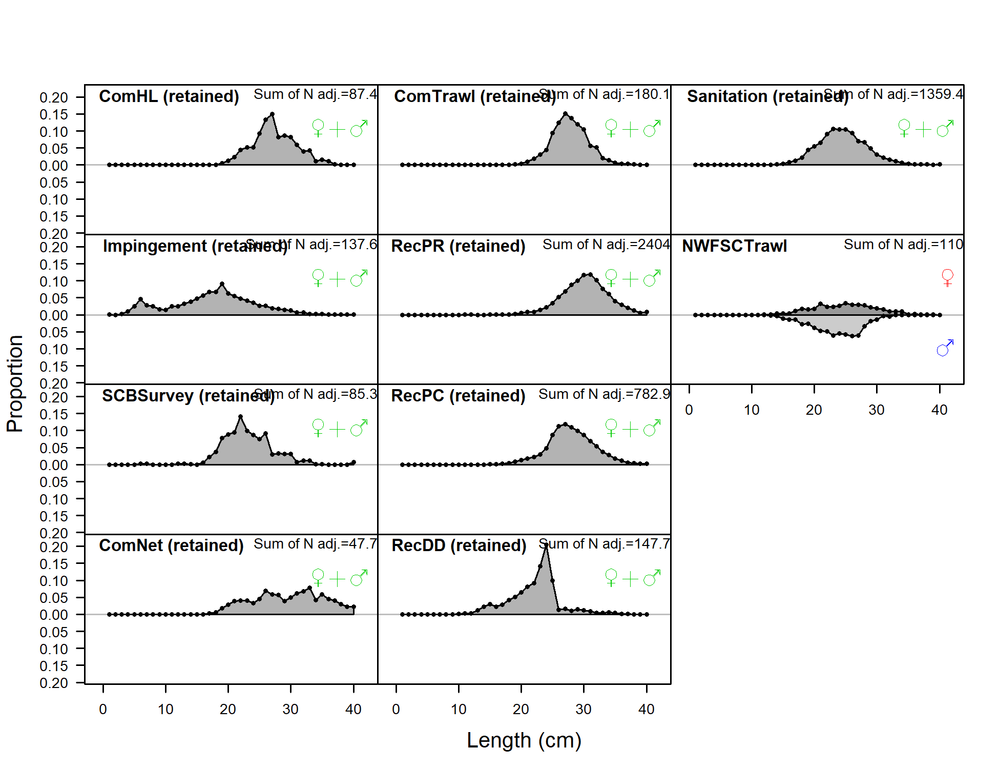
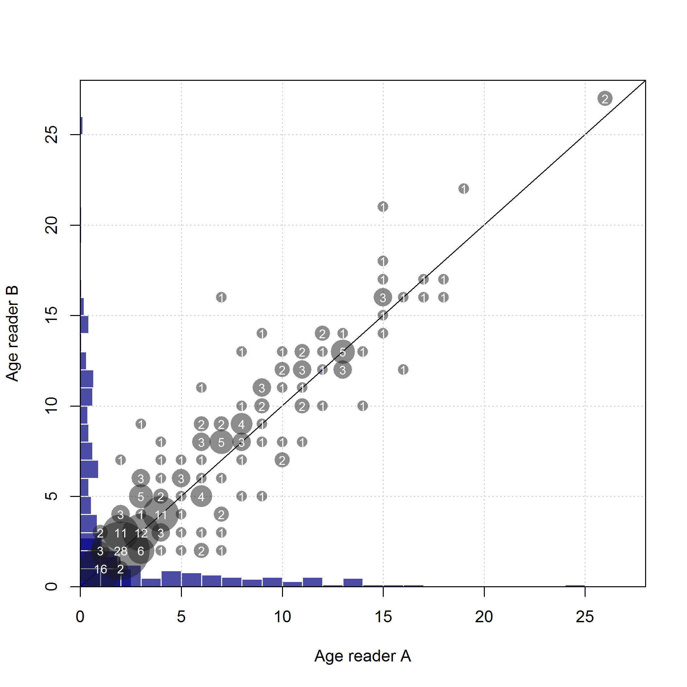

<!-- ====================================================================== -->
<!-- **************************             ******************************* --> 
<!-- **************************BEGIN FIGURES******************************* --> 
<!-- **************************             ******************************* -->
<!-- ====================================================================== -->
\FloatBarrier

\newpage

#Figures

<!-- ====================================================================== --> 
<!-- *********************INTRODUCTION FIGURES***************************** --> 
<!-- ====================================================================== --> 

<!-- ********************************************************************** --> 
<!-- *************************Data FIGURES********************************* --> 
<!-- ********************************************************************** -->

\FloatBarrier

<!-- ********************************************************************** --> 
<!-- ******************Commercial landings FIGURES************************* --> 
<!-- *either read in data to create figure or load in figures from analyst* --> 
<!-- *******************one example of each here*************************** -->

\FloatBarrier

<!-- ********************************************************************** --> 
<!-- *****************Commercial Discards FIGURES************************** --> 
<!-- ********************************************************************** -->

<!-- ********************************************************************** -->
<!-- ************Recreational Landings and Discards FIGURES**************** --> 
<!-- ********************************************************************** -->

\FloatBarrier

<!-- ********************************************************************** -->
<!-- ****************Fleet 4 Rec. PR Index FIGURES************************* -->
<!-- ********************************************************************** --> 

\FloatBarrier

<!-- ********************************************************************** -->
<!-- ***************Fleet 5 CPFV logbook index FIGURES*********************--> 
<!-- ********************************************************************** -->

\FloatBarrier

\FloatBarrier
<!-- ********************************************************************** -->
<!-- ***************Fleet 5 CPFV logbook index FIGURES*********************--> 
<!-- ********************************************************************** -->

\FloatBarrier

<!-- ********************************************************************** -->
<!-- *************Recreational onboard observer FIGURES******************** --> 
<!-- ********************************************************************** -->

\FloatBarrier
<!-- ********************************************************************** -->
<!-- *************Fleet 7 Sanitation survey FIGURES************************ --> 
<!-- ********************************************************************** -->

\FloatBarrier
<!-- ********************************************************************** -->
<!-- *************Fleet 8 NWFSC Trawl survey FIGURES***)***************** --> 
<!-- ********************************************************************** -->

\FloatBarrier
<!-- ********************************************************************** -->
<!-- *************Fleet 9 Gillnet survey FIGURES*************************** --> 
<!-- ********************************************************************** -->

\FloatBarrier
<!-- ********************************************************************** -->
<!-- *************Fleet 11 Bight trawl survey FIGURES********************** --> 
<!-- ********************************************************************** -->

\FloatBarrier

<!-- ====================================================================== -->
<!-- *****************                             ************************ -->
<!-- *****************START BIOLOGICAL DATA FIGURES************************ --> 
<!-- *****************                            ************************ -->
<!-- ====================================================================== -->

<!-- ********************************************************************** -->
<!-- ****************Length and Age Composition FIGURES******************** --> 
<!-- ********************************************************************** -->

<!-- ***********MODEL 1**************************************************** -->
 

\FloatBarrier

<!--RESEARCH Age and lengh composition figures-->

<!-- ********************************************************************** -->
<!-- *****************Maturity and Fecundity FIGURES*********************** --> 
<!-- ********************************************************************** -->

<!-- ********************************************************************** -->
<!-- **********************Age structure FIGURES*************************** --> 
<!-- ********************************************************************** -->

<!-- ********************************************************************** -->
<!-- ****************Aging Precision and Bias FIGURES********************** --> 
<!-- ********************************************************************** -->

<!-- ====================================================================== -->
<!-- ******************                           ************************* -->
<!-- ******************END BIOLOGICAL DATA FIGURES************************* --> 
<!-- ******************                           ************************* -->
<!-- ====================================================================== -->

<!-- ********************************************************************** -->
<!-- **********************Weight-Length FIGURES*************************** --> 
<!-- ********************************************************************** -->

\FloatBarrier

<!-- ********************************************************************** -->
<!-- ***********History of modelleing approaches FIGURES******************* --> 
<!-- ********************************************************************** -->

<!-- ********************************************************************** -->
<!-- ****************STAR PANEL Recommendations FIGURES******************** --> 
<!-- ********************************************************************** -->

<!-- ********************************************************************** -->
<!-- ****************Model description section FIGURES********************* --> 
<!-- ********************************************************************** -->

\FloatBarrier

<!-- ====================================================================== -->
<!-- *********************BASE MODEL FIGURES******************************* -->
<!-- ====================================================================== -->

<!-- ***********MODEL 1 BASE MODEL FIGURES********************************* --> 

\FloatBarrier

<!-- ********************************************************************** -->
<!-- ****************Uncertainty and Sensitivity FIGURES******************* -->
<!-- ********************************************************************** -->

<!-- ***********MODEL 1 Uncertainty and Sensitivity FIGURES**************** --> 

<!-- ********************************************************************** -->
<!-- *****************Retrospective analysis FIGURES*********************** -->
<!-- ********************************************************************** -->

<!-- ***********MODEL 1 Retrospective analysis FIGURE********************** --> 

\FloatBarrier

<!-- ********************************************************************** -->
<!-- ******************Likelihood profile FIGURES************************** --> 
<!-- ********************************************************************** -->

<!-- ***********R0 Likelihood profile FIGURES****************************** --> 

<!-- ***********M Likelihood profile FIGURES******************************* -->

<!-- ***********h Likelihood profile FIGURES******************************* -->

\FloatBarrier

<!-- ***********Post-STAR M Likelihood profile FIGURES********************* -->

<!-- ********************************************************************** -->
<!-- *********************REFERENCE POINTS FIGURES************************* --> 
<!-- ********************************************************************** -->

<!-- ***********MODEL 1 REFERENCE POINTS FIGURES*************************** --> 

\FloatBarrier
<!-- ***********MODEL 2 REFERENCE POINTS FIGURES  -- IF NEEDED ************ --> 

<!-- ***********MODEL 3 REFERENCE POINTS FIGURES  -- IF NEEDED ************ --> 

<!-- ********************************************************************** --> 
<!-- *************************FORECAST FIGURES***************************** --> 
<!-- ********************************************************************** --> 
