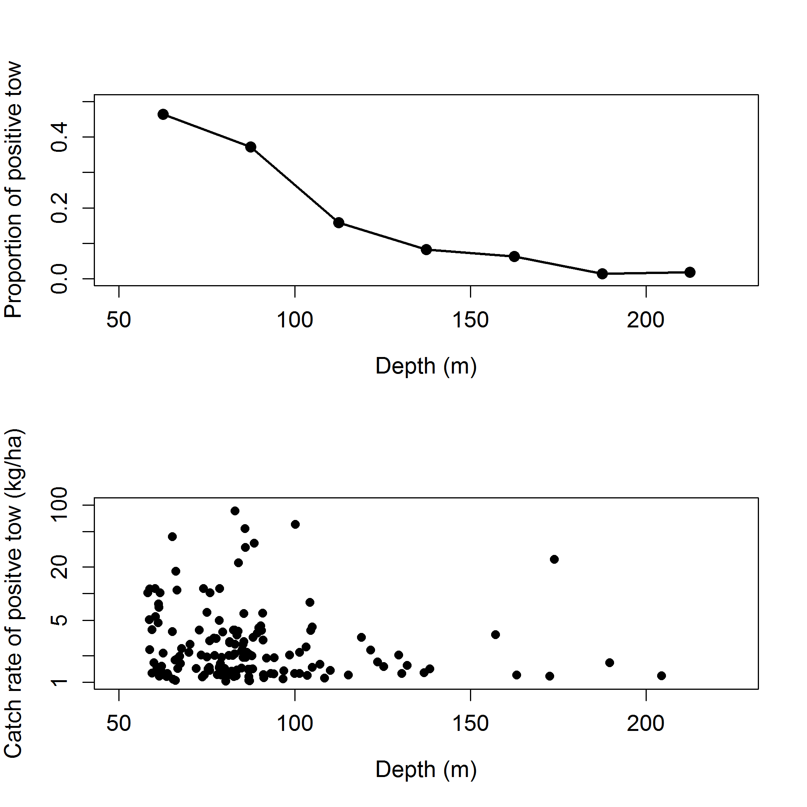

```{r global_options, include=FALSE}
    # set global options for R code chunks: echo=FALSE (don't include source code); 
    # warning=FALSE (suppress R warnings); message=FALSE (suppress R messages)
    # eval = TRUE is default
    knitr::opts_chunk$set(echo = FALSE, warning = FALSE, message = FALSE)
```

```{r}
    # Read in preamble R code - including required libraries and the SS file(s)
    source('./Rcode/Preamble.R')
 
    # Read in data/manipulations for executive summary tables and figures
    # It may take time to edit this file and get it ready for your assessment
    # Make small changes in this file and then try to compile the document
    # Commit when you have a success!
    source('./Rcode/Exec_summary_figs_tables.R')
```
\setlength{\parskip}{5mm plus1mm minus1mm}
\pagebreak

\pagenumbering{arabic}
\setcounter{page}{1}
\renewcommand{\thefigure}{\alph{figure}}
\renewcommand{\thetable}{\alph{table}}


#Executive Summary{-}

##Stock{-}


This assessment reports the status of the `r spp` (\emph{`r spp.sci`}) resource 
in U.S. waters off the coast of the California, Oregon, and Washington using data 
through `r LastYR`.  Etc...


##Catches{-}


Catch figure(s) with fleets: (Figures \ref{fig:Exec_catch1}-\ref{fig:Exec_catch3})    
Catch table:                 (Table \ref{tab:Exec_catch})


\FloatBarrier

<!-- ***********BEGIN EXECUTIVE SUMMARY CATCH FIGURES AND TABLES*********** -->
<!-- ***********Edit the Plot_catch tables and captions******************** -->
<!-- ***********This depends on how many plots you need******************** -->
<!-- ***********Also included is the r4SS plot - keep or remove************ -->
<!-- ***********CATCH FIGURES********************************************** -->
```{r, fig.cap= paste(spp, 'landings history for the recreational fleets. \\label{fig:Exec_catch1}',sep=' ')}
    # CSV: './txt_files/Exec_catch_for_figs.csv'
    # Note: you cannot have carriage returns in the R options line
    # Plot washington catches           
    Plot_catch(Catch_df = Exec_region1_catch)
```

```{r, fig.cap=paste('Stacked line plot of', spp,' landings history for the commercial fleets. \\label{fig:Exec_catch2}',sep=' ')}
    # Plot Oregon catches
    Plot_catch(Catch_df = Exec_region2_catch)
```

```{r, fig.cap=paste('Stacked line plot of', spp, 'landings history by region, north of Pt. Conception, between Pt. Conception and the U.S.-Mexico border, and Mexican waters. \\label{fig:Exec_catch3}',sep=' ')}
     # Plot California catches  
      Plot_catch(Catch_df = Exec_region3_catch)
```

\FloatBarrier


<!-- ***********CATCH TABLE************************************************ -->
```{r, results='asis'}
    #CSV: './txt_files/Exec_catch_summary.csv'
    # Catch table section in R_exec_summary_fig_tables.R
    # Print the table
    print(Exec_catch.table, include.rownames = FALSE, caption.placement = 'top')
```
<!-- ***********END EXECUTIVE SUMMARY CATCH FIGURES AND TABLES************* -->


\FloatBarrier


\newpage

##Data and Assessment{-}

`r spp` was assessed in 2005 [@Maunder2005] using Stock Synthesis II version 1.18. 
This assessment uses the newest version of Stock Synthesis (3.30.0.4).  The model 
begins in `r Dat_start_mod1`, and assumes the stock 
was at an unfished equilibrium that year.


Map of assessment region: (Figure \ref{fig:assess_region_map}).  
 


\FloatBarrier


##Stock Biomass{-}

Spawning output Figure:    Figure \ref{fig:Spawnbio_all}     
Spawning output Table(s):  Table \ref{tab:SpawningDeplete_mod1}     
Relative depletion Figure: Figure \ref{fig:RelDeplete_all}     

 
The estimated relative depletion level (spawning output relative to unfished 
spawning output) of the the base-case model in `r LastYR` is `r Depl_mod1` 
(~95% asymptotic interval: $\pm$ `r Depl_mod1_CI`) (Figure \ref{fig:RelDeplete_all}).


\FloatBarrier


<!--BEGIN  EXECUTIVE SUMMARY SPAWNING BIOMASS AND DEPLETE TABLES AND FIGURES-->
```{r, results='asis'}
    # Print spawning biomass table(s)
    print(Spawn_Deplete_mod1.table, include.rownames = FALSE, caption.placement = 'top')
    
    # Select which file to use for the recuitment figure, depending on if you have one model or multiple models
      spawn.file  = ifelse(fecund=='numbers',
                           'r4ss/plots_mod1/ts7_Spawning_output_with_95_asymptotic_intervals_intervals.png',
                           'r4ss/plots_mod1/ts7_Spawning_biomass_(mt)_with_95_asymptotic_intervals_intervals.png')
      Bratio.file = 'r4ss/plots_mod1/ts9_Spawning_depletion_with_95_asymptotic_intervals_intervals.png' 
```

\FloatBarrier


<!-- ***********END  EXECUTIVE SUMMARY SPAWNING BIOMASS AND**************** -->


<!-- ***********DEPLETION TABLES AND FIGURES******************************* -->

\FloatBarrier


##Recruitment{-}

Recruitment Figure: (Figure \ref{fig:Recruits_all})     
Recruitment Tables: (Tables \ref{tab:Recruit_mod1}, \ref{tab:Recruit_mod2} 
and \ref{tab:Recruit_mod3})


<!-- ***********BEGIN EXECUTIVE SUMMARY RECRUITMENT TABLES AND FIGURES***** -->
```{r, results='asis'}
   # Print recruitment tables; will print up to 3 depending on the number of models, you can delete the code
   # for models you don't need as well
   print(Recruit_mod1.table, include.rownames = FALSE, caption.placement = 'top')
   
   # select which file to use for the recuitment figure, depending on if you have one model or multiple models
   
     recruit.file  = 'r4ss/plots_mod1/ts11_Age-0_recruits_(1000s)_with_95_asymptotic_intervals.png'
    
```

\FloatBarrier


<!-- ***********END EXECUTIVE SUMMARY RECRUITMENT TABLEs AND FIGURES******* -->

 \FloatBarrier


##Exploitation status{-}


Exploitation Tables: Table \ref{tab:SPR_Exploit_mod1}, Table \ref{tab:SPR_Exploit_mod2}, Table \ref{tab:SPR_Exploit_mod3}
Exploitation Figure: Figure \ref{fig:SPR_all}). 

A summary of `r spp` exploitation histories for base model is provided as Figure \ref{fig:Phase_all}.


\FloatBarrier

<!-- ***********BEGIN EXECUTIVE SUMMARY EXPLOITATION AND******************* -->
<!-- ***********SPRratio TABLE AND FIGURES********************************* -->
```{r, results='asis'}
   # Print exploitation and SPRratio tables depending on how many models there are
   
     print(SPRratio_Exploit_mod1.table, include.rownames = FALSE, caption.placement = 'top')
   
   # select the files for the SPR and phase plots depending on the number of models
   
     SPR.file   = 'r4ss/plots_mod1/SPR2_minusSPRseries.png'

   
```

\FloatBarrier


<!-- ************END EXECUTIVE SUMMARY EXPLOITATION************************ -->
<!-- ************AND SPRratio TABLE AND FIGURES**************************** -->

\FloatBarrier


##Ecosystem Considerations{-}
In this assessment, ecosystem considerations were.....


##Reference Points{-}

This stock assessment estimates that `r spp` in the `r mod1_label` are 
`r ifelse(Deplete_mod1[nrow(Deplete_mod1),2]-MT>0,"above","below")` the biomass 
target, but `r ifelse(Deplete_mod1[nrow(Deplete_mod1),2]-MSST>0,"above","below")` 
the minimum stock size threshold.  \hl{Add sentence about spawning output trend.} 
The estimated relative depletion level for \hl{Model 1} in `r LastYR` is 
`r Depl_mod1` (~95% asymptotic interval: $\pm$ `r Depl_mod1_CI`, corresponding 
to an unfished spawning output of `r paste(Spawn_mod1, fecund_unit,sep=' ')` 
(~95% asymptotic interval: `r paste(Spawn_mod1_CI, fecund_unit, sep=' ')`) of 
spawning output in the base model (Table \ref{tab:Ref_pts_mod1}).  Unfished 
age `r min_age` biomass was estimated to be `r Ref_pts_mod1[2,2]` mt in the 
base case model. The target spawning output based on the biomass target 
($SB_{40\%}$) is `r paste(Ref_pts_mod1[7,2], fecund_unit,sep=' ')`, which gives 
a catch of `r Ref_pts_mod1[10,2]` mt. Equilibrium yield at the proxy $F_{MSY}$ 
harvest rate corresponding to $SPR_{50\%}$ is `r Ref_pts_mod1[15,2]` mt.


\FloatBarrier

<!-- ***********BEGIN EXECUTIVE SUMMARY REFERENCE POINT TABLES************* -->
```{r, results='asis'}
   # Print reference point tables
  
     print(Ref_pts_mod1.table, include.rownames = FALSE, caption.placement = 'top',
           sanitize.text.function = function(x){x})
   
```
<!-- ***********END EXECUTIVE SUMMARY REFERENCE POINT TABLES*************** --> 

\FloatBarrier


##Management Performance{-}


Management performance table: Table \ref{tab:mnmgt_perform}


<!-- ***********BEGIN EXECUTIVE SUMMARY MANAGEMENT PERFORMANCE TABLE******* --> 
```{r, results='asis'}
    # Print management performance table - will have to edit the text file and 
    # R code for this table
    # Edit file: './txt_files/Exec_mngmt_performance.csv'
    print(mngmnt.table, include.rownames = FALSE, caption.placement = 'top', 
          sanitize.text.function = function(x){x}, scalebox = .9)
```
<!-- ***********END EXECUTIVE SUMMARY MANAGEMENT PERFORMANCE TABLE********* -->


##Unresolved Problems And Major Uncertainties{-}
   TBD after STAR panel

\FloatBarrier


##Decision Table{-}    

OFL projection table: Table \ref{tab:OFL_projection}    

Decision table(s) Table \ref{tab:Decision_table_mod1} 
              
 
    Yield curve: Figure \ref{fig:Yield_all}

<!-- ***********BEGIN EXECUTIVE SUMMARY OFL AND DECISION TABLES************ -->
```{r, results='asis'}   
    # Print OFL table 
      print(OFL.table, include.rownames = FALSE, caption.placement = 'top')

   # Decision tables currently read in as txt files and will need to be changed
   # Decision table text set up for alternate states of natural mortality, but 
   # the text can be changed in the Decision Table section of the R file, 
   # R_exec_summary_figs_tables.R
   # Edit text file(s): ./txt_files/DecisionTable_mod1 ,  
   # ./txt_files/DecisionTable_mod1 , and
   # ./txt_files/DecisionTable_mod3
    # print Model 1 decision table
    print(decision_mod1.table, add.to.row = addtorow, include.rownames = FALSE, 
          caption.placement = 'top', 
          hline.after = c(-1, 0, 10, 20, 30, nrow(decision_mod1.table)), 
          scalebox = .85)

```
<!-- ***********END EXECUTIVE SUMMARY OFL AND DECISION TABLES************** -->


<!-- ***********BEGIN EXECUTIVE SUMMARY RESULTS SUMMARY TABLE --> 
```{r, results='asis'}
   # Print the results summary table, will have to edit the R code and input file 
   # depending on the stock structure
   # Edit file: ./txt_files/Exec_basemodel_summary.csv and the Summary Results 
   # section in R code R_exec_summary_figs_tables.R
  
 print(base_summary.table, 
       include.rownames = FALSE, 
       caption.placement = 'top',
       floating.environment = 'sidewaystable', 
       sanitize.text.function = function(x){x}, 
       scalebox = .6, 
       align = TRUE, 
       hline.after = c(-1, 0, 4, 5, 7, 9, 11, nrow(base_summary.table)))
```

<!-- ***********Yield curve table****************************************** -->
```{r, results='asis'}
   # Select the file to use for the yield curve depending on the number of models
       yield.file  = 'r4ss/plots_mod1/yield1_yield_curve.png'
   
```
<!-- ***********Edit caption based on fixed params************************* -->


<!-- ***********END EXECUTIVE SUMMARY RESULTS SUMMARY TABLE AND YIELD CURVE -->

\FloatBarrier

\newpage

##Research And Data Needs{-}
We recommend the following research be conducted before the next assessment:

\begin{enumerate}

\item List item No. 1 in the list

\item List item No. 2 in the list, etc.

\end{enumerate}

##Rebuilding Projections{-}


\FloatBarrier

<!--************RESET FIGURE & TABLE NUMBERS FOR THE DOCUMENT'S MAIN BODY** -->
\newpage
\renewcommand{\thefigure}{\arabic{figure}}
\renewcommand{\thetable}{\arabic{table}}
\setcounter{figure}{0}
\setcounter{table}{0}

<!-- ***********INTRODUCTION SECTION*************************************** -->

#Introduction

##Basic Information and Life History
California scorpionfish (\emph{Scorpaena guttata}), also known locally as sculpin or 
spotted scorpionfish, originates from the Greek word for scorpionfishes and \emph{guttata} 
is Latin for speckled.  California scorpionfish is a medium-bodied fish and like other
species in the genus \emph{Scorpaena}, it produces a toxin in its dorsal, anal, and 
pectoral fin spines, which produces intense, painful wounds [@Love1987]. Scorpionfish 
are very resistant to hooking mortality and have shown survival under extreme conditions. 
 
Its range extends from central California (Santa Cruz) to the Gulf of California, 
although within U.S. waters they are most common in the Southern California Bight 
[@Eschmeyer1983; @Love1987]. The species generally inhabits rocky reefs, caves and 
crevices, but in certain areas and seasons it aggregates over sandy or muddy substrate
[@Frey1971; @Love1987].  California scorpionfish have been observed from the intertidal
to 600 ft with a preferred depth range from 20-450 ft.  
 
Males and females show different growth rates, with females growing to a larger size 
than males, and the sexes exhibit different length-weight relationships [@Love1987]. 
Few California scorpionfish are mature at one year old (14 cm total length). 
Fifty-percent of fish mature at 17-18 cm (2 years old) and all by 22 cm (4 years old) [@Love1987].
 
California scorpionfish feed on a wide variety of mobile prey, including crabs, fishes
(e.g., include northern anchovy, spotted cusk-eel), octopi, isopods and shrimp,
[@Love1987; @Turner1969; @Taylor1963; @Quast1968].  The species is nocturnal, but
have been observed feeding during the day.  Predation on scorpionfish is believed
to be low, but one individual was found in the gut of a leopard shark (Love pers comm.).
 


## Early Life History
California scorpionfish utilize the “explosive breeding assemblage” reproductive 
mode in which fish migrate to, and aggregate at traditional spawning sites for 
brief periods [@Love1987].  California scorpionfish migrate to deeper waters 
(120-360 ft)  to spawn during May-August, with peak spawning occurring July. 
The species is oviparous, producing floating, gelatinous egg masses in which 
the eggs are embedded in a single layer [@Orton1955]. and it is believed that 
spawning takes place just before, and perhaps after dawn, in the water column 
[@Love1987].  Tagging data suggest California scorpionfish return to the same 
spawning site, but information is not available on non-spawning season site fidelity. 
 
Little is known about California scorpionfish larvae. The CalCOFI survey observed 
463 California scorpionfish larvae from 1977-2000, with the majority at station 
close to Oxnard (east of the Channel Islands) [@Moser2002]. Higher densities of 
larvae have been observed in the CalCOFI stations throughout Baja, peaking south 
of Punta Eugenia from July to September.  The hatching length is reported as 
1.9-2.0 mm [@Washington1984] and transformation length of greater than 1.3 cm 
[@Washington1984] less than 2.1 cm [@Moser1996].  


##Map
A map showing the scope of the assessment and depicting boundaries for fisheries or 
data collection strata is provided in Figure \ref{fig:boundary_map}.

##Ecosystem Considerations
In this assessment, ecosystem considerations were not explicitly included in the analysis.  
This is primarily due to a lack of relevant data and results of analyses (conducted elsewhere) 
that could contribute ecosystem-related quantitative information for the assessment.


##Fishery Information


The hook-and-line fishery fishery off California developed in the late 19th century [@Love2002].  
The rockfish trawl fishery was established in the early 1940s, when the United 
States became involved in World War II and wartime shortage of red meat created 
an increased demand for other sources of protein [@Alverson1964; @Harry1961].

California scorpionfish comprise a minor part of the Californian sport and commercial 
fisheries [@Love1987].  Historically, California scorpionfish were taken commercially 
by hook and line and, occasionally, by round haul nets [@Daugherty1949]. Scorpionfish 
were commonly caught around Santa Catalina Island during the late 19th Century with 
gillnets [@Jordan1887].  The 1937 Bureau of Commercial Fisheries report noted that 
California scorpionfish had been a fairly important commercial species for a long time. 
The species was targeted by a few fishermen during the summer months, and was also taken 
as a bycatch in the rockfish fisheries.  By 1949, Bureau of Marine Fisheries reported  
“[Scorpionfish] will even come to the surface to lights at night” and were also taken 
in round haul nets. At that time, scorpionfish were rarely targeted by fishermen except by a few specialists.
 
More recently, commercial bottom longlines have been used to target spawning aggregations 
offshore of Long Beach [@Love1987]. Since the early 1990s, trawl catch has been a substantial 
component of the commercial catch. Commercial landings have fluctuated substantially 
over time, which could, in part, be due to changes in targeting and El Niño events 
[@Love1987]. A high proportion of the catch landed in California during the 1960s 
and 1970s was taken from Mexican waters. In recent years, most of the catch has come 
from around the Los Angeles region. In general, the majority of the commercial catch 
has come from the Los Angeles region, except in the 1960s and 1970s when the majority
of the catch came from the San Diego region and Mexican waters.
 
They are most often taken by boat fishermen, but fairly large numbers are caught from 
piers, jettys, and rocky shorelines.  The CPFV effort has remained relatively constant 
over a long period (1959-1998) [@Dotson2003]. However, there appears to be a shift in 
effort towards less utilized species, such as California scorpionfish, over the past
decade [@Dotson2003].  Especially as catch limits for rockfish have become more
restricted commercial passenger fishing vessels (CPFV) operators target California 
scorpionfish spawning aggregations during spring and summer [@Love1987], and also 
target California scorpionfish in the winter when other fisheries are closed.  
California scorpionfish become a target species for day boats during the spawning
months when spawning aggregations can be located.  There are a small number of 
boats that specialize in targeting these aggregations.  The spawning aggregations
occur in deeper waters, often times outside of the three nautical mile state 
jurisdiction.  It is also unknown what fraction of the population aggregates 
during the spawning season, e.g., all mature fish.
 
Aggregate mortality has been far below the Annual Catch Limits (ACL) established 
by the 2005 stock assessment.  The ACL projections from the 2005 assessment 
assumed that the entire ACL was being taken each year and as a result, the 
ACL for each subsequent year declined despite under-attainment in reality.  
In addition, in 2014, recreational catch was higher than expected.  As a result, 
in 2014, the combined recreational and commercial catch exceeded the OFL by 2mt 
(1%) resulting from assumption that the ACL had been attained.  Subsequently,
action was taken to decrease the recreational season by four months 
(September 1 - December 31).  A catch only update of the stock was undertaken 
in 2015  [@Wallace2015] that imputed the actual catch values since the last 
assessment, resulting in significant increase in the OFL and ACL.  
Retrospectively, the catch in 2014 was well below the OFL as well as the 
ACL that would have been in place had the ACL values from the actual
attainment been in place in 2014.  Thus the stock has not been subject
to overfishing since the original assessment or 
been in an overfished condition historically and is considered healthy.  
The season restriction in the recreational fishery remained in place as 
a precautionary measure until the full assessment is completed to better 
inform the current status of the stock, catch limits and regulations given 
the perspective provided.


##Summary of Management History

Prior to the adoption of the Pacific Coast Groundfish Fishery Management Plan (FMP) 
in 1982, California scorpionfish (\emph{Scorpaena guttata}) was managed through a regulatory 
process that included the California Department of Fish and Wildlife (CDFW) along 
with either the California State Legislature or the Fish and Game Commission (FGC) 
depending on the sector (recreation or commercial) and fishery. With implementation 
of the Pacific Coast Groundfish FMP, California scorpionfish came under the management 
authority of the Pacific Fishery Management Council (PFMC), being incorporated, along 
with all genera and species of the family Scorpaenidae, into a federal rockfish 
classification and managed as part of "Remaining Rockfish" under the larger 
heading of "Other Rockfish" (PFMC [-@PFMC2004; -@PFMC2002], Tables 31-39). 

The ABCs provided by the PFMC's Groundfish Management Team (GMT) in the 1980's 
were based on an analysis of commercial landings from the 1960's and 1970's. 
For this analysis, most of the rockfishes were lumped into one large group. 
This analysis indicated that the landings for rockfish in the Monterey-Conception 
area were at or near ABC levels [@PFMC1993]. To keep landings within these 
adopted harvest targets, the Pacific Coast Groundfish FMP provided the Council 
with a variety of management tools including area closures, season closures, 
gear restrictions, and, for the commercial sector, cumulative limits (generally 
for two-month periods). With the implementation of a federal groundfish restricted 
access program in 1994, allocations of total catch and cumulative limits began 
to be specifically set for open access (including most of California's commercial 
fisheries that target California scorpionfish in Southern California) and limited 
entry fisheries [@PFMC2002; @PFMC2004].  As a result, in the later 1990'ss as commercial 
landings decreased and recreational harvest became a greater proportion of the 
available harvest. 

Beginning in 1997, California scorpionfish was managed as part of the Sebastes 
complex-south, Other Rockfish category. (\emph{Sebastes} complex-south included the 
Eureka, Monterey, and Conception areas while Sebastes complex-north included 
the Vancouver and Columbia areas.)  The PFMC's rockfish management structure 
changed significantly in 2000 with the replacement of the \emph{Sebastes} 
complex -north and -south areas with Minor Rockfish North (now covering the 
Vancouver, Columbia, and Eureka areas) and Minor Rockfish South (now Monterey 
and Conception areas only). The OY for these two groups (which continued to 
be calculated as 0.50 of the ABC) was further divided (between north and 
south of $40^\circ 10^\prime$ N. latitude) into nearshore, shelf, and slope rockfish categories 
with allocations set for Limited Entry and Open Access fisheries within 
each of these three categories (January 4, 2000, 65 FR 221; PFMC [-@PFMC2002], 
Tables 54-55). Because of its depth range and southern distribution, 
California scorpionfish was included within the Minor Rockfish South, 
Other Rockfish ABC and managed under the south of $40^\circ 10^\prime$ N. latitude
nearshore rockfish OY and trip limits (PFMC [-@PFMC2002], Table 29).

Along with the above changes, in 2000 the southern area divided into two separate 
management areas at Point Lopez, $36^\circ 00^\prime$ N. latitude. This was followed in 2001 with 
the implementation of the northern rockfish and lingcod management area between 
($40^\circ 10^\prime$ N. latitude) and Point Conception ($34^\circ 27^\prime$ N. 
latitude); and the southern rockfish 
and lingcod management area between Point Conception and the U.S.- Mexico border. 
These were later revised starting in 2004 with the northern rockfish and lingcod 
management area redefined as ocean waters from the Oregon-California border 
($42^\circ 00^\prime$ N. latitude) to $40^\circ 10^\prime$ N. latitude, the central 
rockfish and lingcod management area defined as ocean waters from $40^\circ 10^\prime$ 
N. latitude to Point Conception, and the southern rockfish and management area 
continuing to be defined as ocean waters from Point Conception to the U.S.-Mexico border.

Cowcod Conservation Areas (CCAs) also were established in 2001 to reduce fishing 
effort for cowcod rockfish (PFMC [-@PFMC2002], Table 29). These areas were closed to 
all recreational and commercial fishing for groundfish except for minor 
nearshore rockfish1 (including California scorpionfish) within waters less 
than 20 fathoms. In addition, Rockfish Conservation Areas (RCAs) were established 
in 2003 to allow for the closure of specific area and depth ranges along the West 
Coast for the purpose of reducing fishing effort for shelf and slope rockfish. 
The California Rockfish Conservation Area (CRCA) was defined as those ocean waters 
south $40^\circ 10^\prime$ N. latitude to the U.S.-Mexico border with different depth 
zones specified for the areas north and south of Pt. Reyes ($37^\circ 59.73^\prime$ N. latitude). 

During the late 1990's and early 2000's, major changes also occurred in the way 
that California managed its nearshore fishery. The Marine Life Management Act 
(MLMA), which was passed in 1998 by the California Legislature and enacted in 
1999, required that the FGC adopt an FMP for nearshore finfish. It also gave 
authority to the FGC to regulate commercial and recreational nearshore fisheries 
through FMPs and provided broad authority to adopt regulations for the nearshore 
fishery during the time prior to adoption of the nearshore finfish FMP. Within this 
legislation, the Legislature also included commercial size limits for nine nearshore
species including California scorpionfish (10-inch minimum size) and a requirement 
that commercial fishermen landing these nine nearshore species possess a nearshore permit.

Following adoption of the Nearshore FMP and accompanying regulations by the FGC in 
fall of 2002, the FGC adopted regulations in November 2002 which established a set 
of marine reserves around the Channel Islands in Southern California (which became 
effective April 2003) and adopted a nearshore restricted access program in December 
2002 (which included the establishment of a Deeper Nearshore Permit) to be effective 
starting in the 2003 fishing year.

Although the Nearshore FMP provided for the management of the nearshore rockfish 
and California scorpionfish, management authority for these species continued to 
reside with the Council. Even so, for the 2003 and subsequent fishery seasons, 
the State provided recommendations to the Council specific to the nearshore 
species that followed the directives set out in the Nearshore FMP. These 
recommendations, which the Council incorporated into the 2003 management 
specifications, included a recalculated OY for Minor Rockfish South - Nearshore, 
division of the Minor Rockfish South - Nearshore into three groups (shallow 
nearshore rockfish; deeper nearshore rockfish; and California scorpionfish), 
and specific harvest targets and recreational and commercial allocations for 
each of these groups. 

Also, since the enactment of the MLMA, the Council and State in a coordinated 
effort developed and adopted various management specifications to keep harvest 
within the harvest targets, including seasonal and area closures (e.g. the CCAs; 
a closure of Cordell Banks to specific fishing), depth restrictions, minimum 
size limits, and bag limits to regulate the recreational fishery and license 
and permit regulations, finfish trap permits, gear restrictions, seasonal 
and area closures (e.g. the RCAs and CCAs; a closure of Cordell Banks to 
specific fishing), depth restrictions, trip limits, and minimum size 
imits to regulate the commercial fishery.


##Management Performance

Management performance table: (Table \ref{tab:mnmgt_perform})      
A summary of these values as well as other base case summary results can be found 
in Table \ref{tab:base_summary}.


##Fisheries off Mexico
The California scorpionfish’s range extends into to Abreojos, Baja California.  
The species is also found in the northern Gulf of California and Guadalupe 
Island.  No formal stock assessments have been conducted for California 
scorpionfish in Mexican waters.  


<!-- ************ASSESSMENT SECTION**************************************** -->
#Assessment

##Data
Data used in the `r spp` assessment are summarized in Figure \ref{fig:data_plot}.  
A description of each data source is below.


<!-- ************FISHERY-DEPENDENT DATA************************************ -->
###Commercial Fishery Landings
Commercial catches of California scorpionfish (often landed as “sculpin”) are available 
back to 1916. Landings from 1916 to 1935 are presented in CDFG Fish Bulletin No. 49 
and Bulletin No. 149 provides tabulated data from 1916 to 1968. Over 99% of the 
commercial catches of California scorpionfish are from south of Pt. Conception.  
Whenever possible, catches from north of Pt. Conception and also caught in Mexico 
but landed in the U.S. were excluded from the commercial catch histories.
 
[California Explores the Ocean](http://library.ucsd.edu/ceo/fishcatchtables/fish-catch-download.html)(CEO) 
provides landings data taken from the CDFG Fish Bulletins in electronic form, as well 
as electronic copies of all CDFG Fish Bulletins. 
 
Statewide annual landings are available for California scorpionfish from 1916 to 1925,
and are assumed to be taken by hook-and-line.  Data by area and month are given in a 
series of bulletins, each bulletin usually providing information for a single year. 
Data by region and month is available for 1926 to 1986.  The Santa Barbara region 
includes San Luis Obispo, Santa Barbara and Ventura counties.  Catches from this 
region were included in the catch history and comprised less than 10 mt for the 
period from 1926-1968 (the period when data at the regional scale are available).  
Catches from Mexico can be separated from the total catch starting in 1931, 
although the CDFG Bulletins do not report catches originating from Mexican 
waters available for all years, e.g., 1932-1934.  It is assumed that before 
1931 there was no catch taken from Mexican waters landed in California. 
 
 The [CALCOM](http://128.114.3.187/) database was queried (March 7, 2017) for 
 commercial landing estimates of California scorpionfish in California, 1969-2016.
 Landings were stratified by year, quarter, live/dead, market category, gear group, 
 port complex, and source of species composition data (actual port samples, borrowed 
 samples, or assumed nominal market category).  All CALCOM California scorpionfish 
 landing data are either actual port samples or the nominal California scorpionfish
 market category.  However, catches in CALCOM do not separate out catches originating
 from Mexican waters and landed at U.S. ports.
 
The Commercial Fisheries Information System (CFIS; maintained by CDFW) contains 
California catch in pounds by gear and port for 1969 to 2016 (Figures). The CFIS 
data come from landing receipts or “fish tickets” filled out by the markets or 
fish buyers as required by the state for all commercial landings.  The fish tickets 
include the CDFW block in which the majority of the landings were caught.   
Landings with a block solely in Mexican waters (blocks >900) were removed from 
the catch history.  Landings with reported blocks 877-882 with area in both U.S.
and Mexican waters were retained in the catch histories.
The commercial catch is dominated by the hook-and-line fishery (89% of total catches).  
The catch by reported gear types: hook-and-line, fish pot, trawl, gill net, and 
other can be found in Table \ref{tab:CommCatches}.  Catch taken by fish pot and 
other gears is added to the hook-and-line catch in the stock assessment (30.6 mt 
from fish pot and 93.9 mt from other gears). 
 
In the assessment, catch for 1916 to 1968 is taken from the CDFG
Fish Bulletins. Catch by gear for 
1969 to 2004 is taken from CFIS.

###Commercial Discards
Information on commercial discards from the West Coast Groundfish Observer 
Program (WCGOP) are available starting in 2004.  The commercial fishery for 
California scorpionfish has been minimal since the early 2003 (averaging 3.5 
mt per year).  The available length composition data from the observed discards is minimal…..


###Sport Fishery Removals and Discards

Data used in reconstructing the retained catch and discarded mortality for California 
scorpionfish in the California recreational fishery are from the Commercial Passenger 
Fishing Vessel (CPFV) Logbooks (1932-2017), the Marine Recreational Fishery Statistical 
Survey (MRFSS, 1980-2003) and the California Recreational Fishery Survey (CRFS, 2004-2017).  
Total catch was accounted for including retained catch as well as the estimate of fish 
discarded dead assuming a 7% discard mortality rate approved for use in management in 
the regulatory specifications for 2009-2010 [@PFMC2008].  The MRFSS and CRFS data provide 
estimates of mortality for four fishing “modes” including the Party/Charter Boat, 
Private/Rental Boat, Man Made (piers and jetties etc.) and Beach and Bank modes. 
 
While estimates of mortality from the Party/Charter (PC) boat mode is available from 
the MRFSS and CRFS surveys for the Party/Charter Boat mode for 1980-2017, estimates
from the CRFS data from 2011-2017 and data from CPFV Logbook for 1932-2010 were used
to represent catch from this mode.  The Party/Charter Phone Survey was used to estimate
effort used in producing effort estimates for CRFS between 2004 and 2010, which was 
subject to negative bias due to the low of participation in the survey south of Point
Conception.   The Coastal County Household Telephone Survey was used to estimate 
fishing effort for the MRFSS survey from 1980-2003 and were subject to potential 
positive avidity bias in participation by those contacted by the survey.  As a 
result, the CPFV logbooks were used to provide the reported number of retained 
and discarded California scorpionfish used to estimate mortality from 1932-2010.  
This is consistent with the catch based update conducted in 2015 as well as the 
original assessment, both of which used estimates of catch from logbooks to 
represent catch in the PC mode with the exception of the years after 2011 when 
effort estimates used in CRFS estimates were derived from logbooks. 
  
 
An underreporting adjustment reflecting an average 20% of logs not being submitted 
was applied to all estimates for the PC mode from 1932-2010.  Annual average weights 
from this mode for retained catch from the MRFSS or CRFS estimates for 1980-2010 and 
average weight from 1980-1984 was applied to the preceding years.  To estimate 
discard mortality for the PC mode, the annual average weight determined from lengths 
collected sampling onboard CPFVs by the CRFS survey for 2004-2010 were applied to
the number of discards from the CPFV logbooks and the average weight over this entire
period were applied to the preceding years for 1995-2003.  For the period between 
1980 and 1994, the MRFSS estimates for discards were used to reflect discarding due 
to the paucity of data on the number of discards from PC logbooks prior to 1995. 
 
For all other modes, the MRFSS (1980-2003) and CRFS (2004-2017) based estimates of 
retained catch and discard mortality were used.  There was a lapse in MRFSS sampling 
from 1990 through 1992, which for which retained catch and discard mortality was 
estimated using the average of values three years before and three years after the 
lapse for all modes other than the PC mode.  For the PC mode, estimates of numbers 
of fish were available from logbook data and average weight from the three years 
before and after this period were applied to provide estimates for the PC mode. 


Estimates of retained catch and discards were not available from the non-PC modes 
prior to 1980, thus the ratio of catch in the PC mode to the other modes for 1980 
through 1985 was used to provide an estimate of catch in the other modes in the 
years 1932-1979.  In the case of the PR mode, a linear ramp in the ratio adjustment 
between PC and PR modes was applied between 1979 and 1966 from 0.55 in 1980 to 0.10 
in 1965, reflecting the increase in the relative proportion of catch contributed by 
the PR mode with time as more individuals anglers purchased vessels, as recommended 
in the California Catch Reconstruction [@Ralston2010], and the ratio of 0.10 was assumed
for all years prior.  The ratio of PC estimates to the MM and BB modes was assumed to 
constant and the average between 1980 and 1989 was applied from 1979 to 1932.  Catch 
estimates from CPFV logbooks were not available during the World War II era from 1941
until 1946 and catch was assumed to be zero for all modes during this period.  Estimates
for retained catch and discarded mortality for 1935 to 1928 were estimated using a
linear ramp from the value for 1936 to zero in 1928 for the PC mode and ratios PC 
compared to other modes were used to proxy estimates for other modes based on the 
resulting ramped values for the PC mode.  The final time series of retained and 
discarded landings is in Table \ref{tab:Rec_removal}.


###Fishery-dependent Abundance Indices

**MRFSS Dockside Private Boat Index**

The CDFW provided the CRFS private boat dockside sampling fisheries data from 2004 
to 2016.  The data went through several data quality checks to identify the best 
subset of available data that are consistent over the time series and provide a 
representative relative index of abundance once standardized.  The dockside sampling 
of the private mode (PR mode in RecFIN) consists of samples from a primary series 
of ports (PR1) where the majority of fishing effort for this mode originates and a 
secondary series of ports with historically low effort (PR2).  Only PR1 samples were 
used for this index as the sampling forms for the PR2 index have changed over time 
and the data could not reliably be collapsed to the trip level.  The dockside data 
consist of two types of data; Type 2 data contain records of angler-reported catch, 
i.e., catch that was not observed by the sampler and Type 3 data includes sampler-examined 
retained catch.  Of the Type 2 reported catch for scorpionfish, less than one percent 
were reported “thrown back dead” and  five percent reported as retained to eat.  Given 
that the reported retained catch is a small fraction of the catch overall and discard
mortality of California scorpionfish is low, only the Type 3 examined catch are used in the index.


The survey records the number of contributing anglers (number of anglers on the vessel 
for the private mode), but does not contain data on hours fished.  For this index, 
angler-day was the assumed effort.  The data were filtered to trips fishing with 
hook-and-line gear in southern California.  Trips with a primary fishing area of 
Mexico were also removed.  The CRFS dockside private boat records with these broad 
filters include  44,128 trips of which 3,802 caught California scorpionfish (8.6%).  


The Stephens-MacCall approach was used to identify trips with a high probability of 
catching California scorpionfish [@Stephens2004].  Prior to using the Stephens-MacCall approach to 
select relevant trips a number of other filters were applied to the data to minimize 
variability in CPUE estimates.  Over the course of the time series only 45 trips 
from Santa Barbara county encountered California scorpionfish, ranging from 0-10 
trips a year.  The Stephens-MacCall approach was applied with and without trips 
from Santa Barbara and the same species were identified as indicators and 
counter-indicators.  For the final model prior to Stephens-MacCall, trips 
from Santa Barbara were excluded, leaving 41,235 trips, and 3,747 of those 
caught California scorpionfish (Table \ref{tab:Fleet4_RecPR_dockside_filter}).
 
 
Coefficients from the Stephens-MacCall analysis (a binomial GLM) are positive for 
species which co-occur with California scorpionfish, and negative for species that
are not caught with California scorpionfish (Figure \ref{fig:Fleet4_RecPR_dockside_SM}).Potentially 
informative species for the Stephens-MacCall analysis were limited 
to species caught in at least one percent of all trips and caught in at least 
five years.  Some of these never occurred with California scorpionfish (strong 
‘counter-indicators’) and records with these species were removed from the data 
prior to estimation of the index. Strong counter-indicators for the CRFS private 
boat index included yellowfin tuna and dolphinfish.  

 
A total of 6,673 trips were retained following the Stephens-MacCall filter, with 
all positive California scorpionfish trips retained.  The California scorpionfish
recreational fishery in the southern management area was closed for eight months 
in 2004 and nine months in 2005. The majority of records from 2004 and 2005 are 
from the period when the fishery was closed and were removed from the analysis 
(Figure \ref{fig:recregs}).  Records from months with the fishery was closed 
from 2006-2016 were also excluded from the index since this index relies on 
sampler-examined retained catch.  


Catch per unite effort was modeled using a delta-GLM approach, where the catch occurrence 
(binomial) component was modeled using a logit link function and the positive
catch component was modeled after log-transformation of the response variable, 
according to a normal distribution with an identity link function. The units 
for CPUE are fish landed/anglers. A gamma distribution for the positive catch
component was also explored, but model selection favored the lognormal model.

 
Model selection procedures selected the covariates *2-month wave* 
and *county* as important for both the catch occurrence and positive
catch component models for all data sets, along with the categorical year
factor used for the index of abundance (Table \ref{tab:Fleet4_RecPR_dockside_aic}).  The 
final index indicates a decrease in relative abundance from 2006 to 2010, 
at which point the index is relatively flat (Figure \ref{fig:index5_logcpuefit_RecPR}). 


**CRFS Dockside Party/Charter Boat Index**

CPFV operators have been required to submit written catch logs with daily trips records
of catches to CDFW since 1935.  The logbook data from 1936-1979 are available as monthly 
summaries, which do not contain the level of detail needed for an index of abundance. 
CDFW provided the CPFV logbook data from 1980-2016 (Charlene Calac, CDFW).  Logbook 
data from 1980-2016 contain records for each trip, including the fishing date, port 
of landing, vessel name and number, CDFG block area fished (Figure \ref{fig:boundary_map}), 
angler effort, number of fish kept and discarded by species.  As of 1994, operators 
were required to report the number of fish discarded and lost to seals.  Prior to
1994, it is assumed that all reported fish were retained.  Details and additional 
information on the historical logbook database can be found in Hill and Schneider [-@Hill1999].
 
The number of anglers on board the vessel and the hours fished are included in 
the database for all years. Only retained fish are included in the index of abundance 
the the unit of effort is angler hours. A number of data filters were applied to 
the data to account for possible mis-reporting, e.g., trips reporting retained 
California scorpionfish in top 1% of the data (>325 fish).  Trips fishing outside 
of California scorpionfish habitat (reported as targeting pelagic species) or trips 
reporting a block with a minimum depth deeper than 140 m were also filtered out.  
Because California scorpionfish is not a primary target species, boats with fewer 
than 10 trips retaining California scorpionfish were removed from the analysis. 
Data were also filtered to only include catches reported from blocks South of Pt. 
Conception and north of the U.S.-Mexico border (Figure \ref{fig:boundary_map}, 
and blocks with at least 100 trips retaining California scorpionfish and a total 
of 500 trips.  A full description of the data filters is in 
Table \ref{tab:Fleet5_RecPC_CPFVlogbook_filter}. A total of 432,868 trips were
retained for the index of abundance, 202,937 of which caught California scorpionfish. 
 
Two different area factors were considered for the standardization, block and region.  
The 60 retained blocks were split into nearshore regions north and south of San Pedro 
and the northern and southern islands, for four regions.  Both a delta model and a 
negative binomial model were considered for index standardization.  However, due to 
the large number of records, the traditional jackknife routine to estimate uncertainty 
was not possible.  
 
California scorpionfish were present in 47% of all trips, which warrants the use of 
a negative binomial model.  Factors considered were  *year*, *month*, and *area* 
(either block or region). A model with blocks and  was selected over a model 
with region by 39,180 AIC.  The final model includes *year*, *month*, and *block* 
with a log link and effort as an offset (Table \ref{tab:Fleet5_RecPC_CPFVlogbook_aic}).  
The standardized index shows a cyclic pattern, with period of higher CPUE 
(late 1980’s to early 1990’s and late 1990s) and has shown a general downward 
trend since 2008 (Figure \ref{fig:index5_logcpuefit_RecPC}).  An interesting note 
is the similarity in standardized CPUE between the CPFV logbook index and the CPFV 
dockside index (not used in the stock assessment model) from 1992-1997 (for a 
Stephens-MacCall threshold of 0.1) (Figure \ref{fig:RecPC_index_compare}).


**Party/Charter Boat Logbook Index**

**Onboard Observer Party/Charter Boat Index**

California implemented a statewide Onboard Observer Sampling Program in 1999, and 
began measuring discarded fish in 2003 [@Monk2014].  The goal of the Onboard Observer 
Sampling Program is to collect data including charter boat fishing locations, catch 
and discard of observed fish by species, and lengths of discarded fish.  The program
samples the commercial passenger fishing vessel (CPFV), i.e., charter boat or for-hire
fleet and collects drift-specific information at each fishing stop on an observed trip.  
At each fishing stop recorded information includes start and end times, start and end 
location (latitude/longitude), start and end depth, number of observed anglers (a subset 
of the total anglers), and the catch (retained and discarded) by species of the observed anglers.  
 
CDFW implemented a regulation of three hooks in 2000, which was reduced to (and remains 
at) two hooks in 2001. CDFW also implemented a 10 inch size limit for California 
scorpionfish in 2000. The length composition of retained in discarded California 
scorpionfish (both before and after the minimum size restriction).  Prior to 2001, 
there were no depth restrictions for the southern California recreational fishery. 
Given these regulation changes, the data from 1999 and 2000 are excluded from the index.
 
From 2002 to 2005, the California scorpionfish fishery was closed from four to nine 
months of the year.  During these years, California scorpionfish were still encountered, 
but all discarded.  The onboard observer program provides the only available information 
on discards because the sampler records both the retained and discarded catch at each 
fishing stop.  The onboard observer data are used to create two indices of abundance, 
one using only the discarded catch and one using only the retained catch.  The index of 
discarded catch is used as an index of abundance for the recreational discard fleet, 
and the index derived from the retained catch is treated a survey in the assessment model.  
 
Prior to any analyses, drifts with erroneous or missing data were removed from the data 
considered for the California scorpionfish index.  Both of the indices derived from this 
dataset were standardized using a delta-GLM modeling approach [@Lo1992]. 
 
The locations of positive encounters were mapped, using the drift starting locations.  
Regions of suitable habitat were defined by creating detailed hulls (similar to an alpha 
hull) with a 0.01 decimal degree buffer around a location or cluster of locations.  
Any portion of a region that intersected with land was removed.  As an example of the 
buffers, a region with only one positive encounter has an ellipsoid area of 3.22km2. 
Each drift (both positive and zero-catch) was assigned to the region with which it 
intersected.  Drifts that did not intersect with a region were considered structural 
zeroes, i.e., outside of the species habitat, and not used in analyses.  


**California CRFS Party/Charter Boat Index (Dockside)**

From 1980 to 2003 the MRFSS program sampled landings at dockside (called an “intercept”) 
upon termination of recreational fishing trips. The program was temporarily suspended 
from 1990-1992 due to lack of funding. For purposes of this assessment, the MRFSS time
series is truncated at 1998 due to overlap with an alternative index used to represent
1999 onward using onboard sampling data making analysis using the dockside data redundant
(see “Recreational Onboard Observer Surveys”). Only trips south of Point Conception
were included in the analysis as California scorpionfish are exceedingly uncommon in 
the catch to the north. The California party and charter boat (a.k.a. “PC mode,” 
commercial passenger fishing vessel, or CPFV) samples used in the present analysis
provide catch and effort data aggregated at the trip level. Each entry in the RecFIN 
Type 3 database corresponds to a single fish examined by a sampler at a particular 
survey site. Since only a subset of the catch may be sampled, each record also 
identifies the total number of that species possessed by the group of anglers 
being interviewed.  The number of anglers and the hours fished are also recorded. 
Unfortunately the Type 3 data do not indicate which records belong to the same 
boat trip. Because our aim is to obtain a measure of catch per unit effort (fish
per angler hour), it is necessary to separate the records into individual trips.
For this reason trips must be inferred from the RecFIN data. This is a lengthy 
process, and is outlined in Supplemental Materials (“Identifying Trips in RecFIN”).
 
Since recreational fishing trips target a wide variety of species, standardization
of the catch rates requires selecting trips that are likely to have fished in habitats 
containing California scorpionfish. The method of Stephens and MacCall (2004) was used
to identify trips with a high probability of catching California scorpionfish, based 
on the species composition of the catch in a given trip. Prior to applying the 
Stephens-MacCall filter, we identified potentially informative “predictor” species
, i.e., those with sufficient sample sizes and temporal coverage (at least 30 positive
trips total, distributed across at least 10 years of the index) to inform the binomial
model. Coefficients from the Stephens-MacCall analysis (a binomial GLM) are positive 
for species which co-occur with California scorpionfish, and negative for species that 
are not caught with California scorpionfish.
 
Data for dockside sampling of 6295 commercial passenger fishing vessel (CPFV) trips 
south of Point Conception by the Marine Recreational Fishery Statistical Survey (MRFSS) 
were filtered using the Stephens-McCall method to identify trips with catch associated 
with California scorpionfish and the resulting trips analyzed in a delta-GLM including 
year and county to produce annual indices of abundance for the period 1980 through 1998
.  To eliminate trips targeting species caught near the surface for all or part of the 
trip where Calfornia scorpionfish do not occur, prior applying the Stephens-MacCall filter,
trips with catch of bluefin tuna, yellowfin tuna, dorado, Pacific bonito, skipjack, albacore,
chinook salmon, coho salmon and bigeye tuna were removed.  Trips with catch of yellowtail 
amberjack were also removed since effort on such trips can often be focused in the surface
and midwater where California scorpionfish do not occur.  In addition, trips with aggregate
effort less below and above 95% percentile (less than 2 and over 109.5 hours) were removed 
to exclude trips for which either too little effort was exerted to be informative or longer
trips that may make an excessive contribution to the effort likely distributed over a 
number of targets only some of which may co-occur with California scorpionfish biasing 
low the resulting CPUE.   Lastly, trips in Santa Barbara County were removed due the 
low number of positive samples for California scorpionfish since it resides in the 
northern extent of their range and this is a transition zone between biogeographic 
provinces in which the presence of more northerly distributed species could adversely
affect the ability of the Stephens-MacCall filtering method to identify co-occurring species.
 
Removal of the aforementioned trips resulted in a total of 3968 trips to which the 
Stephens-MacCall filtering method was applied.  Species that composed less than 5% 
of the catch were excluded from analysis to prevent these uncommon species from 
affecting correlations identified using the algorithm.  Chub mackerel, Pacific 
mackerel and barracuda were removed as potential predictor species despite having
weak positive correlations with California scorpionfish since they are predominantly 
pelagic and their co-occurrence is not expected to be predictive.  As expected, positive
indicators of California scorpionfish trips include several species of nearshore rockfish,
California sheephead, California halibut, Pacific sanddabs and seabasses and counter-indicators
include several species of deep-water rockfish (Figure 1). While the filter is useful 
in identifying co-occurring or non-occurring species assuming all effort was exerted 
in pursuit of a single target, the targeting of more than one target species can result
in co-occurrence of species in the catch that do not truly co-occur in terms of habitat
associations informative for an index of abundance, presenting a confounding influence 
in selecting trips using the methods employed. 
 
Two levels of filtering were applied using the Stephens- MacCall Filter.  The Stephens-MacCall
filtering method identified the probability of occurrence (in this case 0.27) at which 
the rate of false positives and false negatives for the presence of California scorpionfish 
were equal as a heuristic for selecting a threshold for trips in appropriate habitat to be
included in analysis.  The trips from this criteria for selection was compared to an 
alternative method including the false positive trips as well as all positive trips
for California scorpionfish supported by the assumption that if California scorpionfish
were caught in such trips, they must constitute appropriate habitat justifying their 
inclusion.   In addition, the false positives from a lower probability of occurrence 
(0.10) that was considered to reflect a less stringent threshold inclusive of more 
trips including a higher proportion of the false positive trips combined with the 
positive trips from the entire data set was evaluated for comparison.   
 
CPUE (number of fish per angler hour) was modelled using a “delta-GLM”” model 
[@Lo1992; @Stefansson1996]. Model selection using Akaike Information Criterion 
(AIC) and Bayesian Information Criteria (BIC) supported inclusion of year and
region effects in both the binomial and lognormal components of the index for both 
the model with false positives from the 0.27 threshold and the 0.10 threshold.  The
addition of month effects (to allow for seasonal changes in CPUE) did not improve 
model fit.  The lognormal model was employed as a result of the lower AIC values 
compared to the binomial model.  The resulting index values for 1989 were anomalously 
high compared to other years.  In addition, the less stringent filter of 0.10 resulted 
in a higher index value than 0.27, which was antithetical to the expectation that including 
trips with fewer positive trips would decrease the CPUE.  Further examination of the number 
of California scorpionfish per trip by year showed a lower number of trips for this year 
than others and a lower proportion of low catch trips explaining why exclusion of low 
catch trips through application of the 0.27 index reduced the relative magnitude of the 
1989 index value relative to other years.  As a result of this anomalous result and the
low sample size, trips from 1989 were excluded from analysis. 
 
The percentage of trips that caught California scorpionfish was 20.8% (828/3968) prior
to filtering with the Stephens-MacCall method, and 71.0% (828/1167) with the filter set 
to 0.27 and 26.7% (828/3099) with the filter set to 0.10, filtered data set. 
Residual-based model diagnostics for the positive component of the index suggest
the data generally met the assumptions of the GLM (Figure 2 for 0.27 threshold, 
Figure 3 for 0.10 threshold). The resulting index is highly variable for both thresholds,
with consistent peaks in 1984 and 1998 (Figure 4).
 
  The results of the models with each of the thresholds provided similar trends 
  seen in Figure 4 along with the results from the CPFV logbook index.  The trends
  differ from those resulting from the CPFV logbook index early in the time series,
  but both show an increase in the mid to late 1990s.  The PC dockside index was
  excluded from further analysis in the model given that the PC logbook index 
  represents the same sector of the fishery and presumably contains data from the
  some of the same trips, utilizes data for many thousands more trips, and 
  provides data from 1989 to 1992 omitted from the MRFSS data as a result of 
  filtering out 1989 and a lapse of sampling from 1990-1992.


<!-- ************FISHERY-INDPENDENT DATA*********************************** -->

###Fishery-Independent Abundance Indices

**Sanitation Districts Trawl Survey Index**

Sanitation districts in southern California are required to conduct trawls as 
part of their National Pollutant Discharge Elimination System (NPEDES) permits. 
All sanitation districts in southern California were contacted for data series. 
The two northernmost districts Goleta and the City of Oxnard provided data, but 
no scorpionfish have been observed in either trawl survey.  The four other 
sanitation districts, Orange County, City of Los Angeles, Los Angeles County,
and the City of San Diego all encounter California scorpionfish.

Orange County
Orange County Sanitation District provided trawl data from 1970-2015, and the 
majority of sampling occurred in Quarter 1 and 3 (Jan-March and July-September).
From 1970-1985 Quarter 2, sampling was based on a 10 minute tow time.  As of 1985 
Quarter 3 sampling was based upon a towed distance of 450m. Tow time was missing 
for approximately half of the tows from 1985 Quarter 3 to present, and was imputed
based on the mean tow time of the sampling station. Two stations were removed that
were frequently sampled, but observed very few scorpionfish.  Eleven stations 
(T0-T6,T10-T13) with long time series and 1,490 tows were retained for the analysis .
 
 
 
City of Los Angeles (Hyperion)
The City of Los Angeles Sanitation District provided trawl data from 1986-2016.  
Years with fewer than ten samples were removed from the analysis (1986, 1987, and 1992).
Tow times were recorded starting in 1999, and assumed to be 10 minutes prior to 1999.
Stations sampled at least ten years were retained, which resulted in ten stations 
(A1, A3, C1, C3, C6, C9A, D1T, Z2, Z3, Z4; 921 hauls) for the analysis.  Haul depth
was missing for approximately half of the stations, and was imputed as the mean depth
of of other tows at that station. 
 
Los Angeles County (Palos Verdes)
The Sanitation Districts of Los Angeles County provided trawl data from 1972-2016 with
quarterly sampling.  Stations sampled in fewer than 10 years or at 305m where California
scorpionfish were never observed were removed from the analysis.  Non-standard and 
special study trawls were also removed, e.g., night trawl study in 1987.  Hauls were
based on a 10 minute tow time. Twelve stations (stations at 23m, 61m, and 137m for T0,T1,T4,T5)
containing 1,848 tows were retained after initial filtering.
 
City of San Diego 
The City of San Diego Sanitation provided trawl data from 1985-2015.  Stations sampled 
in at least 15 years were retained for analysis, resulting in 14 stations (SD1-SD14, SD17-21) 
and a total of 1,180 tows.   A ten minute tow time is assumed for all trawls.  


**NWFSC Trawl Survey Index**

The Northwest Fishery Science Center has conducted combined shelf and slope trawl 
surveys (hereafter referred as NWFSC trawl survey) since 2003, based on a random-grid 
design from depths of 55 to 1280 meters.  Additional details on this survey and design
are available in the abundance and distribution reports by Keller et al. [-@Keller2008]. 
Spatial locations of raw catch rates (in log scale) are shown in Figure X1.

The proportions of positive catch haul and the raw catch rates of positive hauls by 
depth and latitude are shown in Figure \ref{fig:Fleet8_NWFSCtrawl_posdepth} and 
Figure \ref{fig:Fleet8_NWFSCtrawl_poslat}, respectively.  These figures show that more 
scorpionfish were caught at shallow depth zones and in the southern latitude zones. 
Box plots of length summary data by depth and sex (Figure \ref{fig:Fleet8_NWFSCtrawl_lengthlat}) 
and by latitude and sex (Figure \ref{fig:Fleet8_NWFSCtrawl_lengthlat}) show no evidences of 
different spatial distributions (by depth and latitude) by length or by sex.  
The numbers of total hauls and percentages of positive catch hauls by depth and 
latitude zones are presented in Tables \ref{tab:Fleet8_NWFSCtrawl_catchdepth} and
\ref{tab:Fleet8_NWFSCtrawl_catchlat}, respectively.  Summaries of raw catch data by 
year are listed in Table \ref{tab:Fleet8_NWFSCtrawl_summary}.  Overall, catches of scorpionfish
by the survey were very low with less than 1mt fish caught during the entire 14 
years of the survey.  Bubble plots of length frequency distribution by year and 
sex are presented in Figure \ref{fig:Fleet8_NWFSCtrawl_lengthcomp}.

Summaries of age data by year and sex are presented in Table \ref{tab:Fleet8_NWFSCtrawl_agesummary}.  
There were more males (n = 529) being aged than females (n = 340), presumably 
indicating that there are more males than females in the populations.  The table 
also shows that mean ages and mean lengths for both sexes decreased in recent years.  
Table \ref{tab:Fleet8_NWFSCtrawl_agepercents} show five percentiles of fish aged by sex, 
indicating more older males in the population.  All aged data from the survey were 
used as conditional age-at-length matrix in the assessment model.

Total biomass estimates from the survey were analyzed using the VAST program 
[@Thorson2017].  The Q-Q goodness of fit plot and time series of 
total biomass estimates are shown in Figures \ref{fig:Fleet8_NWFSCtrawl_QQ} and 
\ref{fig:index5_logcpuefit_NWFSCtrawl}, respectively.  The Q-Q plots shows generally good of 
fits and the time series of biomass estimates indicates no significant trend with 
relatively large uncertainties from the survey.  The final survey index and log 
standard error used in the assessment model are in Table \ref{tab:NWFSCtrawl_index}.


**CSUN/VRG Gillnet Survey Index**

The CSUN/VRG gillnet survey was conducted from 1995-2008.  Sites along the coast 
from Santa Barbara to Newport were consistently sampled for the time series, as well
as Catalina Island.  Gillnet sets from within Marina Del Rey and Catalina Harbor were
removed from the analysis.
  
Gillnets were All gillnets were the same length with six-25' panels (150' in length).  
The majority of samples were collected using a net with 1", 1.5", 2" square mesh, each 
mesh was on 2 panels. 
 
Perp/para was whether or not the net was set perpendicular or parallel to shore. 

**Southern California Bight 2013 Regional Monitoring Project Trawl Survey Index**


###Other data sources considered


*Northwest Fisheries Science Center (NWFSC) shelf-slope survey*     
This survey is referred to as the “combo,” conducted annually since 2003.  
The survey consistently covered depths between 30 and 700 fm.

*Alaska Fisheries Science Center (AFSC) shelf survey*     
The survey, often referred to as the “triennial” survey was conducted every 
third year between 1977 and (and conducted in 2004 by the NWFSC using the 
same protocols).  The triennial survey trawls in depths of 30 to 275 fm.


*California Cooperative Oceanic Fisheries Investigations (CalCOFI) Survey*
Only 16 positive tows in the core area (lines 77-93) of California scorpionfish.  
The majority of the 335 positive tows occurred in Mexico, south of Punta Eugenia 
Baja California and are likely a combination of California scorpionfish and other
\emph{Scorpaena} species.  Prior to 1965, \emph{Scorpaena} samples were not speciated.

*Generating Station Impingement Surveys*

Data from the southern California generating station surveys were provided by 
Eric Miller (xxx).  There are five generating stations that conduct normal operation
and heat treatment surveys: Scattergood Generating Station (SGS), El Segundo Generation
Station (ESGS), Redondo Beach Generating Station (RBGS), Huntington Beach Generatig Station
(HBGS), and San Onofre Generatin Station (SONGS).

The generating stations all draw in seawater through an intake system for once-through 
cooling water.  Each generating station draws in water from different depths and distances
from shore: SGS draws from 500 m offshore at 6 m depth, ESBS draws from 700 m offshore at 
9.8 m depth, RBGS draws from 289 m offshore at 13.7 m depth, HBGS draws from 500 m offshore
at 5 m depth, and SONGS has two intake systems 960 m and 900 m offshore and at 9 m and 8m 
depth, respectively [@Miller2009].  

The two surveys conducted are normal operations surveys and heat treatment surveys.  For 
normal operations surveys, the intake screens are rotated and cleaned to start the survey.
All of the impinged fish are washed off the screen at this time and discarded. when the
intake screens stop running, the survey begins. The generating station then operates as 
normal for 24 hours, which includes operating and washing the screens as usual 
(typically every eight hours). The screens are then operated and washed again after
a second 24 hours has elapsed.  Any specimens washed off the screens during the
48 hour study period are retained. The total sample is processed to identify, 
count, weigh, measure the fish and macroinvertebrates. 
There is no information on the water flow collected during the 48 hour period of 
the normal operations survey.  Most fish enger the the generating station and swim 
in the forebay until either getting exhausted or impinged.
Does that sound about right?


During a heat treatment,


data, it's my understanding that the screens are rotated and washed off per normal 
operating procedures right up until the heat treatment takes place.  Therefore, 
only the fish remaining in the forebay and those impinged since the last screen 
rotation are counted in the heat treatment. The flow between heat treatments has 
previously been used to standardize the catch.  However, I don't see that as very 
useful since the fish killed in the heat treatment are not the total representative
sample since the last heat treatment.


<!--************BIOLOGICAL DATA*********************************************-->
###Biological Parameters and Data

Conversion factors California scorpionfish do not have a forked tail, therefore total 
length and fork length are equal. Love et al.  [-@Love1987]  provide conversion factors
between standard length (SL) and total length (TL). $TL = 1.21SL + 1.02$ and $SL = 0.82TL - 0.69$.
 
Standard and total lengths of 163 California scorpionfish  were available from a 
halibut trawl survey in southern California (Steve Wertz, CDFW).  The conversion 
from SL to TL from these data was estimated at $TL = 1.2225SL + 0.7773$.  
The conversion originating from the halibut trawl data was used in this assessment 
due to the fact that the original data from Love et al.  [-@Love1987] are not available.
 
The majority of available length composition data were measured to total length, 
except for three of the sanitation district trawl surveys, the Southern California
Bight Regional Monitoring Program trawl survey, and the CSUN/VRG gillnet survey 
(gillnet survey).  Maunder et al. [-@Maunder2005] converted all data to standard 
length due to clumping of data when length data are only available to the nearest 
centimeter. However, the same is true for the conversion from TL to SL when data a
re available to the nearest centimeter. All length data for this assessment are in
TL.  The Sanitation District of Orange county and the VRG gillnet study measured SL 
to the nearest mm.
 
To avoid missing length bins (specifically 18, 23, 29cm) in the conversion from SL 
to TL,  0.5 was first subtracted from each SL and a random uniform number (U[0,1]) 
was added to the SL measurement.  All TL measurements were rounded to the nearest 
length centimeter length bin.  A comparison of the length distributions


**Length And Age Compositions**

Include: Sample size information for length and age composition data by area, 
year, gear, market category, etc., including both the number of trips and 
fish sampled.

Length compositions were provided from the following sources, with 
brief descriptions below:    

\begin{itemize}[noitemsep,nolistsep,topsep=0pt]
  \item CDFW market category study (\emph{commercial dead fish},1996-2003)    
  \item CALCOM (\emph{commercial dead fish}, 2013-2016)    
  \item CDFW onboard observer (\emph{recreational charter discards}, 2003-2016)    
  \item Ally onboard observer study (\emph{recreational charter discards}, 1984-1989)  
  \item California recreational sources combined (\emph{recreational charter retained catch})     
    \begin{itemize}[noitemsep,nolistsep]
      \item CDFW and Ally onboard observer surveys (1984-1989)     
      \item Collins and Crooke onboard observer surveys (1975-1978)     
      \item MRFSS (1980-2003)     
      \item CRFS (2004-2014)
    \end{itemize}
 \item California recreational sources combined (\emph{private mode retained catch})      
    \begin{itemize}[noitemsep,nolistsep]   
      \item MRFSS (1980-2003)      
      \item CRFS (2004-2016)  
    \end{itemize}
 \item Sanitation district trawl surveys (\emph{research}, 1970-2016)      
 \item CSUN/VRG gillnet survey (\emph{research}, 1995-2008)        
 \item Power plant impingement surveys (\emph{research}, 1974-2016) 
 \item Southern California Bight trawl survey (\emph{research}, 1994,1998,2003,2008,2013) 
\end{itemize}

*Recreational: California MRFSS And CRFS Length Composition Data*
Individual fish lengths recorded by MRFSS (1980-2003) and CRFS (2004-2011) samplers were
downloaded from the RecFIN website (www.recfin.org). CRFS data from 2012-2014 were
obtained directly from CDFW.

*Commercial: PacFIN*

*Research: NWFSC shelf-slope survey*

*Research: NWFSC slope survey*


\vspace{.5cm}
**Age Structures**
Age data were provided from the NWFSC trawl survey from 2005-2016.  

Length-at-age was initially estimated external to the population dynamics models 
using the von Bertalanffy growth curve [@vonB1938], $L_i = L_{\infty}e^{(-k[t-t_0])}$, 
where $L_i$ is the length (cm) at age $i$, $t$ is age in years, $k$ is rate of 
increase in growth, $t_0$ is the intercept, and $L_{\infty}$ is the asymptotic length.  


\vspace{.5cm}
**Aging Precision And Bias**


\vspace{.5cm}
**Weight-Length**

The weight-length relationship is based on the standard power function: 
$W = \alpha(L^\beta)$ where $W$ is individual weight (kg), $L$ is length (cm), 
and $\alpha$ and $\beta$ are coefficients used as constants.


\vspace{.5cm}
**Maturity And Fecundity**


\vspace{.5cm}
**Natural Mortality**
Hamel [-@Hamel2015] developed a method for combining meta-analytic approaches to relating the natural mortality rate $M$ to other life-history parameters such as longevity, size, growth rate and reproductive effort, to provide a prior on M. In that same issue of ICESJMS, Then et al. [-@Then2015], provided an updated data set of estimates of $M$ and related life history parameters across a large number of fish species, from which to develop an $M$ estimator for fish species in general. They concluded by recommending $M$ estimates be based on maximum age alone, based on an updated Hoenig non-linear least squares (nls) estimator $M= 4.899*{A_{max}}^{-.916}$. The approach of basing $M$ priors on maximum age alone was one that was already being used for west coast rockfish assessments. However, in fitting the alternative model forms relating $-.916M$ to $A_{max}$, Then et al. [-@Then2015] did not consistently apply their transformation. In particular, in real space, one would expect substantial heteroscedasticity in both the observation and process error associated with the observed relationship of $M$ to $A_{max}$. Therefore, it would be reasonable to fit all models under a log transformation. This was not done.
Revaluating the data used in Then et al. [-@Then2015] by fitting the one-parameter $A_{max}$ model under a log-log transformation (such that the slope is forced to be -1 in the transformed space (as in Hamel [-@Hamel2015]), the point estimate for $M$ is:
\begin{equation}
M = \frac{5.4}{A_{max}}
\end{equation}
 
The above is also the median of the prior. The prior is defined as a lognormal with mean $ln\frac{5.4}{A_{max}}$  and SE = 0.4384343. Using a maximum age of 21 the point estimate and median of the prior is 0.2545, which is used as a prior for females in the assessment model.


\vspace{.5cm}
**Sex ratios**


###Environmental Or Ecosystem Data Included In The Assessment


<!-- ***********HISTORY AND CURRENT ASSESSMENT***************************** -->
##History Of Modeling Approaches Used For This Stock

###Previous Assessments

###2005 Assessment Recommendations
Include: Response to STAR panel recommendations from the most recent previous 
assessment.

\begin{description}[style=unboxed]

  \item[Recommendation 1: The sanitation surveys conducted to track the impact 
  of sewage outfall provided a fishery independent index of abundance for 
  scorpionfish. This data source should be more fully explored for other 
  near-shore species of recreational or commercial interest. Methods should 
  be developed to produce a more statistically rigorous index from the 
  separate surveys.] \hfill \\

   STAT response: Data from all sanitation districts in southern California 
   were obtained for this assessment.  All of the data were pooled across
   surveys to develop one index of abundance using the delta-GLM method

\item[Recommendation 2: An age, growth and maturity study for scorpionfish is 
needed.  Although there has been previous research on scorpionfish age and growth, 
the available information is not appropriate for stock assessment modeling.] \hfill \\

  STAT response: Age data are available from the NWFSC trawl survey from 2005-2016.
  THere have been no additional studies on growth or maturity for California 
  scorpionfish since the 2005 assessment.

\item[Recommendation 3: Location information for the historic groundfish data 
of all species is currently available, in hard copy form only, from the 
California Department of Fish and Game. Putting this information into electronic 
format would greatly improve the ability to assign catches of all species to 
specific stocks on a trip-by-trip basis.] \hfill \\

  STAT response: The location-sepciic catches referred to above have been
  key-punched and are available in electornic form from the SWFSC, Santa Cruz.

\item[Recommendation 4: The SS2 model should be modified to allow for projections 
of user-specified recruitment at user defined values. It would be most helpful if 
the default harvest policies were then recalculated automatically for these 
user-specified recruitments.] \hfill \\

  STAT response: The status of this within Stock Synthesis is unknown.
  
\end{description}


<!-- ************************MODEL DESCRIPTION***************************** -->
##Model Description


###Transition To The Current Stock Assessment
Include: Complete description of any new modeling approaches

Below, we describe the most important changes made since the last full assessment 
and explain rationale for each change.:

1. Change No. 1. \emph{Rationale}: blah blah blah.

2. Change No. 2.  \emph{Rationale}: blah blah blah.

3. Change No. 3.  \emph{Rationale}:  Continue list as needed.


###Definition of Fleets and Areas
We generated data sources for each of the models.  Fleets by model include:


**Model Region 1 or remove this line if only one model** 

\emph{Commercial}: The commercial fleets include...   

\emph{Recreational}: The recreational fleets include...

\emph{Research}: Research derived-data include...


###Summary of Data for Fleets and Areas


###Modeling Software
The STAT team used Stock Synthesis 3 version 3.30.0.4 by Dr. Richard Methot at 
the NWFSC. This most recent version was used, since it included 
improvements and corrections to older versions.  The r4SS package 
(GitHub release number v1.27.0) was used to post-processing output data from Stock
Synthesis. 

###Data Weighting
Citation for Francis method [@Francis2011]      
Citation for Ianelli-McAllister harmonic mean method [@McAllister1997]


###Priors
Citation for Hamel prior on natural mortality [@Hamel2015]


###General Model Specifications
    
Model data, control, starter, and forecast files can be found in Appendices A-D.


###Estimated And Fixed Parameters
A full list of all estimated and fixed parameters is provided in Tables....
Estimated and fixed parameters tables currently read in from .csv file, 
EXAMPLE: Table \ref{tab:Model1_params}


##Model Selection and Evaluation
###Key Assumptions and Structural Choices
Include: Evidence of search for balance between model realism and parsimony.  
Comparison of key model assumptions, include comparisons based on nested models 
(e.g., asymptotic vs. domed selectivities, constant vs. time-varying selectivities).  


###Alternate Models Considered
Include: Summary of alternate model configurations that were tried but rejected.


###Convergence
Include: Randomization run results or other evidence of search for global 
best estimates.    

Convergence testing through use of dispersed starting values often requires 
extreme values to actually explore new areas of the multivariate likelihood 
surface. Jitter is a SS option that generates random starting values from a 
normal distribution logistically transformed into each parameter's range 
[@Methot2015]. Table \ref{tab:jitter} shows the results of running 100 jitters 
for each pre-STAR base model....

##Response To The Current STAR Panel Requests
\begin{description}[style=unboxed]

\item[Request No. 1: Add after STAR panel.] \hfill \\

    \textbf{Rationale:} Add after STAR panel.  

    \textbf{STAT Response:} Add after STAR panel.

\item[Request No. 2: Add after STAR panel.] \hfill \\

    \textbf{Rationale:} Add after STAR panel.

    \textbf{STAT Response:} Add after STAR panel.

\item[Request No. 3: Add after STAR panel.] \hfill \\

    \textbf{Rationale:} Add after STAR panel.
  
    \textbf{STAT Response:} Add after STAR panel.

\item[Request No. 4: Example of a request that may have a list:] \hfill \\
\begin{itemize}
\item \textbf{Item No. 1}
\item \textbf{Item No. 2}
\item \textbf{Item No. 3, etc.}
\end{itemize}

    \textbf{Rationale:} Add after STAR panel.

    \textbf{STAT Response:} Continue requests as needed.


\end{description}

<!-- *********************MODEL 1 RESULTS********************************** -->
##Model 1 
###Model 1 Base Case Results

Table \ref{tab:Model1_params}   


### Model 1 Uncertainty and Sensitivity Analyses
Table \ref{tab:Sensitivity_model1}


### Model 1 Retrospective Analysis
 

### Model 1 Likelihood Profiles


###Model 1 Harvest Control Rules (CPS only)

###Model 1 Reference Points (groundfish only)
Intro sentence or two....(Table \ref{tab:Timeseries_mod1}). 

Equilibrium yield at the proxy $F_{MSY}$ harvest rate corresponding to 
$SPR_{50\%}$ is `r Ref_pts_mod1[15,2]` mt.  Table \ref{tab:Ref_pts_mod1} 
shows the full suite of estimated reference points for the northern area model 
and Figure \ref{fig:Yield_all} shows the equilibrium yield curve.


<!-- **************HARVEST PROJECTIONS AND DECISION TABLE****************** -->
#Harvest Projections and Decision Tables
Table \ref{tab:mnmgt_perform}

**Model 1 Projections and Decision Table (groundfish only)**
(Table \ref{tab:Forecast_mod1} 

Table \ref{tab:Decision_table_mod1}

**Model 2 Projections and Decision Table (groundfish only)** 

**Model 3 Projections and Decision Table (groundfish only)**


<!-- **************************REGIONAL MANAGEMENT************************* -->
#Regional Management Considerations
1.  For stocks where current practice is to allocate harvests by management 
area, a recommended method of allocating harvests based on the distribution 
of biomass should be provided.  The MT advisor should be consulted on the 
appropriate management areas for each stock.
2.  Discuss whether a regional management approach makes sense for the species 
from a biological perspective.
3.  If there are insufficient data to analyze a regional management approach,
what are the research and data needs to answer this question?


<!-- ****************************RESEARCH NEEDS**************************** -->
#Research Needs
\begin{enumerate}

\item Research need No. 1

\item Research need No. 2

\item Research need No. 3

\item etc.

\end{enumerate}


<!-- ***************************ACKNOWLEDGEMENTS*************************** -->
#Acknowledgments
Include: STAR panel members and affiliations as well as names and affiliations 
of persons who contributed data, advice or information but were not part of the 
assessment team. Not required in draft assessment undergoing review.  We thank Kevin
Lee for the use of the cover photo for this document.


\newpage
\FloatBarrier

<!-- ====================================================================== -->
<!-- ****************************            ****************************** --> 
<!-- ****************************BEGIN TABLES****************************** --> 
<!-- ****************************             ***************************** --> 
<!-- ======================================================================--> 

#Tables

<!-- ********************************************************************** --> 
<!-- *********************Commercial landings TABLES*********************** --> 
<!-- ********************************************************************** --> 
```{r, eval=TRUE, echo=FALSE, message=FALSE, warning=FALSE, include=FALSE}
     Comm_removal = read.csv("./txt_files/Comm_removals.csv")
     colnames(Comm_removal) = c('Year',
                                'Hook-and-line',
                                'Trawl',
                                'Gillnet',
                                'Mexico',
                                'Total U.S. Removals',
                                'Source')
```
```{r, eval=TRUE, echo=FALSE, results='asis', message=FALSE}
   Comm_removal.table = xtable(Comm_removal, 
                    caption = c("Commercial removals (mt) from the commercial 
                                fisheries. Data sources are the the CDFG Fishery
                                Bulletins (availabl from California Explores the Ocean)
                                and the California Fisheries Information System (CFIS)"),
                    label="tab:CommCatches")
   align(Comm_removal.table) =c('l','c', 
                            '>{\\centering}p{1in}',
                            '>{\\centering}p{.6in}',
                            '>{\\centering}p{.6in}',
                            '>{\\centering}p{.6in}',
                            '>{\\centering}p{1in}',
                            'l')  
     print(Comm_removal.table,include.rownames=FALSE,      
           caption.placement="top",align=TRUE,tabular.environment="longtable",
                     sanitize.text.function = function(x){x}, floating=FALSE,
                     add.to.row = list(pos = list(0),command = "\\hline \\endhead "))
```


\FloatBarrier
\newpage
<!-- ********************************************************************** --> 
<!-- ***********Recreational Landings and discards TABLE******************* --> 
<!-- ********************************************************************** --> 
<!-- Washington rec removal TABLES--> 
```{r, eval=TRUE, echo=FALSE, message=FALSE, warning=FALSE, include=FALSE}
     Rec_removal = read.csv("./txt_files/Rec_removals.csv")
     colnames(Rec_removal) = c('Year',
                                  'Private',
                                  'Party/charter',
                                  'Dead Discard (all modes)',
                                  'Total Removals')
```
```{r, eval=TRUE, echo=FALSE, results='asis', message=FALSE}
   Rec_removal.table = xtable(Rec_removal, 
                          caption = c("Recreational removals (mt) from the party/charter 
                                        and private vessels. Removals from man-made and 
                                        beach/bank modes were included in the private mode
                                        removals. Dead discards include all modes. CDFW provided 
                                        all data. Note: A discard mortality rate of 7% was applied 
                                        to the dead discard removals."),
                          label="tab:Rec_removal")
    align(Rec_removal.table) = 'lccccc'
  
    print(Rec_removal.table,include.rownames=FALSE, 
          caption.placement="top",tabular.environment="longtable",align=TRUE,     
                    floating=FALSE, add.to.row = list(pos = list(0),command = "\\hline \\endhead "))

```

\FloatBarrier
<!-- ********************************************************************** --> 
<!-- ***********Fleet 4 Recreational PR dockside survey TABLES************* --> 
<!-- ********************************************************************** --> 


```{r, eval=TRUE, echo=FALSE, message=FALSE, warning=FALSE, include=FALSE}
      ##read in data for 3 tables
        Fleet4_filter = read.csv("./txt_files/Fleet4_RecPR_dockside_filter.csv")
        Fleet4_aic = read.csv("./txt_files/Fleet4_RecPR_dockside_aic.csv")
        Fleet4_index = read.csv("./txt_files/Fleet4_RecPR_dockside_index.csv")
        
        colnames(Fleet4_filter) = c('Filter',
                                    'Criteria',
                                    'Sample size (no. positive trips)',
                                    'Sample size (no. of trips)')
        
        colnames(Fleet4_aic) = c('Model',
                                 'Binomial',
                                 'Lognormal')
        
        colnames(Fleet4_index) = c('Year',
                                   'Index',
                                   'Log-scale SE')
      

```
```{r, eval=TRUE, echo=FALSE, results='asis', message=FALSE}
    #Fleet 4 filter
         Fleet4_filter.table = xtable(Fleet4_filter,
                              caption = c("Recreational private mode dockside data sample 
                                          sizes at each data filtering step.  
                                          The bold value indicates the final sample size 
                                          used for delta-GLM analysis."),
                              label='tab:Fleet4_RecPR_dockside_filter')
        
        align(Fleet4_filter.table) = c('l',
                                  '>{\\raggedright}p{1.5in}',
                                  '>{\\raggedright}p{2.6in}',
                                  '>{\\raggedright}p{1in}',
                                  '>{\\raggedright}p{1in}')          
        
        print(Fleet4_filter.table, 
              include.rownames=FALSE, 
              caption.placement="top",
              sanitize.text.function = function(x){x})

   #Fleet 4 aic
         Fleet4_aic.table = xtable(Fleet4_aic,
                              caption = c("AIC values for each model in the
                                          recreational private mode dockside sample 
                                          index."),
                              label='tab:Fleet4_RecPR_dockside_aic')
        
        
        print(Fleet4_aic.table, 
              include.rownames=FALSE, 
              caption.placement="top",
              sanitize.text.function = function(x){x})

   #Fleet 4 index
         Fleet4_index.table = xtable(Fleet4_index,
                              caption = c("The recreational private mode 
                                            dockside sample index."),
                              digits=4,
                              label='tab:Fleet4_RecPR_dockside_index')
        
        
        print(Fleet4_index.table, 
              include.rownames=FALSE, 
              caption.placement="top",
              sanitize.text.function = function(x){x})
```

\FloatBarrier
<!-- ********************************************************************** -->
<!-- ************Fleet 5 Recreational CPFV logbook index TABLES************ -->
<!-- ********************************************************************** -->
```{r, eval=TRUE, echo=FALSE, message=FALSE, warning=FALSE, include=FALSE}
      ##read in data for 3 tables
        Fleet5_filter = read.csv("./txt_files/Fleet5_RecPC_CPFVlogbook_filter.csv")
        Fleet5_aic = read.csv("./txt_files/Fleet5_RecPC_CPFVlogbook_aic.csv")
        Fleet5_index = read.csv("./txt_files/Fleet5_RecPC_CPFVlogbook_index.csv")
        
        colnames(Fleet5_filter) = c('Filter',
                                    'Criteria',
                                    'Sample size (no. of trips)')
        
        colnames(Fleet5_aic) = c('Model',
                                 'Negative Binomial')
        
        colnames(Fleet5_index)= c('Year',
                                  'Index',
                                  'Log-scale SE')

```
```{r, eval=TRUE, echo=FALSE, results='asis', message=FALSE}
    #Fleet 5 filter
         Fleet5_filter.table = xtable(Fleet5_filter,
                              caption = c("Recreational CPFV logbook sample 
                                          sizes at each data filtering step.  
                                          The bold value indicates the final sample size 
                                          used for delta-GLM analysis."),
                              label='tab:Fleet5_RecPC_CPFVlogbook_filter')
        
        align(Fleet5_filter.table) = c('l',
                                  '>{\\raggedright}p{1.5in}',
                                  '>{\\raggedright}p{3in}',
                                  '>{\\raggedright}p{1in}')          
        
        print(Fleet5_filter.table, 
              include.rownames=FALSE, 
              caption.placement="top",
              sanitize.text.function = function(x){x})

   #Fleet 5 aic
         Fleet5_aic.table = xtable(Fleet5_aic,
                              caption = c("AIC values for each model in the
                                          recreational CPFV logbook sample 
                                          index."),
                              label='tab:Fleet5_RecPC_CPFVlogbook_aic')
        
        
        print(Fleet5_aic.table, 
              include.rownames=FALSE, 
              caption.placement="top",
              sanitize.text.function = function(x){x})

   #Fleet 5 index
         Fleet5_index.table = xtable(Fleet5_index,
                              digits=4,
                              caption = c("The recreational CPFV  
                                            logbook sample index."),
                              label='tab:Fleet5_RecPC_CPFVlogbook_index')
        
        
        print(Fleet5_index.table, 
              include.rownames=FALSE,
              caption.placement="top",
              sanitize.text.function = function(x){x},
              scalebox=.9)
```


\FloatBarrier
<!-- ********************************************************************** -->
<!-- *****Fleets 6 and 12 Recreational onboard observer index TABLES******* -->
<!-- ********************************************************************** -->


```{r, eval=TRUE, echo=FALSE, message=FALSE, warning=FALSE, include=FALSE}
      ##read in data for 3 tables
        Fleet6_filter = read.csv("./txt_files/Fleets6_12_onboard_filter.csv")
        Fleet6_aic = read.csv("./txt_files/Fleet6_RecDD_onboard_aic.csv")
        Fleet6_index = read.csv("./txt_files/Fleet6_RecDD_onboard_index.csv")
        Fleet12_aic = read.csv("./txt_files/Fleet12_RecPC_onboard_aic.csv")
        Fleet12_index = read.csv("./txt_files/Fleet12_RecPC_onboard_index.csv")
        
        colnames(Fleet6_filter) = c('Filter',
                                    'Criteria',
                                    'Sample size (no. positive trips)',
                                    'Sample size (no. of trips)')
        
        colnames(Fleet6_aic) = c('Model',
                                 'Binomial',
                                 'Lognormal')
        
        colnames(Fleet6_index) = c('Year',
                                   'Index',
                                   'Log-scale SE')
      
        colnames(Fleet12_aic) = c('Model',
                                 'Binomial',
                                 'Lognormal')
        
        colnames(Fleet12_index) = c('Year',
                                   'Index',
                                   'Log-scale SE')

```
```{r, eval=TRUE, echo=FALSE, results='asis', message=FALSE}
    #Fleet 6 and 12 filter
         Fleet6_filter.table = xtable(Fleet6_filter,
                              caption = c("Recreational onboard observer data sample 
                                          sizes at each data filtering step.  
                                          The bold value indicates the final sample size 
                                          used for delta-GLM analysis.
                                          The same sample data were used for the discard-only
                                          index and the retained-only catch indices"),
                              label='tab:Fleet6_RecDD_onboard_filter')
        
        align(Fleet6_filter.table) = c('l',
                                  '>{\\raggedright}p{1.5in}',
                                  '>{\\raggedright}p{2.6in}',
                                  '>{\\raggedright}p{1in}',
                                  '>{\\raggedright}p{1in}')          
        
        print(Fleet6_filter.table, 
              include.rownames=FALSE, 
              caption.placement="top",
             # tabular.environment="tabularx",
              sanitize.text.function = function(x){x})

   #Fleet 6 aic
         Fleet6_aic.table = xtable(Fleet6_aic,
                              caption = c("AIC values for each model in the
                                          The recreational CPFV onboard 
                                          observer discard-only catch 
                                          index."),
                              label='tab:Fleet6_RecDD_onboard_aic')
        
        
        print(Fleet6_aic.table, 
              include.rownames=FALSE, 
              caption.placement="top",
              sanitize.text.function = function(x){x})

   #Fleet 6 index
         Fleet6_index.table = xtable(Fleet6_index,
                              caption = c("The recreational CPFV
                                            onboard observer discard-only
                                            catch sample index."),
                              digits=4,
                              label='tab:Fleet6_RecDD_onboard_index')
        
        
        print(Fleet6_index.table, 
              include.rownames=FALSE, 
              caption.placement="top",
              sanitize.text.function = function(x){x})
        
        
  #Fleet 12 aic
         Fleet12_aic.table = xtable(Fleet12_aic,
                              caption = c("AIC values for each model in the
                                          The recreational CPFV onboard 
                                          observer retained-only catch 
                                          index."),
                              label='tab:Fleet12_RecPC_onboard_aic')
        
        
        print(Fleet12_aic.table, 
              include.rownames=FALSE, 
              caption.placement="top",
              sanitize.text.function = function(x){x})

   #Fleet 12 index
         Fleet12_index.table = xtable(Fleet12_index,
                              caption = c("The recreational CPFV
                                            onboard observer retained-only
                                            catch sample index."),
                              digits=4,
                              label='tab:Fleet12_RecPC_onboard_index')
        
        
        print(Fleet12_index.table, 
              include.rownames=FALSE, 
              caption.placement="top",
              digits=4,
              sanitize.text.function = function(x){x})
```


\FloatBarrier
<!-- ********************************************************************** -->
<!-- ***************Fleet 7 Sanitation index TABLES************************ -->
<!-- ********************************************************************** -->
```{r, eval=TRUE, echo=FALSE, message=FALSE, warning=FALSE, include=FALSE}
      ##read in data for 3 tables
        Fleet7_filter = read.csv("./txt_files/Fleet7_Sanitation_filter.csv")
        Fleet7_aic = read.csv("./txt_files/Fleet7_Sanitation_aic.csv")
        Fleet7_index = read.csv("./txt_files/Fleet7_Sanitation_index.csv")
        
        colnames(Fleet7_filter) = c('Filter',
                                    'Criteria',
                                    'City of LA',
                                    'LA County',
                                    'Orange County',
                                    'City of San Diego',
                                    'Total trawls')
        
        colnames(Fleet7_aic) = c('Model',
                                 'Binomial',
                                 'Lognormal')
        
        colnames(Fleet7_index) = c('Year',
                                   'Index',
                                   'Log-scale SE')
      

```
```{r, eval=TRUE, echo=FALSE, results='asis', message=FALSE}
    #Fleet 7 filter
         Fleet7_filter.table = xtable(Fleet7_filter,
                              caption = c("The trawl sample sizes for each
                                          sanitation district at each data filtering step.  
                                          The bold value indicates the final sample size 
                                          used for delta-GLM analysis."),
                              label='tab:Fleet7_Sanitation_filter')
        
        align(Fleet7_filter.table) = c('l',
                                  '>{\\raggedright}p{.8in}',
                                  '>{\\raggedright}p{2in}',
                                  '>{\\raggedright}p{.6in}',
                                  '>{\\raggedright}p{.6in}',
                                  '>{\\raggedright}p{.6in}',
                                  '>{\\raggedright}p{.8in}',
                                  '>{\\raggedright}p{.6in}')          
        
        print(Fleet7_filter.table, 
              include.rownames=FALSE, 
              caption.placement="top",
              sanitize.text.function = function(x){x})

   #Fleet 7 aic
         Fleet7_aic.table = xtable(Fleet7_aic,
                              caption = c("AIC values for each model in the
                                         sanitation districts trawl sample 
                                          index."),
                              label='tab:Fleet7_Sanitation_aic')
        
        
        print(Fleet7_aic.table, 
              include.rownames=FALSE, 
              caption.placement="top",
              sanitize.text.function = function(x){x})

   #Fleet 7 index
         Fleet7_index.table = xtable(Fleet7_index,
                              caption = c("The sanitation districts 
                                           trawl sample index."),
                              digits=4,
                              label='tab:Fleet7_Sanitation_index')
        
        
        print(Fleet7_index.table, 
              include.rownames=FALSE, 
              caption.placement="top",
              sanitize.text.function = function(x){x},
              scalebox=.9)
```

\FloatBarrier
<!-- ********************************************************************** -->
<!-- **************Fleet 8 NWFSC trawl survey index TABLES***************** -->
<!-- ********************************************************************** -->


```{r, eval=TRUE, echo=FALSE, message=FALSE, warning=FALSE, include=FALSE}
      ##read in data for 3 tables
        Fleet8_catchdepth = read.csv("./txt_files/Fleet8_NWFSCTrawl_catchdepth.csv")
        Fleet8_catchlat = read.csv("./txt_files/Fleet8_NWFSCTrawl_catchlat.csv")
        Fleet8_summary = read.csv("./txt_files/Fleet8_NWFSCTrawl_summary.csv")
        Fleet8_agesummary = read.csv("./txt_files/Fleet8_NWFSCTrawl_agesummary.csv")
        Fleet8_agepercents = read.csv("./txt_files/Fleet8_NWFSCTrawl_agepercents.csv")
        Fleet8_index = read.csv("./txt_files/Fleet8_NWFSCTrawl_index.csv")
        
        colnames(Fleet8_catchdepth) = c('Depth zone (m)',
                                        'Total catch (kg)',
                                        'Raw CPUE (kg/ha)')
        
        colnames(Fleet8_catchlat) = c('Latitude zone',
                                      'Total catch (kg)',
                                      'Raw CPUE (kg/ha)')
        
        colnames(Fleet8_summary) = c('Year',
                                       'No. hauls',
                                       'No. positive hauls',
                                       'Percent positive hauls',
                                       'Total catch (kg)',
                                       'Raw CPUE (kg/ha)')
          
            
        colnames(Fleet8_agesummary) = c('Year',
                                        'No. aged',
                                        'Mean age (year)',
                                        'Mean length (cm)',
                                        'No. aged',
                                        'Mean age (year)',
                                        'Mean length (cm)')
        
        colnames(Fleet8_agepercents) = c('Percentile',
                                         'Female age at percentile',
                                         'Male age at percentile')
        
        colnames(Fleet8_index) = c('Year',
                                   'Index',
                                   'Log-scale SE')
      

```
```{r, eval=TRUE, echo=FALSE, results='asis', message=FALSE}
    #Fleet 8 catch by depth
        Fleet8_catchdepth.table = xtable(Fleet8_catchdepth,
                              caption = c("Summaries of catch statistics of 
                                          Califronia scorpionfish by depth zones 
                                          from NWFSC trawl survey between 2003 and 2016."),
                              label='tab:Fleet8_NWFSCTrawl_catchdepth')
    
        
        print(Fleet8_catchdepth.table, 
              include.rownames=FALSE, 
              caption.placement="top",
              sanitize.text.function = function(x){x})

   #Fleet 8 catch by latitude
         Fleet8_catchlat.table = xtable(Fleet8_catchlat,
                              caption = c("Summaries of catch statistics of 
                                          Calfironia scorpionfish by latitude zones 
                                          from NWFSC trawl survey between 2003 and 2016."),
                              label='tab:Fleet8_NWFSCTrawl_catchlat')
        
        
        print(Fleet8_catchlat.table, 
              include.rownames=FALSE, 
              caption.placement="top",
              sanitize.text.function = function(x){x})

   
        
    #Fleet 8 CPUE summary
         Fleet8_summary.table = xtable(Fleet8_summary,
                              caption = c("Summaries of haul statistics of 
                                          California scorpionfish from NWFSC 
                                          trawl survey between 2003 and 2016."),
                              label='tab:Fleet8_NWFSCTrawl_summary')
        
       align(Fleet8_summary.table) = c('l','l', rep('>{\\centering}p{.7in}', dim(Fleet8_summary)[2]-1))
        
        print(Fleet8_summary.table, 
              include.rownames=FALSE, 
              caption.placement="top",
              sanitize.text.function = function(x){x})  
        
        
  #Fleet 8 CPUE age summary
        Fleet8_agesummary.table = xtable(Fleet8_agesummary,
                              caption = c("Summary statistics of age data by
                                          year and sex from NWFSC trawl survey 
                                          between 2005 and 2016.  The last raw s
                                          hows total numbers of fish aged by sex."),
                              label='tab:Fleet8_NWFSCTrawl_agesummary')
        
        align(Fleet8_agesummary.table) = c('l','l', rep('>{\\centering}p{.7in}', dim(Fleet8_agesummary)[2]-1))
         
        print(Fleet8_agesummary.table, 
              include.rownames=FALSE, 
              caption.placement="top",
              sanitize.text.function = function(x){x})       
        
        
   #Fleet 8 CPUE age summary
         Fleet8_agepercents.table = xtable(Fleet8_agepercents,
                              caption = c("Ages at five percentiles by sex from 
                                          NWFSC trawl survey between 2005 and 2016, 
                                          indicating more older males in the population."),
                              label='tab:Fleet8_NWFSCTrawl_agepercents')
        
        
        print(Fleet8_agepercents.table, 
              include.rownames=FALSE, 
              caption.placement="top",
              sanitize.text.function = function(x){x})        
        
        
        
      #Fleet 8 index
         Fleet8_index.table = xtable(Fleet8_index,
                              caption = c("The NWFSC trawl survey
                                            index."),
                              digits=4,
                              label='tab:Fleet8_NWFSCTrawl_index')
        
        
        print(Fleet8_index.table, 
              include.rownames=FALSE, 
              caption.placement="top",
              sanitize.text.function = function(x){x})
```


\FloatBarrier
<!-- ********************************************************************** -->
<!-- ***************Fleet 9 Gillnet survey index TABLES******************** -->
<!-- ********************************************************************** -->

```{r, eval=TRUE, echo=FALSE, message=FALSE, warning=FALSE, include=FALSE}
      ##read in data for 3 tables
        Fleet9_filter = read.csv("./txt_files/Fleet9_GillnetSurvey_filter.csv")
        Fleet9_aic = read.csv("./txt_files/Fleet9_GillnetSurvey_aic.csv")
        Fleet9_index = read.csv("./txt_files/Fleet9_GillnetSurvey_index.csv")
        
        colnames(Fleet9_filter) = c('Filter',
                                    'Criteria',
                                    'Sample size (no. positive trips)',
                                    'Sample size (no. of trips)')
        
        colnames(Fleet9_aic) = c('Model',
                                 'Binomial',
                                 'Lognormal')
        
        colnames(Fleet9_index) = c('Year',
                                   'Index',
                                   'Log-scale SE')
      

```
```{r, eval=TRUE, echo=FALSE, results='asis', message=FALSE}
    #Fleet 9 filter
         Fleet9_filter.table = xtable(Fleet9_filter,
                              caption = c("Recreational private mode dockside data sample 
                                          sizes at each data filtering step.  
                                          The bold value indicates the final sample size 
                                          used for delta-GLM analysis."),
                              label='tab:Fleet9_GillnetSurvey_filter')
        
        align(Fleet9_filter.table) = c('l',
                                  '>{\\raggedright}p{1.5in}',
                                  '>{\\raggedright}p{2.6in}',
                                  '>{\\raggedright}p{1in}',
                                  '>{\\raggedright}p{1in}')          
        
        print(Fleet9_filter.table, 
              include.rownames=FALSE, 
              caption.placement="top",
              sanitize.text.function = function(x){x})

   #Fleet 9 aic
         Fleet9_aic.table = xtable(Fleet9_aic,
                              caption = c("AIC values for each model in the
                                          recreational private mode dockside sample 
                                          index."),
                              label='tab:Fleet9_GillnetSurvey_aic')
        
        
        print(Fleet9_aic.table, 
              include.rownames=FALSE, 
              caption.placement="top",
              sanitize.text.function = function(x){x})

   #Fleet 9 index
         Fleet9_index.table = xtable(Fleet9_index,
                              caption = c("The recreational private mode 
                                            dockside sample index."),
                              digits=4,
                              label='tab:Fleet9_GillnetSurvey_index')
        
        
        print(Fleet9_index.table, 
              include.rownames=FALSE, 
              caption.placement="top",
              sanitize.text.function = function(x){x})
```
\FloatBarrier
<!-- ********************************************************************** -->
<!-- ***************Fleet 11 Bight trawl survey index TABLES*************** -->
<!-- ********************************************************************** -->

```{r, eval=TRUE, echo=FALSE, message=FALSE, warning=FALSE, include=FALSE}
      ##read in data for 3 tables
        Fleet11_filter = read.csv("./txt_files/Fleet11_SCBSurvey_filter.csv")
        Fleet11_aic = read.csv("./txt_files/Fleet11_SCBSurvey_aic.csv")
        Fleet11_index = read.csv("./txt_files/Fleet11_SCBSurvey_index.csv")
        
        colnames(Fleet11_filter) = c('Filter',
                                    'Criteria',
                                    'Sample size (no. positive trips)',
                                    'Sample size (no. of trips)')
        
        colnames(Fleet11_aic) = c('Model',
                                 'Binomial',
                                 'Lognormal')
        
        colnames(Fleet11_index) = c('Year',
                                   'Index',
                                   'Log-scale SE')
      

```
```{r, eval=TRUE, echo=FALSE, results='asis', message=FALSE}
    #Fleet 11 filter
         Fleet11_filter.table = xtable(Fleet11_filter,
                              caption = c("Recreational private mode dockside data sample 
                                          sizes at each data filtering step.  
                                          The bold value indicates the final sample size 
                                          used for delta-GLM analysis."),
                              label='tab:Fleet11_SCBSurvey_filter')
        
        align(Fleet11_filter.table) = c('l',
                                  '>{\\raggedright}p{1.5in}',
                                  '>{\\raggedright}p{2.6in}',
                                  '>{\\raggedright}p{1in}',
                                  '>{\\raggedright}p{1in}')          
        
        print(Fleet11_filter.table, 
              include.rownames=FALSE, 
              caption.placement="top",
              sanitize.text.function = function(x){x})

   #Fleet 11 aic
         Fleet11_aic.table = xtable(Fleet11_aic,
                              caption = c("AIC values for each model in the
                                          recreational private mode dockside sample 
                                          index."),
                              label='tab:Fleet11_SCBSurvey_aic')
        
        
        print(Fleet11_aic.table, 
              include.rownames=FALSE, 
              caption.placement="top",
              sanitize.text.function = function(x){x})

   #Fleet 11 index
         Fleet11_index.table = xtable(Fleet11_index,
                              caption = c("The recreational private mode 
                                            dockside sample index."),
                              digits=4,
                              label='tab:Fleet11_SCBSurvey_index')
        
        
        print(Fleet11_index.table, 
              include.rownames=FALSE, 
              caption.placement="top",
              sanitize.text.function = function(x){x})
```


\FloatBarrier
<!-- ********************************************************************** -->
<!--  ************Fishery dependent biological sampling TABLES************* -->
<!-- ********************************************************************** -->

\FloatBarrier


<!-- ====================================================================== --> 
<!-- ******************START BIOLOGICAL DATA TABLES************************ --> 
<!-- ====================================================================== --> 


<!-- ********************************************************************** -->
<!-- ***********************Weight-length TABLES*************************** --> 
<!-- ********************************************************************** -->


<!-- ********************************************************************** --> 
<!-- ******************Maturity and Fecundity TABLES*********************** --> 
<!-- ********************************************************************** --> 


<!-- ********************************************************************** -->
<!-- **********************Age Structure TABLES**************************** --> 
<!-- ********************************************************************** -->


\FloatBarrier

<!-- ====================================================================== -->
<!-- ********************BASE-CASE MODEL 1 TABLES************************** --> 
<!-- **REPEAT THIS SECTION AND EDIT AS NEEDED IF YOU HAVE MULTIPLE MODELS** --> 
<!-- ====================================================================== -->


<!-- ***********MODEL 1 PARAMETERS***************************************** --> 
\begin{landscape}
```{r, results='asis'}
       # If you use this for more than one model = change mod1 to mod2 or mod3
    mod_params = mod1$parameters[-c(grep('Recr',mod1$parameters$Label),
                                         grep('Impl',mod1$parameters$Label)),
                                      (names(mod1$parameters) %in%
                                         c("Num","Label","Value","Phase","Min",
                                           "Max","Status","Parm_StDev",
                                           "Pr_type","Prior","Pr_SD"))]  

    # Combine bounds into one column
    mod_params$Min = paste('(', mod_params$Min, ', ', mod_params$Max, ')', sep='')
    
    
    # Combine prior info to one column
    #mod_params$Pr_type = gsub('No_prior', 'None', mod_params$Pr_type)
    mod_params$Pr_type = ifelse(mod_params$Pr_type == 'No_prior' , 'None',
                                paste(mod_params$Pr_type,' (', mod_params$Prior, 
                                      ', ', mod_params$Pr_SD, ')', sep = ''))
    
    # Remove the max, prior and prior sd columns
    drops = c('Max', 'Prior', 'Pr_SD')
    mod_params = mod_params[, !(names(mod_params) %in% drops)]
    
    # Add column names
    colnames(mod_params) = c('No.',
                             'Parameter',
                             'Value',
                             'Phase',
                             'Bounds',
                             'Status',
                             'SD',
                             'Prior (Exp.Val, SD) ')

    # Model 1 model parameters
    mod_params.table = xtable(mod_params, 
                              caption=c(paste('List of parameters used in
                                              the base model, including estimated 
                                              values and standard deviations (SD), 
                                              bounds (minimum and maximum), 
                                              estimation phase (negative values indicate
                                              not estimated), status (indicates if 
                                              parameters are near bounds, and prior type
                                              information (mean, SD).'
                                              , sep='')), 
                              label='tab:model_params',
                              digits = c(0,0,0,3,0,3,0,3,0))  

    # Add alignment  
    align(mod_params.table) = c('lrlrrcccl')
        
 
    # Add "continued on next page"" footnote   
    addtorow          <- list()
    addtorow$pos      <- list()
    addtorow$pos[[1]] <- c(0)
    addtorow$command  <- c(paste("\\hline \n",
                                 "\\endhead \n",
                                 "\\hline \n",
                                 "\\multicolumn{3}{l}",
                                 "{\\footnotesize Continued on next page} \n",
                                 "\\endfoot \n",
                                 "\\endlastfoot \n",sep=""))


    # Print Model 1 parameters
    print(mod_params.table, 
          include.rownames = FALSE,
          caption.placement = 'top',
          tabular.environment = 'longtable',
          floating = FALSE,
          add.to.row = addtorow)
```
\end{landscape}
<!-- ---------------------------------------------------------------------- -->

\FloatBarrier

\newpage

<!-- ***********Indices of abundance summary table************************* -->
\begin{landscape}
```{r, results = 'asis'}
    Index_summary = read.csv('./txt_files/Index_summary.csv')
      colnames(Index_summary) = c('Fleet',
                                  'Years',	
                                  'Name',
                                  'Fishery ind.',
                                  'Filtering',
                                  'Method',	
                                  'Endorsed')

   # Index of abundance summary, create table   
     Index_summary.table = xtable(Index_summary, 
                                  caption = c('Summary of the biomass/abundance
                                              time series used in the stock
                                              assessment.'),
                                 label = 'tab:Index_summary',
                                 digits = 0)    
    # Add alignment  
      align(Index_summary.table) = c('l',
                                    '>{\\centering}p{.3in}',
                                     '>{\\centering}p{1in}',
                                     '>{\\centering}p{2.5in}',
                                     '>{\\centering}p{.3in}', 
                                     '>{\\centering}p{2in}',
                                     '>{\\centering}p{1.2in}',
                                     '>{\\centering}p{.5in}')  
    
    # Print index summary table
      print(Index_summary.table, 
            include.rownames=FALSE, 
            caption.placement='top',
            sanitize.text.function = function(x){x})
```
\end{landscape}
<!-- ---------------------------------------------------------------------- -->

\newpage

<!-- ***********JITTER TABLE*********************************************** --> 
```{r, results = 'asis'}
    # Replace values in file and read in - values for all models in 1 table  
      jitter = read.csv('./txt_files/JitterTable.csv')  

    # Create model 1 jitter table
    jitter.table = xtable(jitter, 
                          caption = c('Results from 100 jitters from each of 
                                      the three models.'),
                          label = 'tab:jitter')
    
    # Print jitter table (all models)    
    print(jitter.table, 
          include.rownames = FALSE, 
          caption.placement = 'top')
```
<!-- ---------------------------------------------------------------------- -->

\FloatBarrier

\newpage
<!-- ***********MODEL 1 SENSITIVITY TABLE(S)******************************* --> 
```{r, results = 'asis'}
    
    # Read in/organize sensitivity file, change column names, caption
    Sens_model1 = read.csv('./txt_files/Sensitivities_model1.csv')
    colnames(Sens_model1) = c('Label', 
                              'Base (Francis weights)', 
                              'Harmonic mean weights',
                              'Drop index', 
                              'Drop ages', 
                              'Down-weight lengths',
                              'Free size Age0', 
                              'Free CV Amin', 
                              'External growth')

    # Create sensitivities table
    Sens_model1.table = xtable(Sens_model1, 
                               caption = c('Sensitivity of the base model 
                                          to dropping or down-weighting data 
                                          sources and alternative assumptions 
                                          about growth.'),
                               label = 'tab:Sensitivity_model1', digits = 2)    
  
    # Add alignment - this uses centered aligment of .6 inches for all columns 2+,
    # You can change this easily to have variable columns width after you know how many
    # colunns your final table has
    align(Sens_model1.table) = c('l','l', rep('>{\\centering}p{.6in}', dim(Sens_model1)[2]-1))
                    #             '>{\\centering}p{.6in}',
                    #             '>{\\centering}p{.5in}',
                    #             '>{\\centering}p{.5in}',
                    #             '>{\\centering}p{.6in}', 
                    #             '>{\\centering}p{.5in}',
                    #             '>{\\centering}p{.6in}',
                    #             '>{\\centering}p{.6in}',
                    #             '>{\\centering}p{.6in}')  

    # Print model 1 sensitivity table
    print(Sens_model1.table, 
          include.rownames = FALSE,             
          caption.placement = 'top',
          floating.environment = 'sidewaystable',
          scalebox = .9)

```
<!-- ---------------------------------------------------------------------- -->


\newpage
<!-- ***********MODEL 1 REFERENCE POINTS TIME SERIES TABLE***************** --> 
```{r}
   
    
    # Total biomass, extract and subset
    Bio_all = mod1$sprseries[, c('Yr', 'Bio_all')]
    Bio_allyrs = subset(Bio_all, Yr > (Dat_start_mod1 - 1) & Yr < (LastYR + 1))

  
  
    # Spawning biomass, extract and subset, and turn into scientific notation
    SpawningB = mod1$derived_quants[grep('SPB', mod1$derived_quants$Label), ]
    SpawningB = SpawningB[c(-1, -2), ]
    SpawningByrs = SpawningB[SpawningB$Label >= paste('SPB_', Dat_start_mod1, sep='') &  
                             SpawningB$Label <= paste('SPB_', LastYR, sep=''), ] 
        
        SpawningB_units = ''
        if(mean(SpawningByrs$Value) > 1000000){
            SpawningB_units <- "million"
            SpawningByrs$Value <- SpawningByrs$Value/1000000
         }

    
    # Depletion, extract, rename and subset
    Depl_years = as.data.frame(seq(Dat_start_mod1, LastYR, 1))
    colnames(Depl_years) = 'Yr'
    Depl_years$Depl = 0
    Depletion = mod1$derived_quants[grep('Bratio', mod1$derived_quants$Label), ]
    Depletionyrs = Depletion[Depletion$Label >= paste0('Bratio_', Dat_start_mod1) &  
                             Depletion$Label <= paste0('Bratio_', LastYR), ]
    
    Depletionyrs$Yr = Depletionyrs$Label1 = substr(Depletionyrs$Label,
                                                     (nchar(Depletionyrs$Label) + 1) - 4, 
                                                      nchar(Depletionyrs$Label))
   # Make sure depletion is numeric and merge ...
   Depletionyrs$Yr = as.numeric(Depletionyrs$Yr)
   Depleteyrs = merge(Depl_years, Depletionyrs, all.x=T, all.y=T, by.x='Yr', by.y='Yr')
   Depleteyrs[is.na(Depleteyrs)] <- 0
   Depleteyrs$total = Depleteyrs$Depl + Depleteyrs$Value
    
   # Recruits, extract and subset
   Recruit = mod1$derived_quants[grep('Recr', mod1$derived_quants$Label), ]
   Recruit = Recruit[c(-1, -2), ]
   Recruityrs = Recruit[Recruit$Label >= paste('Recr_', Dat_start_mod1, sep='') &  
                        Recruit$Label <= paste('Recr_', LastYR, sep=''), ]  
    
    
   # Landings/total catch, extract and subset years
   Landings = mod1$sprseries[ , c('Yr','Dead_Catch_B')]
   Landingsyrs = subset(Landings, Yr > (Dat_start_mod1 - 1) & Yr < (LastYR + 1))
    
  
    
   # Relatvie exploitation rate, extract, subset and merge
   Exploit = mod1$derived_quants[grep('F', mod1$derived_quants$Label), ]
   Exploit = Exploit[c(-1, -2), ]
   Exploityrs = Exploit[Exploit$Label >= paste('F_', Dat_start_mod1, sep = '') &  
                        Exploit$Label <= paste('F_', LastYR, sep = ''), ]  
   Exploityrs$Yr = Exploityrs$Label1 = substr(Exploityrs$Label, 
                                               (nchar(Exploityrs$Label) + 1) - 4,
                                                nchar(Exploityrs$Label))
   Exploityrs$Yr = as.numeric(Exploityrs$Yr)
   Exploited = merge(Depl_years, Exploityrs, all.x=T, all.y=T, by.x='Yr', by.y='Yr')
   Exploited[is.na(Exploited)] <- 0
   Exploited$total = Exploited$Depl + Exploited$Value
    
  # SPR, extract and subset years
  SPR = mod1$sprseries[, c('Yr', 'SPR')]
  SPRyrs = subset(SPR, Yr > (Dat_start_mod1 - 1) & Yr < (LastYR + 1))
  
  
  # Bind all the columns together for the table
  Timeseries = as.data.frame(cbind(seq(Dat_start_mod1, LastYR, 1), 
                                       Bio_allyrs$Bio_all, 
                                       SpawningByrs$Value,
                                       Depleteyrs$total,
                                       Recruityrs$Value, 
                                       Landingsyrs$Dead_Catch_B, 
                                       Exploited$total,
                                       SPRyrs$SPR))

 # Add colulmn names    
 colnames(Timeseries)=c('Yr', 
                        'Total biomass (mt)', 
                        paste0('Spawning biomass', SpawningB_units, ' (mt)'),
                        'Depletion', 
                        'Age-0 recruits', 
                        'Total catch (mt)',
                        'Relative exploitation rate', 
                        'SPR')
 
 # Make year a factor so you don't have a decimal   
 Timeseries$Yr = as.factor(Timeseries$Yr)
    
 # Remove 2015 values for last three columns since year isn't complete
 Timeseries[nrow(Timeseries), c((ncol(Timeseries) - 2):ncol(Timeseries))] <- NA
```

```{r, results='asis'}
    # Create the time series table
    Timeseries.table = xtable(Timeseries, 
                              caption = c('Time-series of population estimates 
                                        from the base-case model.'),
                              label='tab:Timeseries_mod1',
                              digits = c(0,0,0,0,2,0,0,2,2))   

    # Add alignment
    align(Timeseries.table) = c('l',
                                'c',
                                '>{\\centering}p{.6in}',
                                '>{\\centering}p{.6in}',
                                '>{\\centering}p{.6in}',
                                '>{\\centering}p{.6in}',
                                '>{\\centering}p{.8in}',
                                '>{\\centering}p{.8in}',
                                'c')

    # Print timeseries of population estimates table
    print(Timeseries.table, 
          include.rownames = FALSE, 
          caption.placement = 'top',
          tabular.environment = 'longtable', 
          align=TRUE, 
          floating = FALSE, 
          add.to.row = list(pos = list(0), 
          command = '\\hline \\endhead '))
```
<!-- ---------------------------------------------------------------------- -->

\FloatBarrier

<!-- ***********MODEL 1 HARVEST PROJECTIONS TABLE************************** --> 
\newpage
```{r, results = 'asis'}
    # Pull OFL contribution and subset years
    OFLcatch = mod1$derived_quants[grep('OFLCatch', mod1$derived_quants$Label), ]
    OFLcatchyrs = OFLcatch[OFLcatch$Label >= paste('OFLCatch_', Project_firstyr, sep = '') &
                           OFLcatch$Label <= paste('OFLCatch_', Project_lastyr, sep = ''), ]

    # Pull forecasted landings and subset years
    ForecastC = mod1$timeseries[, grepl('Yr|retain[(]B[)]', names(mod1$timeseries))]
    ForecastC$total = rowSums(ForecastC[, -1])
    ForecastCyrs = subset(ForecastC, Yr > (Project_firstyr - 1) & Yr < (Project_lastyr + 1))

    # Pull Age 5+ biomass and subset years
    Age5biomass = mod1$timeseries[, c('Yr', 'Bio_smry')]
    Age5biomassyrs = subset(Age5biomass, Yr > (Project_firstyr - 1) & Yr < (Project_lastyr + 1))


    # Pull spawning biomass and subset years
    SpawningB = mod1$derived_quants[grep('SPB', mod1$derived_quants$Label), ]
    SpawningB = SpawningB[c(-1, -2), ]
    SpawningByrs = SpawningB[SpawningB$Label >= paste('SPB_', Project_firstyr, sep = '') &
                             SpawningB$Label <= paste('SPB_', Project_lastyr, sep = ''), ]

    # Pull depletion and subset years
    Depletion = mod1$derived_quants[grep('Bratio', mod1$derived_quants$Label), ]
    Depletion = Depletion[c(-1, -2), ]
    Depletionyrs = Depletion[Depletion$Label >= paste('Bratio_', Project_firstyr, sep = '') &
                             Depletion$Label <= paste('Bratio_', Project_lastyr, sep = ''), ]

    # Combine the data for the forecast table
    Forecast_mod1 = as.data.frame(cbind(seq(Project_firstyr, Project_lastyr, 1),
                                        OFLcatchyrs$Value,
                                        ForecastCyrs$total,
                                        Age5biomassyrs$Bio_smry,
                                        SpawningByrs$Value,
                                        Depletionyrs$Value))
    # Add column names
    colnames(Forecast_mod1)=c('Yr',
                           'OFL contriubtion (mt)',
                           'ACL landings (mt)',
                           'Age 5+ biomass (mt)',
                           'Spawning Biomass (mt)',
                           'Depletion')

    # Make sure year is a factor, so you don't get decimals
    Forecast_mod1$Yr = as.factor(Forecast_mod1$Yr)

    # Create the forecast table
    Forecast_mod1.table = xtable(Forecast_mod1,
                              caption = c('Projection of potential
                                        OFL, spawning biomass, and depletion for the
                                        base case model.'),
                              label = 'tab:Forecast_mod1', digits = 2)
    # Add alignment
    align(Forecast_mod1.table) = c('l',
                                   'c',
                                   '>{\\centering}p{1in}',
                                   '>{\\centering}p{1in}',
                                   '>{\\centering}p{1in}',
                                   '>{\\centering}p{1in}',
                                   '>{\\centering}p{1in}')

    # Print model 1 forecast table
    print(Forecast_mod1.table,
          include.rownames = FALSE,
          caption.placement = 'top')
```
<!-- ---------------------------------------------------------------------- -->
\FloatBarrier


<!-- ********************************************************************** -->
<!-- ************************MODEL 2 TABLES******************************** --> 
<!-- ********************************************************************** -->


<!-- ********************************************************************** -->
<!-- ************************MODEL 3 TABLES******************************** --> 
<!-- ********************************************************************** -->


<!-- ====================================================================== --> 
<!-- *************************          *********************************** --> 
<!-- *************************END TABLES*********************************** --> 
<!-- *************************          *********************************** --> 
<!-- ====================================================================== --> 


<!-- ====================================================================== -->
<!-- **************************             ******************************* --> 
<!-- **************************BEGIN FIGURES******************************* --> 
<!-- **************************             ******************************* -->
<!-- ====================================================================== -->
\FloatBarrier

\newpage


#Figures

<!-- ====================================================================== --> 
<!-- *********************INTRODUCTION FIGURES***************************** --> 
<!-- ====================================================================== --> 


<!-- ********************************************************************** --> 
<!-- *************************Data FIGURES********************************* --> 
<!-- ********************************************************************** -->


\FloatBarrier

<!-- ********************************************************************** --> 
<!-- ******************Commercial landings FIGURES************************* --> 
<!-- *either read in data to create figure or load in figures from analyst* --> 
<!-- *******************one example of each here*************************** -->


\FloatBarrier

<!-- ********************************************************************** --> 
<!-- *****************Commercial Discards FIGURES************************** --> 
<!-- ********************************************************************** -->


<!-- ********************************************************************** -->
<!-- ************Recreational Landings and Discards FIGURES**************** --> 
<!-- ********************************************************************** -->


\FloatBarrier

<!-- ********************************************************************** -->
<!-- ****************Fleet 4 Rec. PR Index FIGURES************************* -->
<!-- ********************************************************************** --> 


\FloatBarrier

<!-- ********************************************************************** -->
<!-- ***************CPFV logbook index FIGURES******************************--> 
<!-- ********************************************************************** -->


\FloatBarrier

<!-- ********************************************************************** -->
<!-- *************Recreational onboard observer FIGURES******************** --> 
<!-- ********************************************************************** -->


\FloatBarrier
<!-- ********************************************************************** -->
<!-- *************Fleet 7 Sanitation survey FIGURES************************ --> 
<!-- ********************************************************************** -->


\FloatBarrier
<!-- ********************************************************************** -->
<!-- *************Fleet 8 NWFSC Trawl survey FIGURES***)***************** --> 
<!-- ********************************************************************** -->





\FloatBarrier
<!-- ********************************************************************** -->
<!-- *************Fleet 9 Gillnet survey FIGURES*************************** --> 
<!-- ********************************************************************** -->


\FloatBarrier
<!-- ********************************************************************** -->
<!-- *************Fleet 11 Bight trawl survey FIGURES********************** --> 
<!-- ********************************************************************** -->


\FloatBarrier

<!-- ====================================================================== -->
<!-- *****************                             ************************ -->
<!-- *****************START BIOLOGICAL DATA FIGURES************************ --> 
<!-- *****************                            ************************ -->
<!-- ====================================================================== -->


<!-- ********************************************************************** -->
<!-- ****************Length and Age Composition FIGURES******************** --> 
<!-- ********************************************************************** -->


<!-- ***********MODEL 1**************************************************** -->
 
 ```{r, results='asis'}
#     # Plot all of the timeseries plots
#       for(i in 1:5) { # was previously 1:10 but caused error due to no 10th figure
#        
#         # find matches to multi-page plots
#         page_test = sapply(multi_page_fig, grepl, LenComp_mod1$label[i])
#        
#        # if the plot is page2+ of a series, add the extra caption
#         if(TRUE %in% page_test) {
#          cat('\n', sep='')
#       
#          cat('\\begin{center} \n
#               Figure continued from previous page \n
#              \\end{center}',sep='')
#        
#        } else {
# 
#         cat('\n![', LenComp_mod1[i,caption_col], ' \\label{fig:mod1_', i, '_', LenComp_mod1[i, label_col], '}](', LenComp_mod1[i, path_col], ')\n', sep='')
# } }
```


\FloatBarrier

<!--RESEARCH Age and lengh composition figures-->


<!-- ********************************************************************** -->
<!-- *****************Maturity and Fecundity FIGURES*********************** --> 
<!-- ********************************************************************** -->


<!-- ********************************************************************** -->
<!-- **********************Age structure FIGURES*************************** --> 
<!-- ********************************************************************** -->


<!-- ********************************************************************** -->
<!-- ****************Aging Precision and Bias FIGURES********************** --> 
<!-- ********************************************************************** -->


<!-- ====================================================================== -->
<!-- ******************                           ************************* -->
<!-- ******************END BIOLOGICAL DATA FIGURES************************* --> 
<!-- ******************                           ************************* -->
<!-- ====================================================================== -->


<!-- ********************************************************************** -->
<!-- **********************Weight-Length FIGURES*************************** --> 
<!-- ********************************************************************** -->


\FloatBarrier

<!-- ********************************************************************** -->
<!-- ***********History of modelleing approaches FIGURES******************* --> 
<!-- ********************************************************************** -->


<!-- ********************************************************************** -->
<!-- ****************STAR PANEL Recommendations FIGURES******************** --> 
<!-- ********************************************************************** -->


<!-- ********************************************************************** -->
<!-- ****************Model description section FIGURES********************* --> 
<!-- ********************************************************************** -->


\FloatBarrier

<!-- ====================================================================== -->
<!-- *********************BASE MODEL FIGURES******************************* -->
<!-- ====================================================================== -->

<!-- ***********MODEL 1 BASE MODEL FIGURES********************************* --> 


\FloatBarrier


<!-- ***********MODEL 2 BASE MODEL FIGURES********************************* --> 


<!-- ***********MODEL 3 BASE MODEL FIGURES********************************* --> 


<!-- ********************************************************************** -->
<!-- ****************Uncertainty and Sensitivity FIGURES******************* -->
<!-- ********************************************************************** -->

<!-- ***********MODEL 1 Uncertainty and Sensitivity FIGURES**************** --> 


<!-- ********************************************************************** -->
<!-- *****************Retrospective analysis FIGURES*********************** -->
<!-- ********************************************************************** -->

<!-- ***********MODEL 1 Retrospective analysis FIGURE********************** --> 


\FloatBarrier


<!-- ********************************************************************** -->
<!-- ******************Likelihood profile FIGURES************************** --> 
<!-- ********************************************************************** -->

<!-- ***********R0 Likelihood profile FIGURES****************************** --> 


<!-- ***********M Likelihood profile FIGURES******************************* -->


<!-- ***********h Likelihood profile FIGURES******************************* -->


\FloatBarrier

<!-- ***********Post-STAR M Likelihood profile FIGURES********************* -->


<!-- ********************************************************************** -->
<!-- *********************REFERENCE POINTS FIGURES************************* --> 
<!-- ********************************************************************** -->

<!-- ***********MODEL 1 REFERENCE POINTS FIGURES*************************** --> 


\FloatBarrier
<!-- ***********MODEL 2 REFERENCE POINTS FIGURES  -- IF NEEDED ************ --> 


<!-- ***********MODEL 3 REFERENCE POINTS FIGURES  -- IF NEEDED ************ --> 


<!-- ********************************************************************** --> 
<!-- *************************FORECAST FIGURES***************************** --> 
<!-- ********************************************************************** --> 

\newpage


<!-- ====================================================================== -->
<!-- ***************************SS FILES*********************************** -->
<!--*****SS APPENDICES INCLUDED AS A CHILD DOCUMENT TO REMOVE CLUTTER****** -->
<!-- ====================================================================== -->

<!-- Uncomment the following lines to include the appendices - exlude to save runtime -->
<!--  ```{r child='SS_file_appendices.rmd'}
``` --> 

<!-- ====================================================================== -->
<!-- **********REFERENCES - WILL APPEAR AFTER APPENDICES******************* -->
<!-- ====================================================================== -->
\color{black}

#References{-}
\renewcommand{\thepage}{}

<!-- ********************END OF THE DOCUMENT******************************* -->