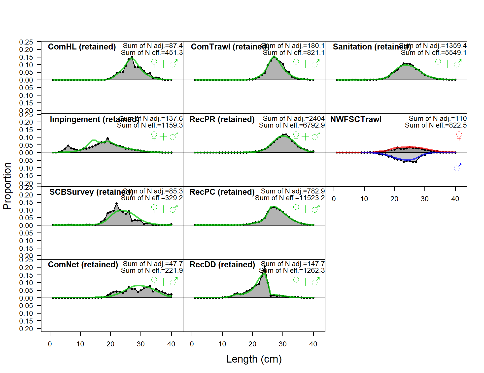
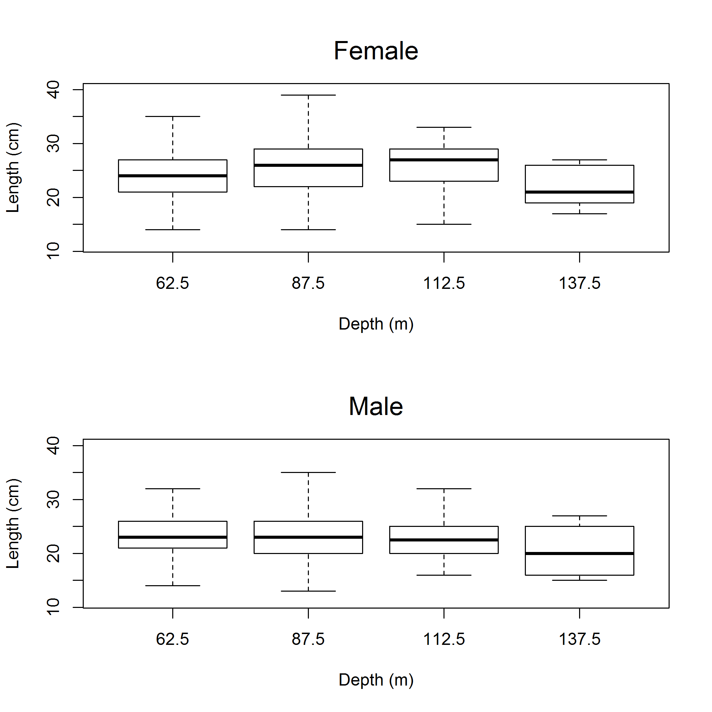

```{r global_options, include=FALSE}
    # set global options for R code chunks: echo=FALSE (don't include source code); 
    # warning=FALSE (suppress R warnings); message=FALSE (suppress R messages)
    # eval = TRUE is default
    knitr::opts_chunk$set(echo = FALSE, warning = FALSE, message = FALSE)
    library(knitr)
    library(xtable)
    # Change options  
      options(xtable.comment = FALSE)  # turns off xtable comments
      options(scipen=999)              # turns off scientific notation

    # Read in preamble R code - including required libraries and the SS file(s)
    source('./Rcode/Preamble.R')
 
    # Read in data/manipulations for executive summary tables and figures
    # It may take time to edit this file and get it ready for your assessment
    # Make small changes in this file and then try to compile the document
    # Commit when you have a success!
    source('./Rcode/Exec_summary_figs_tables.R')
      
    cat(knit_child(text=readLines('8_Tables.Rmd')), sep = '\n')
    cat(knit_child(text=readLines('8a_Tables.Rmd')), sep = '\n')
```

<!--------------------------------------------------------------------------------->
#Background
<!--------------------------------------------------------------------------------->
##California scorpionfish (*Scorpaena guttata*)


\begin{itemize} 
 \item[$\bullet$] Most common species of \emph{Scorpaena} on the U.S. West Coast, more species in Mexico
 \item[$\bullet$] Venomous dorsal, anal and pelvic spines
 \item[$\bullet$] Demersal, found over both hard and soft bottom (anectodtal evidence sugggests they prefer \emph{new} structure)
 \item[$\bullet$] Exhibit aggregating behavior (spawning and non-spawning aggregations)  
\end{itemize}

\centering
\includegraphics[width=.5\textwidth]{cover_photo}

##Early Life History

\begin{itemize} 
\item[$\bullet$] Migration to spawning grounds, exhibit explosive breeding behavior just before dawn
\item[$\bullet$] External fertilization, females produce hollow gelatenous single-layer floating egg matrix
\item[$\bullet$] Eggs hatch after about 5 days
\item[$\bullet$] Juveniles settle at less than 2 cm 
\end{itemize}

\centering
\includegraphics[width=.5\textwidth]{Figures/baby_scorp}

\footnotetext{Line drawning from CalCOFI Atlas 33, pg. 789 Figure 26}

##Distribution and Stock Assessment Boundary
\begincols
  \begincol{.5\textwidth}


  \endcol
  \begincol{.5\textwidth}
\begin{itemize} 
 \item[$\bullet$] Distributed from central California to Punta Eugenia, Baja California Sur, Mexico 
 \item[$\bullet$] Assessment south of Pt. Conception to U.S/Mexico border 
 \item[$\bullet$] Observed from the intertidal to 600 ft,  prefer depths of 20-450 ft  
 \item[$\bullet$] Proportion of the stock in Mexican waters unknown
\end{itemize} 
  \endcol
\endcols

##2005 Stock Assessment

\begin{itemize}
\item[$\bullet$] Transitioning from the 2005 assessment, an error was found
\item[$\bullet$] Harvest rate hit the bounds for the recreational fleet
\item[$\bullet$] Not all of the recreational catch was removed in the model
\item[$\bullet$] Input vs. estimated catch was not standard output in SS v.1.8
\end{itemize}


\begincols
  \begincol{.5\textwidth}
  
  
  
  \endcol
  \begincol{.5\textwidth}
   
  
  
  \endcol
\endcols


##2005 Stock Assessment

\begincols
  \begincol{.5\textwidth}

\begin{itemize}
\item[$\bullet$] \textcolor{blue}{2005 assessment, SS v.1.8}
\item[$\bullet$] \textcolor{red}{2005 model in SS3.24z}
\item[$\bullet$] \textcolor{violet}{2017 pre-STAR base model, SS3.30.0.05}
\item[$\bullet$] The two assessments have very similar trends over time, with $B_0$ higher for the 2017 assessment that includes all removals
\end{itemize}

  \endcol
  \begincol{.5\textwidth}
  

  
  \endcol
\endcols


##2017 Stock Assessment
Pre-STAR Base Model

\begin{itemize}
\item[$\bullet$] One area south of Pt. Conception 
\begin{itemize}
\item[$\circ$] Catches from Mexican waters excluded as in 2005
\end{itemize}
\item[$\bullet$] Steepness fixed at 0.718
\item[$\bullet$] Sex-specific $M$ fixed for females, male $M$ estimated as offset
\item[$\bullet$] Re-evaluated fleet definitions
\item[$\bullet$] Ages now available from the NWFSC trawl survey
\item[$\bullet$] New indices and length compositions available
\item[$\bullet$] Newest version of SS allows specification of the minimmum sample size
\end{itemize}


<!--------------------------------------------------------------------------------->
#Catch
<!--------------------------------------------------------------------------------->
##Catches by Fleet
\centering


##Recreational Catch
\begincols
  \begincol{.4\textwidth}

\begin{itemize}
\item[$\bullet$] 2005 assessment used number of fish for recreational catches
\item[$\bullet$] 2017 assessment includes one recreational discard fleet
\begin{itemize}
\item[$\circ$] Discard mortality rate of 7\%
\item[$\circ$] Discard biomass accounts for  $<$3\% of recreational mortality
\end{itemize}
\end{itemize}

\endcol
  \begincol{.6\textwidth}
\includegraphics[totalheight=0.65\textheight]{California_scorpionfish_2017_files/figure-latex/unnamed-chunk-16-1.pdf}  
  \endcol
\endcols

##Commercial Catch
\begincols
  \begincol{.4\textwidth}
 \begin{itemize}
  \item[$\bullet$] Historical catches same as the 2005 assessment
  \item[$\bullet$] California Fisheries Information System (CFIS) landings data used to update catches from 2005-2016 
  \item[$\bullet$] Discards assumed neglible
\end{itemize}
   \endcol
  \begincol{.55\textwidth}

  \endcol
\endcols


<!--------------------------------------------------------------------------------->
#Indices
<!--------------------------------------------------------------------------------->
##Indices of Abundance


##Indices of Abundance
- All of the methods used to standardize indices have been endorsed by the SSC

```{r, results = 'asis'}
    # Years read in as factor - change to shorten.
      Index_summary$Years = as.character(Index_summary$Years)
      Index_summary[7,2] = paste0("'94, '98, '03, '08, '13")
      Index_summary = Index_summary[,c(3,2,4,6)]

    # Print index summary table
      print(xtable(Index_summary,
                   align = 'lp{2.5in}p{0.8in}p{.4in}p{2in}'),
            include.rownames=FALSE,
            scalebox = 0.7,
            sanitize.text.function = function(x){x})
```


##Indices of Abundance


<!--------------------------------------------------------------------------------->
#Composition
<!--------------------------------------------------------------------------------->
##Length compositions were provided from the following sources:

\begin{itemize}
  \item[$\bullet$] CDFW market category study (\emph{commercial dead fish}, 1996-2003)    
  \item[$\bullet$] CALCOM (\emph{commercial dead fish}, 2013-2016)    
  \item[$\bullet$] CDFW onboard observer (\emph{recreational charter discards}, 2003-2016)  
  \item[$\bullet$] Collins and Crooke onboard observer surveys (1975-1978) 
  \item[$\bullet$] Ally onboard observer study (\emph{recreational charter kept/discards}, 1984-1989)  
  \item[$\bullet$] MRFSS (1980-2003) and CRFS (2004-2014) (\emph{private and party/charter, kept})
  \item[$\bullet$] POTW trawl surveys (\emph{research}, 1970-2016)      
  \item[$\bullet$] CSUN/VRG gillnet survey (\emph{research}, 1995-2008)        
  \item[$\bullet$] Power plant impingement surveys (\emph{research}, 1974-2016)  
  \item[$\bullet$] Southern California Bight trawl survey (\emph{research}, 1994, 1998, 2003, 2008, 2013) 
\end{itemize}

##Aggregate length composition



##Commercial fishery length composition
\begincols
  \begincol{.5\textwidth}
  \centering
  Commercial hook-and-line
\includegraphics[height=3cm]{r4ss/plots_mod1/comp_lendat_bubflt1mkt2.png}

Commercial gillnet
\includegraphics[height=3cm]{r4ss/plots_mod1/comp_lendat_bubflt2mkt2.png}
  \endcol
  \begincol{.5\textwidth}
  \centering
  Commercial trawl
\includegraphics[height=4cm]{r4ss/plots_mod1/comp_lendat_bubflt3mkt2.png}
  \endcol
\endcols


##Recreational fishery Length Composition
\begincols
  \begincol{.5\textwidth}
  Recreational private fleet
\includegraphics[height=3cm]{r4ss/plots_mod1/comp_lendat_bubflt4mkt2.png}

Recreational party/charter fleet
\includegraphics[height=3cm]{r4ss/plots_mod1/comp_lendat_bubflt5mkt2_page2.png}
  \endcol
  \begincol{.5\textwidth}
  \centering
  
  Recreational dead discards
\includegraphics[height=4cm]{r4ss/plots_mod1/comp_lendat_bubflt6mkt2.png}
  \endcol
\endcols

##Research Length Composition

\begincols
  \begincol{.5\textwidth}
  POTW survey
\includegraphics[height=3cm]{r4ss/plots_mod1/comp_lendat_bubflt7mkt2_page2.png}


Impingement survey
\includegraphics[height=3cm]{r4ss/plots_mod1/comp_lendat_bubflt10mkt2.png}

Bight trawl survey
\includegraphics[height=3cm]{r4ss/plots_mod1/comp_lendat_bubflt11mkt2.png}
  \endcol
\endcols

##NWFSC Length and Age Composition
Note: females in red and males in blue
\begincols
  \begincol{.5\textwidth}
\includegraphics[height=.5\textheight]{r4ss/plots_mod1/comp_condAALdat_bubflt8mkt0_page1.png}
  \endcol
  \begincol{.5\textwidth}
\includegraphics[height=.5\textheight]{r4ss/plots_mod1/comp_condAALdat_bubflt8mkt0_page2.png}
  \endcol
\endcols

<!--------------------------------------------------------------------------------->
#Biological
<!--------------------------------------------------------------------------------->
##Length data
\begin{itemize}
\item[$\bullet$] 2005 assessment used standard length
\item[$\bullet$] Impingement, POTW, and Bight surveys measure standard length
\item[$\bullet$] 2017 assessment uses total length (conversion based on a CDFW halibut trawl study; measured both SL and TL)
\item[$\bullet$] To avoid gaps in TL length bins, TL = SL - 0.5 + U[0,1] 
\end{itemize}

\includegraphics[height=.5\textheight]{Figures/SL_to_TL_compare.png}

##Length data
POTW lengths
\begincols
  \begincol{.4\textwidth}
\includegraphics{Figures/Fleet7_Sanitation_lengthboxplots.png}
  \endcol
  \begincol{.6\textwidth}
\includegraphics{Figures/Fleet7_Sanitation_length_source.png}  
  \endcol
\endcols


##Length-at-Age

\begincols
  \begincol{.4\textwidth}
    \includegraphics[trim={0 0 0 2cm}, totalheight=0.65\textheight]{Figures/Age_length_bySex.png}
  \endcol
  \begincol{.48\textwidth}

   \endcol
\endcols


##Length-at-Age

\begincols
  \begincol{.4\textwidth}
  
\endcol
\begincol{.48\textwidth}
  
 \endcol
\endcols
 
<!--------------------------------------------------------------------------------->
#Model
<!--------------------------------------------------------------------------------->
##Model Specifications
\begin{itemize}
\item[$\bullet$] Stock Synthesis version 3.30.05.04
\item[$\bullet$] Model starts in 1916, unfished equilibrium catch prior to that
\item[$\bullet$] Sex-specific growth and mortality with female $M$ fixed at 0.2571 (prior) and male $M$ offset is estimated at -0.2134 (male $M$ = 0.2077)
\begin{itemize}
\item[$\circ$] $M$ fixed at 0.25 for both sexes in 2005 assessment
\end{itemize}
\item[$\bullet$] Steepness fixed at 0.718 (from meta-analysis)
\begin{itemize}
\item[$\circ$] $h$ fixed at 0.7 in 2005 assessment
\end{itemize}
\item[$\bullet$] Maximum age of 21
\item[$\bullet$] One cm length bins
\item[$\bullet$] Recruitment deviations estimated
\end{itemize}

##Selectivity
\begin{itemize}
\item[$\bullet$] Time blocks
\begin{itemize}
\item[$\circ$] Commercial fleet: 1916-1999 and 2000-2016 (10-in. minimum size limit as of 2000)
\item[$\circ$] Recreational fleets: 1916-2000 (few regulations), 2001-2005 (fishery closures), 2006-2016 (consistent regulations)
\end{itemize}
\item[$\bullet$] Double normal except for the impingement survey (Selectivity = 1.0 for all ages)
\item[$\bullet$] Fisheries selectivity parameters estimated for commercial hook-and-line, receational private, recreational party/charter, and recreational discard fleets
\end{itemize}

##Selectivity
\begin{itemize}
\item[$\bullet$] Commercial gillnet and trawl fleets mirrored to the commercial hook-and-line fleet
\item[$\bullet$] Recreational CPFV onboard observer retained catch mirrored to the recreational party/charter fleet selectivity (same boats)
\item[$\bullet$] Survey selectivity parameters estimated for the POTW and NWFSC trawl surveys
\item[$\bullet$] The gillnet survey and Bight trawl survey mirrored to the POTW selectivity 
\end{itemize}
\centering
\includegraphics[height=4cm]{r4ss/plots_mod1/sel01_multiple_fleets_length1.png}


##Selectivity
\begincols
  \begincol{.5\textwidth}
\includegraphics[height=4cm]{r4ss/plots_mod1/sel03_len_timevary_surf_flt1sex1.png}

\includegraphics[height=4cm]{r4ss/plots_mod1/sel03_len_timevary_surf_flt4sex1.png}
  \endcol
  \begincol{.5\textwidth}

\includegraphics[height=4cm]{r4ss/plots_mod1/sel03_len_timevary_surf_flt5sex1.png}  
\includegraphics[height=4cm]{r4ss/plots_mod1/sel09_len_flt6sex1.png}  
  \endcol
\endcols

##Gear Selectivity
\begincols
  \begincol{.5\textwidth}
\includegraphics[height=4cm]{r4ss/plots_mod1/sel09_len_flt7sex1.png}

 \endcol
  \begincol{.5\textwidth}
\includegraphics[height=4cm]{r4ss/plots_mod1/sel09_len_flt8sex1.png} 
  \endcol
\endcols

##Data Weighting
\begin{itemize}
\item[$\bullet$] Extra SD estimated for indices
\item[$\bullet$] Francis weighting applied to length and age data
\item[$\bullet$] Conducted sensitivities to no weighting and harmonic means
\end{itemize}

\begincols
  \begincol{.5\textwidth}
\includegraphics[height=4cm]{Figures/Data_weighting_spawnb.png}
  \endcol
  \begincol{.5\textwidth}
  \includegraphics[height=4cm]{Figures/Data_weighting_Bratio.png}
  \endcol
\endcols


##Base Model Output (page 1)
```{r results='asis'}
    mod_params1 = mod_params[1:24,-1]

  colnames(mod_params1) = c( 'Parameter',
                             'Value',
                             'Phase',
                             'Bounds',
                             'Status',
                             'SD',
                             'Prior (Exp.Val, SD)')
  
  print(xtable(mod_params1,
               align='lp{1.9in}p{.6in}p{.6in}p{.9in}p{.4in}p{.4in}p{2in}',
        digits=c(0,0,3,0,3,0,3,0)),
        scalebox=.5,
        include.rownames = FALSE)
```


##Pre-STAR Base Model Output (page 2)
```{r results='asis'}
    mod_params1 = mod_params[25:50,-1]

  colnames(mod_params1) = c( 'Parameter',
                             'Value',
                             'Phase',
                             'Bounds',
                             'Status',
                             'SD',
                             'Prior (Exp.Val, SD)')
  
  print(xtable(mod_params1,
               align='lp{1.9in}p{.6in}p{.6in}p{.9in}p{.4in}p{.4in}p{2in}',
        digits=c(0,0,3,0,3,0,3,0)),
        scalebox=.5,
        include.rownames = FALSE)
```

##Pre-STAR Base Model Output (page 3)
```{r results='asis'}
    mod_params1 = mod_params[51:75,-1]

  colnames(mod_params1) = c( 'Parameter',
                             'Value',
                             'Phase',
                             'Bounds',
                             'Status',
                             'SD',
                             'Prior (Exp.Val, SD)')
  
  print(xtable(mod_params1,
               align='lp{1.9in}p{.6in}p{.6in}p{.9in}p{.4in}p{.4in}p{2.1in}',
               digits=c(0,0,3,0,3,0,3,0)),
        scalebox=.5,
        include.rownames = FALSE)
```


##Pre-STAR Base Model Output (page 4)
```{r results='asis'}
    mod_params1 = mod_params[75:100,-1]

  colnames(mod_params1) = c( 'Parameter',
                             'Value',
                             'Phase',
                             'Bounds',
                             'Status',
                             'SD',
                             'Prior (Exp.Val, SD)')
  
  print(xtable(mod_params1,
               align='lp{2.5in}p{.6in}p{.6in}p{.9in}p{.4in}p{.4in}p{.4in}',
               digits=c(0,0,3,0,3,0,3,0)),
        scalebox=.5,
        include.rownames = FALSE)
```


##Base Model Output
```{r results = 'asis'}
     SpawnDepletemod1_1 = SpawnDepletemod1
     colnames(SpawnDepletemod1_1) = c('Year','Spawning biomass(mt)','95% CI','Depletion','95% CI')
     print(xtable(SpawnDepletemod1,
                  align = 'llp{1in}p{1.2in}p{1in}p{1.2in}'), 
          include.rownames=FALSE,
          scalebox=0.8)  
```

##Base Model Output
```{r results = 'asis'}
   mngmnt1 = mngmnt
   colnames(mngmnt1) = c('Year','OFL','ABC','ACL','ACT','Total Catch')
   print(xtable(mngmnt1,
                align = 'lp{.8in}p{.8in}p{.8in}p{.8in}p{.8in}p{.8in}'), 
         scalebox=.7,
         include.rownames=FALSE, 
         sanitize.text.function = function(x){x})  
```


<!--------------------------------------------------------------------------------->
#Uncertainty
<!--------------------------------------------------------------------------------->
##Sensitivities
Sensitivities to Likelihood Components and Model Specification
\begincols
  \begincol{.5\textwidth}
\includegraphics{Figures/Sensitivity_All.pdf}
  \endcol
  \begincol{.5\textwidth}
\begin{itemize}
\item Remove fleets, only one index, or length composition only
\item Sensitivity relative to the base model
\item Boxes are the 95\% CI from the base model
\item Metrics
\begin{itemize}
\item $SB_0$ Population scale
\item $SB_{2017}$ Population scale
\item $SB_{2017}/SB_{0}$ Depletion/Population status
\item $MSY_{SPR50\%}$ Yield/Productivity/scale
\end{itemize}
\end{itemize}
  \endcol
\endcols


##Sensitivities - All

\includegraphics{Figures/Sensitivity_Yield.pdf}


