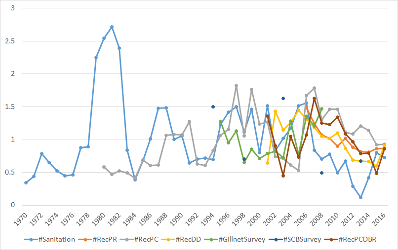
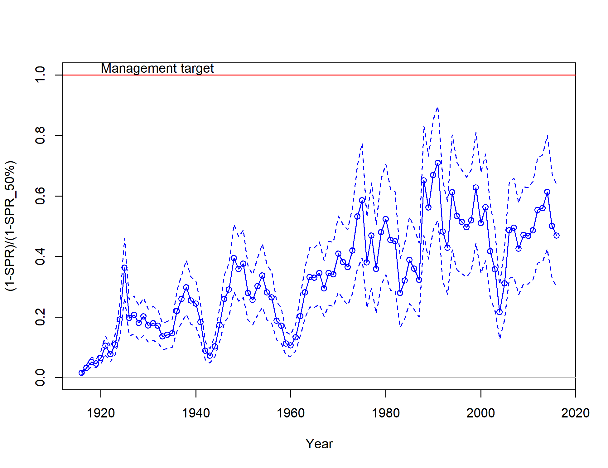
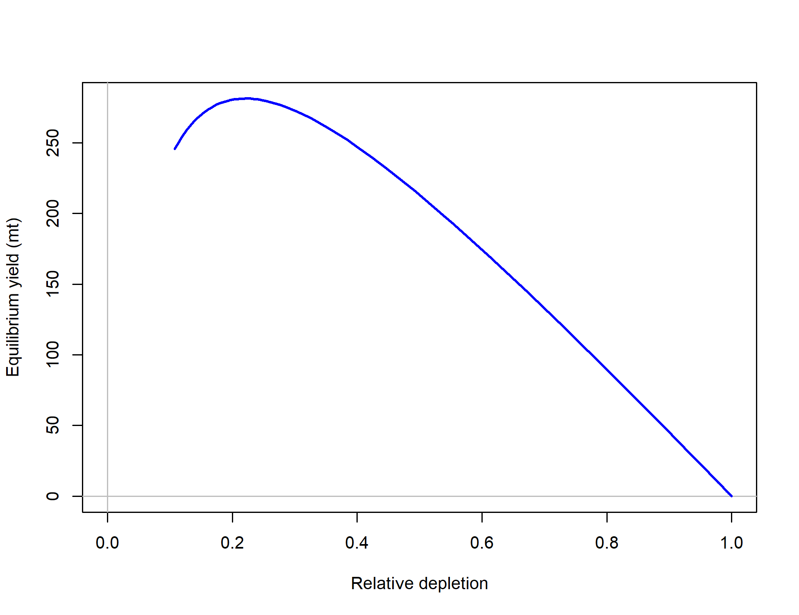

```{r global_options, include=FALSE}
    # set global options for R code chunks: echo=FALSE (don't include source code); 
    # warning=FALSE (suppress R warnings); message=FALSE (suppress R messages)
    # eval = TRUE is default
    knitr::opts_chunk$set(echo = FALSE, warning = FALSE, message = FALSE)
    library(knitr)
    library(xtable)
    # Change options  
      options(xtable.comment = FALSE)  # turns off xtable comments
      options(scipen=999)              # turns off scientific notation

    # Read in preamble R code - including required libraries and the SS file(s)
    source('./Rcode/Preamble.R')
 
    # Read in data/manipulations for executive summary tables and figures
    # It may take time to edit this file and get it ready for your assessment
    # Make small changes in this file and then try to compile the document
    # Commit when you have a success!
    source('./Rcode/Exec_summary_figs_tables.R')
      
    cat(knit_child(text=readLines('8_Tables.Rmd')), sep = '\n')
    cat(knit_child(text=readLines('8a_Tables.Rmd')), sep = '\n')
```

<!--------------------------------------------------------------------------------->
#Background
<!--------------------------------------------------------------------------------->
##California scorpionfish (*Scorpaena guttata*)


\begin{itemize} 
 \item[$\bullet$] Most common species of \emph{Scorpaena} on the U.S. West Coast, more species in Mexico
 \item[$\bullet$] Venomous dorsal, anal and pelvic spines
 \item[$\bullet$] Demersal, found over both hard and soft bottom (anectodtal evidence sugggests they prefer \emph{new} structure)
 \item[$\bullet$] Exhibit aggregating behavior (spawning and non-spawning aggregations)  
\end{itemize}

\centering
\includegraphics[width=.5\textwidth]{cover_photo}


##Distribution and Stock Assessment Boundary
\begincols
  \begincol{.5\textwidth}


  \endcol
  \begincol{.5\textwidth}
\begin{itemize} 
 \item[$\bullet$] Distributed from central California to Punta Eugenia, Baja California Sur, Mexico 
 \item[$\bullet$] Assessment south of Pt. Conception to U.S/Mexico border 
 \item[$\bullet$] Observed from the intertidal to 600 ft,  prefer depths of 20-450 ft  
 \item[$\bullet$] Proportion of the stock in Mexican waters unknown
\end{itemize} 
  \endcol
\endcols

##2005 Stock Assessment

\begin{itemize}
\item[$\bullet$] Transitioning from the 2005 assessment, an error was found
\item[$\bullet$] Harvest rate hit the bounds for the recreational fleet
\item[$\bullet$] Not all of the recreational catch was removed in the model
\item[$\bullet$] Input vs. estimated catch was not standard output in SS v.1.8
\end{itemize}


\begincols
  \begincol{.5\textwidth}
  
  
  
  \endcol
  \begincol{.5\textwidth}
   
  
  
  \endcol
\endcols


##2005 Stock Assessment

\begincols
  \begincol{.5\textwidth}

\begin{itemize}
\item[$\bullet$] \textcolor{blue}{2005 assessment, SS v.1.8}
\item[$\bullet$] \textcolor{red}{2005 model in SS3.24z}
\item[$\bullet$] \textcolor{violet}{2017 pre-STAR base model, SS3.30.0.05}
\item[$\bullet$] The two assessments have very similar trends over time, with $B_0$ higher for the 2017 assessment that includes all removals
\end{itemize}

  \endcol
  \begincol{.5\textwidth}
  

  
  \endcol
\endcols


##2017 Stock Assessment
Pre-STAR Base Model

\begin{itemize}
\item[$\bullet$] One area model, south of Pt. Conception 
\begin{itemize}
\item[$\circ$] Catches from Mexican waters excluded as in 2005
\end{itemize}
\item[$\bullet$] Steepness fixed at 0.718
\item[$\bullet$] Same $M$ for males and females fixed at 0.235
\item[$\bullet$] Re-evaluated fleet definitions
\item[$\bullet$] Ages now available from the NWFSC trawl survey
\item[$\bullet$] New indices and length compositions available
\item[$\bullet$] Newest version of SS allows specification of the minimmum sample size
\end{itemize}


<!--------------------------------------------------------------------------------->
#Data
<!--------------------------------------------------------------------------------->
##Catches by Fleet
\centering


##Indices of Abundance


##Indices of Abundance
- All of the methods used to standardize indices have been endorsed by the SSC

```{r, results = 'asis'}
    # Years read in as factor - change to shorten.
      Index_summary$Years = as.character(Index_summary$Years)
      Index_summary[7,2] = paste0("'94, '98, '03, '08, '13")
      Index_summary = Index_summary[,c(3,2,4,6)]

    # Print index summary table
      print(xtable(Index_summary,
                   align = 'lp{2.5in}p{0.8in}p{.4in}p{2in}'),
            include.rownames=FALSE,
            scalebox = 0.7,
            sanitize.text.function = function(x){x})
```


##Indices of Abundance
\begincols
  \begincol{.5\textwidth}
   \begin{itemize}
\item[$\bullet$] Stephens-MacCall threshold exploration for the dockside recreational charter boat index
\item[$\bullet$] Index not used in the assessment, charter boat logbook used
\end{itemize}
  \endcol
  \begincol{.5\textwidth}

   \endcol
\endcols


##Indices of Abundance



##Aggregate length composition


##NWFSC Length and Age Composition
Note: females in red and males in blue
\begincols
  \begincol{.5\textwidth}
\includegraphics[height=.5\textheight]{r4ss/plots_mod1/comp_condAALdat_bubflt8mkt0_page1.png}
  \endcol
  \begincol{.5\textwidth}
\includegraphics[height=.5\textheight]{r4ss/plots_mod1/comp_condAALdat_bubflt8mkt0_page2.png}
  \endcol
\endcols


##Length-at-Age

\begincols
  \begincol{.4\textwidth}
    \includegraphics[trim={0 0 0 2cm}, totalheight=0.65\textheight]{Figures/Age_length_bySex.png}
  \endcol
  \begincol{.48\textwidth}

   \endcol
\endcols


 
<!--------------------------------------------------------------------------------->
#Model
<!--------------------------------------------------------------------------------->
##Model Specifications
\begin{itemize}
\item[$\bullet$] Stock Synthesis version 3.30.05.04
\item[$\bullet$] Model starts in 1916, unfished equilibrium catch prior to that
\item[$\bullet$] $M$ fixed at 0.235 for both sexes
\begin{itemize}
\item[$\circ$] $M$ fixed at 0.25 for both sexes in 2005 assessment
\end{itemize}
\item[$\bullet$] Steepness fixed at 0.718 (from meta-analysis)
\begin{itemize}
\item[$\circ$] $h$ fixed at 0.7 in 2005 assessment
\end{itemize}
\item[$\bullet$] Maximum age of 21
\item[$\bullet$] One cm length bins
\item[$\bullet$] Recruitment deviations estimated
\end{itemize}

##Selectivity
\begin{itemize}
\item[$\bullet$] Time blocks
\begin{itemize}
\item[$\circ$] Commercial fleet: 1916-1999 and 2000-2016 (10-in. minimum size limit as of 2000)
\item[$\circ$] Recreational fleets: 1916-2000 (few regulations), 2001-2005 (fishery closures), 2006-2016 (consistent regulations)
\end{itemize}
\item[$\bullet$] Double normal selectivity
\item[$\bullet$] Fisheries selectivity parameters estimated for commercial hook-and-line, receational private, recreational party/charter, and recreational discard fleets
\end{itemize}

##Stock Status - Biomass
\centering
_with_95_asymptotic_intervals_intervals.png)

##Stock Status - Depletion
\centering


##Stock Status - Recruitment
\centering
_with_95_asymptotic_intervals.png)

##Stock Status - Exploitation
\begincols
  \begincol{.5\textwidth}

  \endcol
  \begincol{.5\textwidth}

  \endcol
\endcols


##Stock Status - Eq. Yield
\centering



##Reference Points
```{r, results='asis'}
   # Print reference point tables
  
     print(xtable(Ref_pts_mod1.table), 
                  include.rownames = FALSE,
           sanitize.text.function = function(x){x},
           scalebox=0.7)
   
```


##Decision Table
```{r, results='asis'}   
    # print Model 1 decision table
        addtorow <- list()
        addtorow$pos <- list()
        addtorow$pos[[1]] <- -1
        addtorow$pos[[2]] <- -1
        addtorow$command <- c( ' \\multicolumn{3}{c}{}  &  \\multicolumn{2}{c}{} 
                               & \\multicolumn{2}{c}{\\textbf{States of nature}} 
                               & \\multicolumn{2}{c}{} \\\\\n', 
                               ' \\multicolumn{3}{c}{}  &  \\multicolumn{2}{c}{Low M 0.164} 
                               & \\multicolumn{2}{c}{Base M 0.235} 
                               &  \\multicolumn{2}{c}{High M 0.2745} \\\\\n')
        
    print(xtable(decision_mod1.table,
                 align = c('l','l|','c','c|','>{\\centering}p{.7in}',
                           'c|','>{\\centering}p{.7in}','c|','>{\\centering}p{.7in}','c')), 
          add.to.row = addtorow, 
          include.rownames = FALSE, 
          hline.after = c(-1, 0, 10, 20, 30, nrow(decision_mod1.table)), 
          scalebox = .45)
```
<!--------------------------------------------------------------------------------->
#Uncertainty
<!--------------------------------------------------------------------------------->
##Sensitivities - All

\includegraphics{Figures/Sensitivity_All.pdf}

##Research and Data Needs

\begin{itemize}
\item[$\bullet$] \textbf{Natural mortality and steepness}: Both natural mortality and steepness were 
fixed in the base model.  The natural mortality estimate used the assessment 
was based on maximum age and steepness based on rockfish species meta-analysis.

\item[$\bullet$] \textbf{Stock south of the U.S. border}:  No available information on the status of California scorpionfish in Mexico could be found.

\item[$\bullet$] \textbf{Sex ratio}:  The sex ratio in the only published work by Love et al.
(\protect\hyperlink{ref-Love1987}{1987}) and samples 
from the NWFSC trawl survey were skewed towards males.

\item[$\bullet$] \textbf{Aggregating behavior}: Aggregative behavior in both spawning and 
non-spawning seasons of California scorpionfish is not well understood.

\end{itemize}

##Research and Data Needs
\begin{itemize}

\item[$\bullet$] \textbf{Fecundity/maturity}: A reproductive biology study of California 
scorpionfish is needed.There are currently no estimates of fecundity 
for California scorpionfish and no studies have been done of the relationship between weight and reproductive 
output.

\item[$\bullet$] \textbf{Discard mortality}: Many scorpionfish are discarded at sea. The assessment 
used estimates of discard mortality of a distantly related species (lingcod) 
in a different ecological setting (Karpov \protect\hyperlink{ref-Karpov1996}{1996}). 


\item[$\bullet$] \textbf{Environmental covariates}: The relationship between environmental 
conditions and recruitment for scorpionfish should be further explored. Preliminary 
exploration using CalCOFI temperature data suggested that a relationship existed, 
but other time series may correlate more strongly given that scorpionfish are a 
near-shore species.

\end{itemize}


##Research and Data Needs
\begin{itemize}

\item[$\bullet$] \textbf{Discard fleet modeling}: Modeling discard as a separate fleet, as 
was done for California scorpionfish, is a simple and intuitive approach, but 
the strengths and weaknesses of this approach are unclear.

\item[$\bullet$] \textbf{POTW trawl surveys}: Additional biological information 
(sex, otoliths, depth distribution) should be collected for California 
scorpionfish during the Publicly Owned Treatment Works (POTWs) trawl 
survey and the Southern California Bight Regional Monitoring Project 
(SCCWRP) trawl survey.

\item[$\bullet$] \textbf{Age validation}: An age validation study is needed for 
California scorpionfish.

\end{itemize}


##Questions??
\includegraphics[width=\textwidth]{cover_photo}
