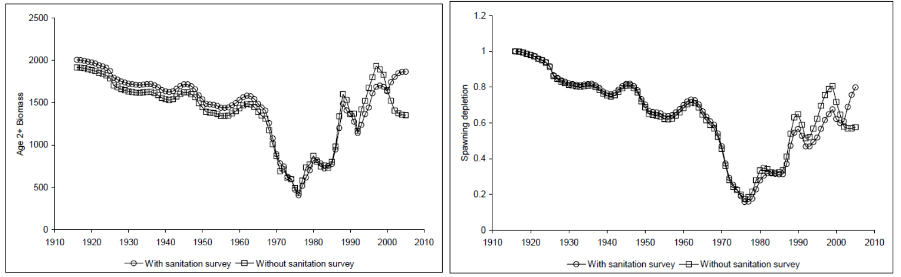

```{r global_options, include=FALSE}
    # set global options for R code chunks: echo=FALSE (don't include source code); 
    # warning=FALSE (suppress R warnings); message=FALSE (suppress R messages)
    # eval = TRUE is default
    knitr::opts_chunk$set(echo = FALSE, warning = FALSE, message = FALSE)
    library(knitr)
    library(xtable)
    # Change options  
      options(xtable.comment = FALSE)  # turns off xtable comments
      options(scipen=999)              # turns off scientific notation

    # Read in preamble R code - including required libraries and the SS file(s)
    source('./Rcode/Preamble.R')
 
    # Read in data/manipulations for executive summary tables and figures
    # It may take time to edit this file and get it ready for your assessment
    # Make small changes in this file and then try to compile the document
    # Commit when you have a success!
    source('./Rcode/Exec_summary_figs_tables.R')
      
    cat(knit_child(text=readLines('8_Tables.Rmd')), sep = '\n')
    cat(knit_child(text=readLines('8a_Tables.Rmd')), sep = '\n')
```

<!--------------------------------------------------------------------------------->
#Background
<!--------------------------------------------------------------------------------->

###California scorpionfish (*Scorpaena guttata*)


\begin{itemize} 
 \item[$\circ$] Most common species of \emph{Scorpaena} on the U.S. West Coast, more species in Mexico
 \item[$\circ$] Venomous dorsal, anal and pelvic spines
 \item[$\circ$] Demersal, found over both hard and soft bottom (prefer \emph{new} structure)
 \item[$\circ$] Exhibit aggregating behavior (spawning and non-spawning aggregations)  
\end{itemize}

\centering
\includegraphics[width=.5\textwidth]{cover_photo}

###Early Life History

\begin{itemize} 
\item[$\circ$] Migration to spawning grounds, exhibit explosive breeding behavior just before dawn
\item[$\circ$] External fertilization, females produce hollow gelatenous single-layer floating egg matrix
\item[$\circ$] Eggs hatch after about 5 days
\item[$\circ$] Juveniles settle at less than 2cm 
\end{itemize}

\centering
\includegraphics[width=.5\textwidth]{Figures/baby_scorp}

\footnotetext{Line drawning from CalCOFI Atlas 33, pg. 789 Figure 26}


###Distribution

\begin{itemize} 
 \item[$\circ$] Distributed from central California to Punta Eugenia, Baja California Sur, Mexico 
 \item[$\circ$] Rarely observed north of Pt. Conception  
 \item[$\circ$] Observed from the intertidal to 600 ft,  prefer 20-450 ft  
 \item[$\circ$] Proportion of the stock in Mexican waters unknown
\end{itemize}

###Distribution


###Stock Assessment Boundary
\centering


###2005 Stock Assessment

\begin{itemize}
\item[$\circ$] Stock first assessed in 2005
\item[$\circ$] South of Pt. Conception
\item[$\circ$] $M$ fixed at 0.25
\item[$\circ$] $h$ 0.7
\end{itemize}




###2005 Stock Assessment

\begin{itemize}
\item[$\circ$] Transitioning from the 2005 assessment, an error was found
\item[$\circ$] Harvest rate hit the bounds for the recreational fleet
\item[$\circ$] Not all of the recreational catch was removed
\item[$\circ$] Input vs. estimated catch was not standard output in SS v.1.8
\end{itemize}


\begincols
  \begincol{.4\textwidth}
  
  
  
  \endcol
  \begincol{.48\textwidth}
   
  
  
  \endcol
\endcols


###2005 Stock Assessment


###2017 Stock Assessment

\begin{itemize}
\item[$\circ$] One area south of Pt. Conception (all catches from Mexican waters excluded as in 2005)
\end{itemize}


##Length-at-age
###Length-at-age

\begincols
  \begincol{.4\textwidth}
  
  \includegraphics[trim={0 0 0 2cm}, totalheight=0.65\textheight]{Figures/Age_length_bySex.png}

  \endcol
  \begincol{.48\textwidth}


  
  \endcol
\endcols


###Length-at-age

\begincols
  \begincol{.4\textwidth}
  


\endcol
\begincol{.48\textwidth}
  


 \endcol
\endcols
 
##Maturity and Fecundity
\begin{itemize}
\item[$\circ$] Only information on maturity from Love et al. (1987)
\item[$\circ$] Found over 50\% of females were mature by 18 cm TL, or two years of age. 
\item[$\circ$] All fish were mature by 22 cm TL
\item[$\circ$] No information available on fecundity of California scorpionfish
\end{itemize}

##Weight-at-length
 
 
 

##Natural mortality
\begin{itemize}
\item[$\circ$] Prior based on maximum age of 21
\item[$\circ$] Lognormal distribution with a median of 0.2715
\item[$\circ$] Base model fixes female natural mortality ($M$)
\item[$\circ$] Male $M$ estiamted as offset from female $M$
\item[$\circ$] Sensitivities explore estimating $M$
\end{itemize}

##Steepness: Density-Dependent Recruitment Compensation
\begin{itemize}
\item[$\circ$] Predictive distribution for Pacific rockfish meta-analysis
\item[$\circ$] Preior mediant in 2017 for steepness ($h$) = 0.718
\end{itemize}


<!--------------------------------------------------------------------------------->
#Removals
<!--------------------------------------------------------------------------------->

##Total Removals 

\centering
\includegraphics{California_scorpionfish_2017_files/figure-latex/unnamed-chunk-16-1.pdf}


##Total Removals 


##Total Removals 


##Commercial Landings by Fleet


##Recreational Landings by Fleet

 
<!--------------------------------------------------------------------------------->
#Index Data
<!--------------------------------------------------------------------------------->
 

##Summary of Data Sources

- All of the methods used to standardize indices have been endorsed by the SSC

```{r, results = 'asis'}
    # Years read in as factor - change to shorten.
      Index_summary$Years = as.character(Index_summary$Years)
      Index_summary[7,2] = paste0("'94, '98, '03, '08, '13")
      Index_summary = Index_summary[,c(3,2,4,6)]

    # Print index summary table
      print(xtable(Index_summary,
                   align = 'lp{2.5in}p{0.8in}p{.4in}p{2in}'),
            include.rownames=FALSE,
            scalebox = 0.7,
            sanitize.text.function = function(x){x})
```
 

##Recreational Private Boat Index

##Recreational Party/Charter Boat Index (Logbook)

##Recreational Dead Discard Index

##Recreational Party/Charter Retained Catch Index


##Sanitation Districts Survey Index
```{r, results='asis'}
  print(xtable(Fleet7_lengthdepth),
                include.rownames=FALSE,
                scalebox = 0.9,
                sanitize.text.function = function(x){x})
```
##Sanitation Districts Survey Index

##Sanitation Districts Survey Index

##NWFSC Trawl Survey Index

##Gillnet Survey Index

##Southern California Bight Trawl Survey Index


<!--------------------------------------------------------------------------------->
#Composition Data
<!--------------------------------------------------------------------------------->

##Dat1


##Summary of Data used in the 2017 Assessment


<!--------------------------------------------------------------------------------->
#2017 assessment
<!--------------------------------------------------------------------------------->


<!--------------------------------------------------------------------------------->
#Uncertainty and Sensitivities
<!--------------------------------------------------------------------------------->


<!--------------------------------------------------------------------------------->
#Additional slides
<!--------------------------------------------------------------------------------->

```{r child = "9_9_Appendices.Rmd"}
```
