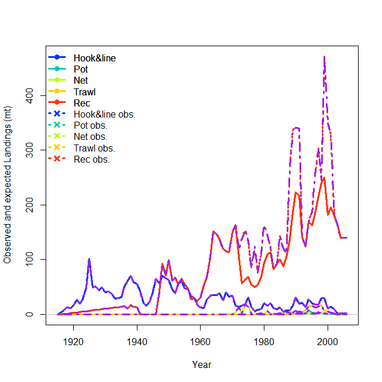
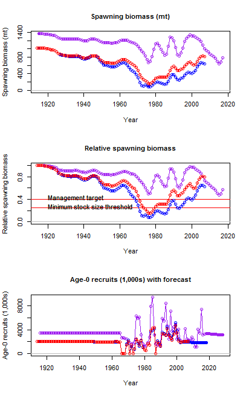
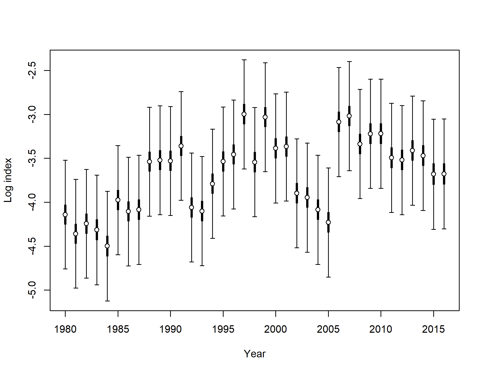
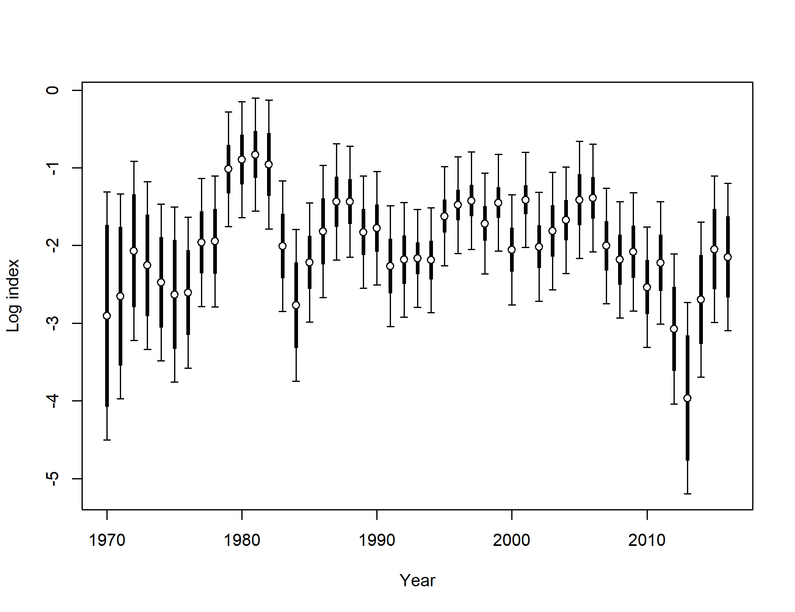
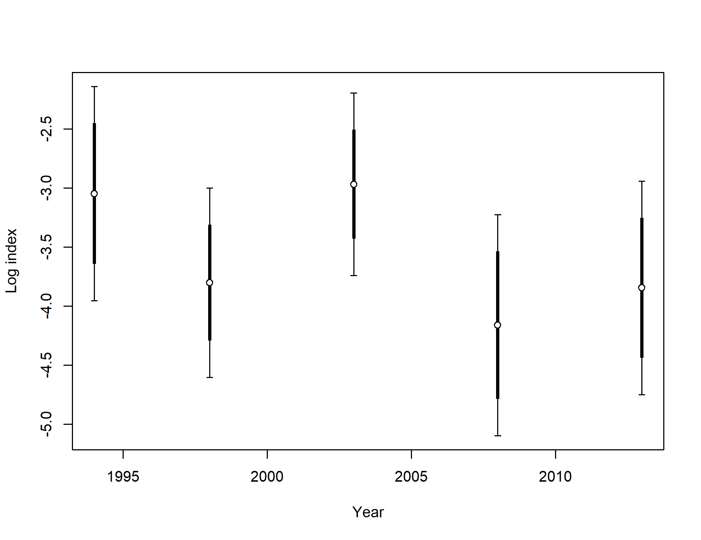

```{r global_options, include=FALSE}
    # set global options for R code chunks: echo=FALSE (don't include source code); 
    # warning=FALSE (suppress R warnings); message=FALSE (suppress R messages)
    # eval = TRUE is default
    knitr::opts_chunk$set(echo = FALSE, warning = FALSE, message = FALSE)
    library(knitr)
    library(xtable)
    # Change options  
      options(xtable.comment = FALSE)  # turns off xtable comments
      options(scipen=999)              # turns off scientific notation

    # Read in preamble R code - including required libraries and the SS file(s)
    source('./Rcode/Preamble.R')
 
    # Read in data/manipulations for executive summary tables and figures
    # It may take time to edit this file and get it ready for your assessment
    # Make small changes in this file and then try to compile the document
    # Commit when you have a success!
    source('./Rcode/Exec_summary_figs_tables.R')
      
    cat(knit_child(text=readLines('8_Tables.Rmd')), sep = '\n')
    cat(knit_child(text=readLines('8a_Tables.Rmd')), sep = '\n')
```

<!--------------------------------------------------------------------------------->
#Background
<!--------------------------------------------------------------------------------->
##Background
###California scorpionfish (*Scorpaena guttata*)


\begin{itemize} 
 \item[$\bullet$] Most common species of \emph{Scorpaena} on the U.S. West Coast, more species in Mexico
 \item[$\bullet$] Venomous dorsal, anal and pelvic spines
 \item[$\bullet$] Demersal, found over both hard and soft bottom (anectodtal evidence sugggests they prefer \emph{new} structure)
 \item[$\bullet$] Exhibit aggregating behavior (spawning and non-spawning aggregations)  
\end{itemize}

\centering
\includegraphics[width=.5\textwidth]{cover_photo}

###Early Life History

\begin{itemize} 
\item[$\bullet$] Migration to spawning grounds, exhibit explosive breeding behavior just before dawn
\item[$\bullet$] External fertilization, females produce hollow gelatenous single-layer floating egg matrix
\item[$\bullet$] Eggs hatch after about 5 days
\item[$\bullet$] Juveniles settle at less than 2cm 
\end{itemize}

\centering
\includegraphics[width=.5\textwidth]{Figures/baby_scorp}

\footnotetext{Line drawning from CalCOFI Atlas 33, pg. 789 Figure 26}


###Distribution

\begin{itemize} 
 \item[$\bullet$] Distributed from central California to Punta Eugenia, Baja California Sur, Mexico 
 \item[$\bullet$] Rarely observed north of Pt. Conception  
 \item[$\bullet$] Observed from the intertidal to 600 ft,  prefer depths of 20-450 ft  
 \item[$\bullet$] Proportion of the stock in Mexican waters unknown
\end{itemize}

###Distribution


###Stock Assessment Boundary
\centering


###2005 Stock Assessment

\begin{itemize}
\item[$\bullet$] Stock first assessed in 2005
\item[$\bullet$] South of Pt. Conception
\item[$\bullet$] $M$ fixed at 0.25
\item[$\bullet$] $h$ fixed at 0.7
\item[$\bullet$] Publicly Owned Treatment Works (POTW) monitoring trawl survey was the axis of uncertainty in the 2005 assessment
\begin{itemize}
\item[$\circ$] POTW survey referred to as the Sanitation District Index in 2005
\end{itemize}
\end{itemize}


###2005 Stock Assessment

\begin{itemize}
\item[$\bullet$] Transitioning from the 2005 assessment, an error was found
\item[$\bullet$] Harvest rate hit the bounds for the recreational fleet
\item[$\bullet$] Not all of the recreational catch was removed in the model
\item[$\bullet$] Input vs. estimated catch was not standard output in SS v.1.8
\end{itemize}


\begincols
  \begincol{.5\textwidth}
  
  
  
  \endcol
  \begincol{.5\textwidth}
   
  
  
  \endcol
\endcols


###2005 Stock Assessment

\begincols
  \begincol{.5\textwidth}

\begin{itemize}
\item[$\bullet$] \textcolor{blue}{2005 assessment, SS v.1.8}
\item[$\bullet$] \textcolor{red}{2005 model in SS3.24z}
\item[$\bullet$] \textcolor{violet}{2017 pre-STAR base model, SS3.30.0.05}
\item[$\bullet$] The two assessments have very similar trends over time, with $B_0$ higher for the 2017 assessment that includes all removals
\end{itemize}

  \endcol
  \begincol{.5\textwidth}
  

  
  \endcol
\endcols


###2017 Stock Assessment
Pre-STAR Base Model

\begin{itemize}
\item[$\bullet$] One area south of Pt. Conception 
\begin{itemize}
\item[$\circ$] Catches from Mexican waters excluded as in 2005
\end{itemize}
\item[$\bullet$] Steepness fixed at 0.718
\item[$\bullet$] Sex-specific $M$ fixed for females, male $M$ estimated as offset
\item[$\bullet$] Re-evaluated fleet definitions
\item[$\bullet$] Ages now available from the NWFSC trawl survey
\item[$\bullet$] New indices and length compositions available
\end{itemize}


<!--------------------------------------------------------------------------------->
#Catch
<!--------------------------------------------------------------------------------->
##Catch
###Catches by Fleet
\centering


###U.S. and Mexico Catch 


###Recreational Catch
\begincols
  \begincol{.4\textwidth}

\begin{itemize}
\item[$\bullet$] 2005 assessment used number of fish for recreational catches
\item[$\bullet$] 2017 assessment includes one recreational discard fleet
\begin{itemize}
\item[$\circ$] Discard mortality rate of 7\%
\item[$\circ$] Discard biomass accounts for  $<$3\% of recreational mortality
\end{itemize}
\end{itemize}

\endcol
  \begincol{.55\textwidth}
\includegraphics[totalheight=0.65\textheight]{California_scorpionfish_2017_files/figure-latex/unnamed-chunk-16-1.pdf}  
  \endcol
\endcols

###Commercial Catch
\begincols
  \begincol{.4\textwidth}
 \begin{itemize}
  \item[$\bullet$] Historical catches same as the 2005 assessment
  \item[$\bullet$] California Fisheries Information System (CFIS) landings data used to update catches from 2005-2016 
  \item[$\bullet$] Discards assumed neglible
\end{itemize}
   \endcol
  \begincol{.55\textwidth}

  \endcol
\endcols


<!--------------------------------------------------------------------------------->
#Indices of Abundance
<!--------------------------------------------------------------------------------->
 
###Summary of Data Sources


###Indices of Abundance
- All of the methods used to standardize indices have been endorsed by the SSC

```{r, results = 'asis'}
    # Years read in as factor - change to shorten.
      Index_summary$Years = as.character(Index_summary$Years)
      Index_summary[7,2] = paste0("'94, '98, '03, '08, '13")
      Index_summary = Index_summary[,c(3,2,4,6)]

    # Print index summary table
      print(xtable(Index_summary,
                   align = 'lp{2.5in}p{0.8in}p{.4in}p{2in}'),
            include.rownames=FALSE,
            scalebox = 0.7,
            sanitize.text.function = function(x){x})
```

##Fishery-Dependent Abundance Indices
###Fishery-Dependent Abundance Indices
\begin{itemize}
\item[$\bullet$] CDFW dockside intercept survey of retained catch
\begin{itemize}
\item[$\circ$] Private/rental fleet
\item[$\circ$] Party/charter fleet (developed and not used in base model)
\end{itemize}
\item[$\bullet$] Commercial Passenger Fishing Vessel (CPFV) logbooks 
\item[$\bullet$] CDFW onbord observer survey of the CPFV fleet
\begin{itemize}
\item[$\cdot$] Developed separate indices for retained and discarded catch 
\end{itemize}
\end{itemize}
 
###Indices of Abundance: Delta-GLM Approach
\begin{itemize}
\item[$\bullet$] Approach used for all indices excpet the NWFSC trawl survey and the CPFV logbook 
\item[$\bullet$] Two-part model
\begin{itemize}
\item[$\circ$] Binomial fir to the presence-absence data
\item[$\circ$] Lognormal of Gamma fit to positives
\end{itemize}
\item[$\bullet$] General approach 
\begin{itemize}
\item[$\circ$] Filter data to identify most appropriate samples 
\item[$\circ$] Model selection
\begin{itemize}
\item[$\cdot$] Gamma or Lognormal for positives
\item[$\cdot$] Covariates for each of the two models chosen using AIC
\end{itemize}
\end{itemize}
\item[$\circ$] Uncertainty for final model estimated via jackknifing 
\end{itemize}


<!--------------------------------------------------------------------------------->
###Recreational Dockside Private Boat Index
<!--------------------------------------------------------------------------------->

__Sample__: California CRFS only; __Years__: 2006-2016; __Effort__: Angler days 

\begincols
  \begincol{.6\textwidth}

```{r, results='asis'}
Fleet4_filter1 = Fleet4_filter
colnames(Fleet4_filter1) = c('Filter','Criteria','Pos. Trips','Trips')
print(xtable(Fleet4_filter1,
             align = 'lp{1.4in}p{2in}p{.5in}p{.5in}'), 
      include.rownames=FALSE,
      sanitize.text.function = function(x){x},
      scalebox=0.5)
```

  \endcol
  \begincol{.4\textwidth}


```{r, results='asis'}
   #Fleet 4 aic
     print(xtable(Fleet4_aic,
                  align = 'lp{1.8in}p{.5in}p{.5in}'), 
              include.rownames=FALSE,
              sanitize.text.function = function(x){x},
              scalebox=0.55)
```

\includegraphics[height=5cm]{Figures/Fleet4_RecPR_dockside_QQ.png}

  \endcol
\endcols


###Recreational Dockside Private Boat Index


###Recreational Dockside Private Boat Index: Results

\centering


<!--------------------------------------------------------------------------------->
###Recreational CPFV Logbook Index
<!--------------------------------------------------------------------------------->
__Sample__: Captain-reported catch; __Years__: 1980-2016; __Effort__: Angler hours

```{r, results='asis'}
Fleet5_filter1 = Fleet5_filter
colnames(Fleet5_filter1) = c('Filter','Criteria','Trips')
print(xtable(Fleet5_filter1,
             align = 'lp{2.4in}p{2.6in}p{.6in}'), 
      include.rownames=FALSE,
      sanitize.text.function = function(x){x},
      scalebox=0.5)
```


###Recreational CPFV Logbook Index: Results
\begincols
  \begincol{.3\textwidth}
```{r, results='asis'}
   #Fleet 5 aic
     print(xtable(Fleet5_aic,
                  align = 'lp{1.8in}p{1.5in}'), 
              include.rownames=FALSE,
              sanitize.text.function = function(x){x},
              scalebox=0.6)
```

  \endcol
  \begincol{.7\textwidth}


  \endcol
\endcols

<!--------------------------------------------------------------------------------->
###Recreational Dockside Party/Charer Boat Index
<!--------------------------------------------------------------------------------->

__Sample__: California MRFSS ; __Years__: 1980-2003; __Effort__: Angler hours 

\begincols
  \begincol{.5\textwidth}
  
\begin{itemize}
\item[$\bullet$] \emph{Index not used in the assessment}
\item[$\bullet$] No MRFSS sampling from 1990-1992
\item[$\bullet$] Index sensitive to Stephens-MacCall threshold
\item[$\bullet$] Dockside index estimate for 1989 is high and anomolous
\item[$\bullet$] 1989 estimate lower if a higher threshold is used
\end{itemize}

  \endcol
  \begincol{.5\textwidth}


  \endcol
\endcols

<!--------------------------------------------------------------------------------->
###Recreational Onboard Indices
<!--------------------------------------------------------------------------------->
__Sample__: Drift-level catch ; __Years__: 1999-2016; __Effort__: Angler hours 

\begincols
  \begincol{.6\textwidth}
  
  \begin{itemize}
  \item[$\bullet$] Drift-level catch data collection onboard CPFVs
  \item[$\bullet$] Alpha hull method used to select suitable habitat for California scorpionfish
  \item[$\bullet$] Assume that suitable habitat is the same for discarded and retained fish
  \end{itemize} 

  \endcol
  \begincol{.4\textwidth}
  
```{r, results='asis'}
Fleet6_filter1 = Fleet6_filter
colnames(Fleet6_filter1) = c('Filter','Criteria','Pos. trips','Trips')
print(xtable(Fleet6_filter1,
             align = 'lp{1.4in}p{2in}p{.6in}p{.6in}'), 
      include.rownames=FALSE,
      sanitize.text.function = function(x){x},
      scalebox=0.5)
```  
    \endcol
\endcols

###Recreational Onboard Retained Catch

\vspace{1cm}

\begincols
  \begincol{.5\textwidth}
Discarded Catch
```{r, results='asis'}
   #Fleet 6 aic
     print(xtable(Fleet6_aic,
                  align = 'lp{2in}p{.6in}p{.6in}'), 
              include.rownames=FALSE,
              sanitize.text.function = function(x){x},
              scalebox=0.6)
```
\includegraphics[height=4cm]{Figures/Fleet6_RecDD_QQ.png}

  \endcol
  \begincol{.5\textwidth}
  
Retained Catch
```{r, results='asis'}
   #Fleet 12 aic
     print(xtable(Fleet12_aic,
                  align = 'lp{2in}p{.6in}p{.6in}'), 
              include.rownames=FALSE,
              sanitize.text.function = function(x){x},
              scalebox=0.6)
```

\includegraphics[height=4cm]{Figures/Fleet12_RecPCOB_QQ.png}
  \endcol
\endcols


###Recreational Onboard Indices: Results
Discard catch index (left) and retained catch index (right)
\begincols
  \begincol{.5\textwidth}


  \endcol
  \begincol{.5\textwidth}

  
  \endcol
\endcols


<!--------------------------------------------------------------------------------->
##Fishery-Independent Abundance Indices
<!--------------------------------------------------------------------------------->
\begin{itemize}
\item[$\bullet$] Publicly Owned Treatment Works (POTW) Monitoring Index
\item[$\bullet$] NWFSC Trawl Survey 
\item[$\bullet$] California State Univeristy Northridge/Vantuna Research Group (CSUN/VRG) Gillnet Survey
\item[$\bullet$] Generating Station Impingement Survey
\item[$\bullet$] Southern California Bight Regional Monitoring Survey (Bight survey)
\end{itemize}


<!--------------------------------------------------------------------------------->
###POTW Survey Index
<!--------------------------------------------------------------------------------->
__Sample__: California MRFSS and CRFS ; __Years__: 1980-2003; __Effort__: Angler hours 

```{r, results='asis'}
  print(xtable(Fleet7_lengthdepth),
                include.rownames=FALSE,
                scalebox = 0.9,
                sanitize.text.function = function(x){x})
```

###POTW Survey Index
\begincols
  \begincol{.5\textwidth}
  \centering

  \endcol
  \begincol{.5\textwidth}
  \centering

  \endcol
\endcols

###POTW Survey Index: Results
\begincols
  \begincol{.5\textwidth}
  
  \endcol
  \begincol{.5\textwidth}

  
  \endcol
\endcols

<!--------------------------------------------------------------------------------->
###NWFSC Trawl Survey Index
<!--------------------------------------------------------------------------------->
Geostatistical approach Vector Autoregressive Spatio-Temporal model

\begin{itemize}
\item[$\bullet$] Uses delta-GLMM framework
\begin{itemize}
\item[$\circ$] Probability of encounters
\item[$\circ$] Catch rates for non-zero catches
\end{itemize}
\item[$\bullet$] Geostatistical approach
\begin{itemize}
\item[$\circ$] Divides survey area into fine-scale grids
\item[$\circ$] Assumes that nearby grids have mroe similar fish density than those further away
\item[$\circ$] Smooths density estimates over the landscape
\item[$\circ$] Reduces uncertainty in the estimates
\end{itemize}
\end{itemize}

###NWFSC Trawl Survey Index
__Sample__: California MRFSS and CRFS ; __Years__: 1980-2003; __Effort__: Angler hours 

###NWFSC Trawl Survey Index

###NWFSC Trawl Survey Index

###NWFSC Trawl Survey Index: Results

<!--------------------------------------------------------------------------------->
###Gillnet Survey Index
<!--------------------------------------------------------------------------------->
__Sample__: California MRFSS and CRFS ; __Years__: 1980-2003; __Effort__: Angler hours 


###Gillnet Survey Index: Results


<!--------------------------------------------------------------------------------->
###Southern California Bight Trawl Survey Index
<!--------------------------------------------------------------------------------->
__Sample__: California MRFSS and CRFS ; __Years__: 1980-2003; __Effort__: Angler hours 

\includegraphics{Figures/Fleet11_SCBSurvey_map.pdf}

###Southern California Bight Trawl Survey Index


###Southern California Bight Trawl Survey Index: Results




<!--------------------------------------------------------------------------------->
#Composition Data
<!--------------------------------------------------------------------------------->
##Composition Data
###Length compositions were provided from the following sources:

\begin{itemize}
  \item[$\bullet$] CDFW market category study (\emph{commercial dead fish}, 1996-2003)    
  \item[$\bullet$] CALCOM (\emph{commercial dead fish}, 2013-2016)    
  \item[$\bullet$] CDFW onboard observer (\emph{recreational charter discards}, 2003-2016)  
  \item[$\bullet$] Collins and Crooke onboard observer surveys (1975-1978) 
  \item[$\bullet$] Ally onboard observer study (\emph{recreational charter kept/discards}, 1984-1989)  
  \item[$\bullet$] MRFSS (1980-2003) and CRFS (2004-2014) (\emph{private and party/charter, kept})
  \item[$\bullet$] POTW trawl surveys (\emph{research}, 1970-2016)      
  \item[$\bullet$] CSUN/VRG gillnet survey (\emph{research}, 1995-2008)        
  \item[$\bullet$] Power plant impingement surveys (\emph{research}, 1974-2016)  
  \item[$\bullet$] Southern California Bight trawl survey (\emph{research}, 1994, 1998, 2003, 2008, 2013) 
\end{itemize}

###Aggregate length composition


###Commercial fishery length composition
\begincols
  \begincol{.5\textwidth}
\includegraphics{r4ss/plots_mod1/comp_lendat_bubflt1mkt2.png}
\includegraphics{r4ss/plots_mod1/comp_lendat_bubflt2mkt2.png}
  \endcol
  \begincol{.5\textwidth}
\includegraphics{r4ss/plots_mod1/comp_lendat_bubflt3mkt2.png}
  \endcol
\endcols


###Recreational fishery length composition
\begincols
  \begincol{.5\textwidth}
\includegraphics{r4ss/plots_mod1/comp_lendat_bubflt4mkt2.png}
\includegraphics{r4ss/plots_mod1/comp_lendat_bubflt5mkt2_page2.png}
  \endcol
  \begincol{.5\textwidth}
\includegraphics{r4ss/plots_mod1/comp_lendat_bubflt6mkt2.png}
  \endcol
\endcols

###Research length composition
\begincols
  \begincol{.5\textwidth}
\includegraphics{r4ss/plots_mod1/comp_lendat_bubflt7mkt2_page2.png}
\includegraphics{r4ss/plots_mod1/comp_lendat_bubflt9mkt2.png}
  \endcol
  \begincol{.5\textwidth}
\includegraphics{r4ss/plots_mod1/comp_lendat_bubflt10mkt2.png}
\includegraphics{r4ss/plots_mod1/comp_lendat_bubflt11mkt2.png}
  \endcol
\endcols

###Research length and age composition
\begincols
  \begincol{.5\textwidth}
\includegraphics{r4ss/plots_mod1/comp_lendat_bubflt8mkt0.png}
  \endcol
  \begincol{.5\textwidth}
\includegraphics{r4ss/plots_mod1/comp_condAALdat_bubflt8mkt0_page1.png}
\includegraphics{r4ss/plots_mod1/comp_condAALdat_bubflt8mkt0_page2.png}
  \endcol
\endcols
<!--------------------------------------------------------------------------------->
#2017 assessment
<!--------------------------------------------------------------------------------->
##2017 assessment
###Summary of Data used in the 2017 Assessment


###Length-at-age

\begincols
  \begincol{.4\textwidth}
  
  \includegraphics[trim={0 0 0 2cm}, totalheight=0.65\textheight]{Figures/Age_length_bySex.png}

  \endcol
  \begincol{.48\textwidth}


  
  \endcol
\endcols


###Length-at-age

\begincols
  \begincol{.4\textwidth}
  


\endcol
\begincol{.48\textwidth}
  


 \endcol
\endcols
 
##Maturity and Fecundity
\begin{itemize}
\item[$\bullet$] Only information on maturity from Love et al. (1987)
\item[$\bullet$] Found over 50\% of females were mature by 18 cm TL, or two years of age. 
\item[$\bullet$] All fish were mature by 22 cm TL
\item[$\bullet$] No information available on fecundity of California scorpionfish
\end{itemize}

##Weight-at-length
 
 
 

##Natural mortality
\begin{itemize}
\item[$\bullet$] Prior based on maximum age of 21
\item[$\bullet$] Lognormal distribution with a median of 0.2715
\item[$\bullet$] Base model fixes female natural mortality ($M$)
\item[$\bullet$] Male $M$ estiamted as offset from female $M$
\item[$\bullet$] Sensitivities explore estimating $M$
\end{itemize}

##Steepness: Density-Dependent Recruitment Compensation
\begin{itemize}
\item[$\bullet$] Predictive distribution for Pacific rockfish meta-analysis
\item[$\bullet$] Preior mediant in 2017 for steepness ($h$) = 0.718
\end{itemize}


<!--------------------------------------------------------------------------------->
#Uncertainty and Sensitivities
<!--------------------------------------------------------------------------------->
##Uncertainty and Sensitivities

###Retrospective analysis

###Sensitivities

<!--------------------------------------------------------------------------------->
#Appendix
<!--------------------------------------------------------------------------------->

<!-- Length Composition (LenComp) r4ss plots ------------------------------- -->
```{r, results='asis'}
 ##subset to just the plots of length comp fits
  len_plots = LenComp_mod1[grep("lenfit_flt",LenComp_mod1$file),]
    # Plot all of the length comp plots
      for(i in 1:dim(len_plots)[1]) { 
        cat('\\begin{frame}{Length composition}')
        cat('\\includegraphics{', len_plots[i, path_col], '}', sep='')
        cat('\\end{frame}')
 }
```

