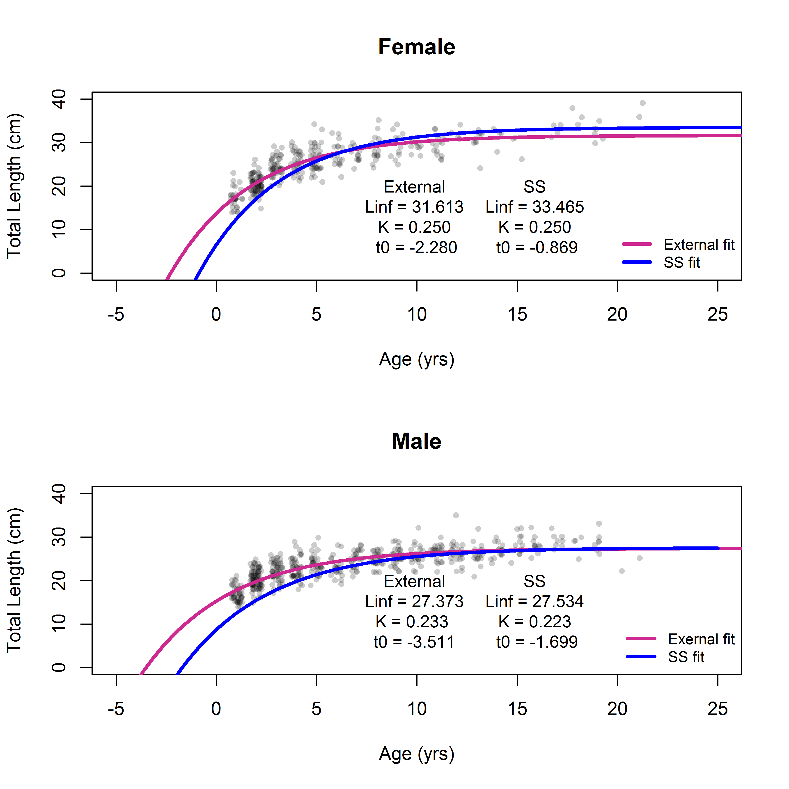

```{r global_options, include=FALSE}
    # set global options for R code chunks: echo=FALSE (don't include source code); 
    # warning=FALSE (suppress R warnings); message=FALSE (suppress R messages)
    # eval = TRUE is default
    knitr::opts_chunk$set(echo = FALSE, warning = FALSE, message = FALSE)

    library(xtable)
    # Change options  
      options(xtable.comment = FALSE)  # turns off xtable comments
      options(scipen=999)              # turns off scientific notation

    # Read in preamble R code - including required libraries and the SS file(s)
    source('./Rcode/Preamble.R')
 
    # Read in data/manipulations for executive summary tables and figures
    # It may take time to edit this file and get it ready for your assessment
    # Make small changes in this file and then try to compile the document
    # Commit when you have a success!
    source('./Rcode/Exec_summary_figs_tables.R')
```

```{r child = "8_Tables.Rmd", include=FALSE}
```

```{r child = "8a_Tables.Rmd", include=FALSE}
```


#Background

###California scorpionfish (*Scorpaena guttata*)


\begin{itemize} 
 \item[\checkmark] Distributed from central California to Punta Eugenia, Baja California Sur, Mexico 
 \item[\checkmark] Rarely observed north of Pt. Conception  
 \item[\checkmark] Observed from the intertidal to 600 ft,  preferred depth range from 20-450 ft  
 \item[\checkmark] Demersal, found over both hard and soft bottom  
 \item[\checkmark] Exhibit aggregating behavior (spawning and non-spawning)  
\end{itemize}

\centering
\includegraphics[width=.5\textwidth]{cover_photo}


#Biology
##Length-at-age
###Length-at-age

\begincols
  \begincol{.4\textwidth}
  
  \includegraphics[trim={0 0 0 2cm}, totalheight=0.65\textheight]{Figures/Age_length_bySex.png}

  \endcol
  \begincol{.48\textwidth}


  \endcol
\endcols


###Length-at-age
\begincols
  \begincol{.4\textwidth}
  


\endcol
\begincol{.48\textwidth}
  


  \endcol
 \begincol{.48\textwidth}
 
##Maturity and Fecundity

* Only information on maturity from Love et al. (1987)
* Found over 50% of females were mature by 18 cm TL, or two years of age. 
* All fish were mature by 22 cm TL

* No information available on fecundity of California scorpionfish


##Weight-at-length
 
 
 

##Natural mortality

* Prior based on maximum age of 21
* Lognormal distribution with a median of 0.2715
* Base model fixes female natural mortality ($M$)
* Male $M$ estiamted as offset from female $M$
* Sensitivities explore estimating $M$


##Steepness: Density-Dependent Recruitment Compensation

* Predictive distribution for Pacific rockfish meta-analysis
* Preior mediant in 2017 for steepness ($h$) = 0.718


#Removals

##Total Removals 


##Commercial Landings by Fleet


##Recreational Landings by Fleet

 

#Index Data

 

##Summary of Data Sources

- All of the methods used to standardize indices have been endorsed by the SSC

```{r, results = 'asis'}
    # Years read in as factor - change to shorten.
      Index_summary$Years = as.character(Index_summary$Years)
      Index_summary[7,2] = paste0("'94, '98, '03, '08, '13")
      Index_summary = Index_summary[,c(3,2,4,6)]

    # Print index summary table
      print(xtable(Index_summary,
                   align = 'lp{2.5in}p{0.8in}p{.4in}p{2in}'),
            include.rownames=FALSE,
            scalebox = 0.7,
            sanitize.text.function = function(x){x})
```
 

##Recreational Private Boat Index

##Recreational Party/Charter Boat Index (Logbook)

##Recreational Dead Discard Index

##Recreational Party/Charter Retained Catch Index


##Sanitation Districts Survey Index
```{r, results='asis'}
  print(xtable(Fleet7_lengthdepth),
                include.rownames=FALSE,
                scalebox = 0.9,
                sanitize.text.function = function(x){x})
```
##Sanitation Districts Survey Index

##Sanitation Districts Survey Index

##NWFSC Trawl Survey Index

##Gillnet Survey Index

##Southern California Bight Trawl Survey Index


#Composition Data

##Dat1


##Summary of Data used in the 2017 Assessment

